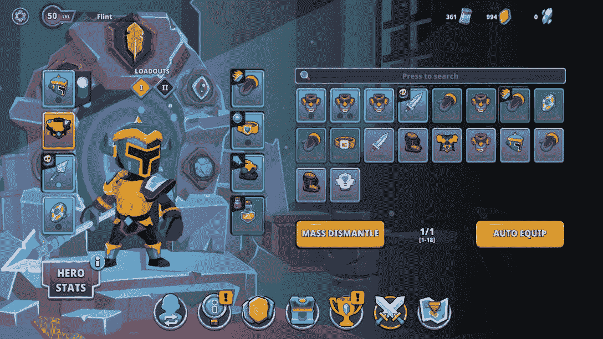
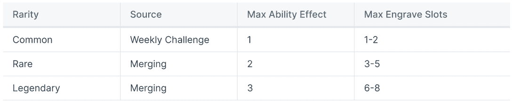
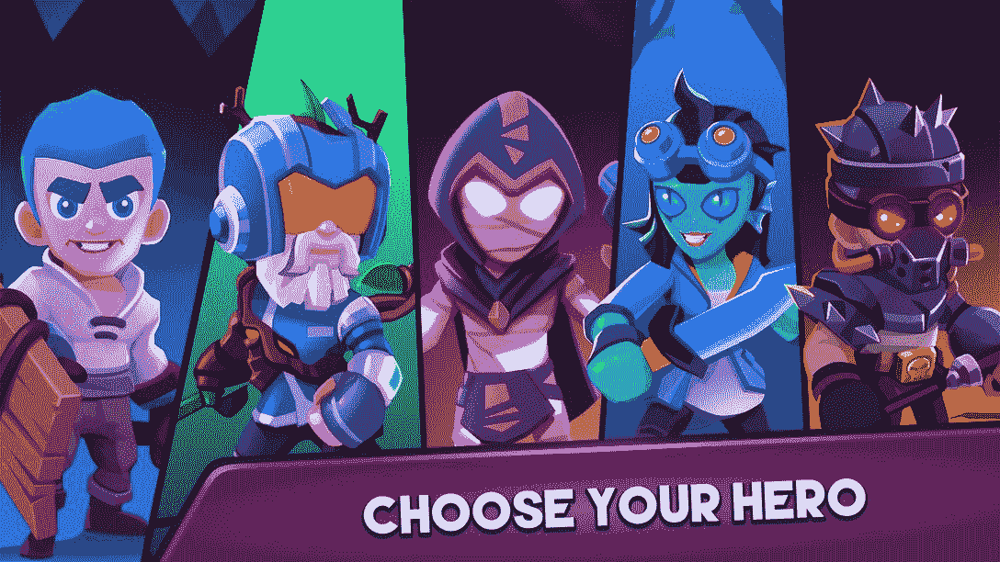

# 如何玩和赢:Shatterpoint

> 原文：<https://web.archive.org/web/https://dappradar.com/blog/shatterpoint-how-to-play-blockchain-web3-game>

## 移动免费拥有的角色扮演游戏，你可以引导你的英雄通过考验和战斗

Shatterpoint 是新一代区块链游戏的一部分，它简单易用，质量上乘，旨在吸引新用户加入 Web3。游戏玩法和以前的相似，收入和所有权的特点足够简单，足以吸引而不是阻止任何担心区块链技术复杂性的人。这是一个战斗 RPG 游戏，有趣的图形和丰富的游戏模式让每个玩家都感兴趣。

**内容**

*   *[什么是 Shatterpoint？](https://web.archive.org/web/20230311215617/https://dappradar.com/blog/shatterpoint-how-to-play-blockchain-web3-game/#what-is)*
*   *[游戏如何入门](https://web.archive.org/web/20230311215617/https://dappradar.com/blog/shatterpoint-how-to-play-blockchain-web3-game/#get-started)*
*   *[如何玩赢沙特点](https://web.archive.org/web/20230311215617/https://dappradar.com/blog/shatterpoint-how-to-play-blockchain-web3-game/#play-and-win)*
*   *[是什么让游戏具有创新性？](https://web.archive.org/web/20230311215617/https://dappradar.com/blog/shatterpoint-how-to-play-blockchain-web3-game/#what-innovative)*
    *   *[数字项](https://web.archive.org/web/20230311215617/https://dappradar.com/blog/shatterpoint-how-to-play-blockchain-web3-game/#digital-items)*
    *   *[自由拥有](https://web.archive.org/web/20230311215617/https://dappradar.com/blog/shatterpoint-how-to-play-blockchain-web3-game/#free-to-own)*
    *   *[作为代币](https://web.archive.org/web/20230311215617/https://dappradar.com/blog/shatterpoint-how-to-play-blockchain-web3-game/#qua-tokens)*
*   *[路线图](https://web.archive.org/web/20230311215617/https://dappradar.com/blog/shatterpoint-how-to-play-blockchain-web3-game/#roadmap)*
*   *[有用链接](https://web.archive.org/web/20230311215617/https://dappradar.com/blog/shatterpoint-how-to-play-blockchain-web3-game/#Useful-Links)*

随着封闭 Alpha 的推出，Shatterpoint 在其漫长的路线图中向前迈出了一大步。这是一种让用户测试游戏、查找漏洞并帮助团队及时做出改进的方式，以便稍后全面推出。

但这也是英雄 NFT 持有者玩他们期待已久的游戏的机会。对于新接触这个平台的人来说，这是一个很好的机会去了解新的游戏模式、竞技场和更新的游戏机制。

[https://web.archive.org/web/20230311215617if_/https://www.youtube.com/embed/dI7dQd7JJgk?feature=oembed](https://web.archive.org/web/20230311215617if_/https://www.youtube.com/embed/dI7dQd7JJgk?feature=oembed)

Check out Shatterpoint gameplay

[Explore Shatterpoint Data](https://web.archive.org/web/20230311215617/https://dappradar.com/polygon/games/shatterpoint)

## 什么是沙特点？

手机游戏 Shatterpoint 采用免费游戏、免费拥有的模式，提供基于技能的动作 RPG 体验。在这款游戏中，玩家通过玩家与环境战役和冲突模式进行战斗，以获得经验值。

随着玩家获得更多的经验值，他们会为英雄角色解锁新的特性。除了获得经验，玩家必须收集装备来提高他们的战斗统计和解锁各种英雄能力组合。

在游戏中，玩家将度过一个又一个赛季，而在游戏赛季结束时，总是会有一场毁灭性的灾难。在那一瞬间，所有的游戏角色都将被重置，但是玩家可以从他们的奖励中提取一部分作为 NFT。这将使他们在新赛季中获得优势。

此外，Shatterpoint 还提供玩家对玩家竞技场，玩家在这里相互竞争以赢得奖励，包括游戏内资源、NFT 和更高的排行榜排名。游戏由 Estoty 和 BlockGames 开发，建立在多边形网络上。

## 如何在游戏中入门

1.  使用 App Store 或 Google Play 将 Shatterpoint 下载到您的手机上。

一旦你打开它，你需要输入你的电子邮件地址

2.  要参与封闭的 Alpha 测试，你需要一个创始人英雄或者是早期申请的测试者之一。

你可以从你选择的二级市场购买一个创始人英雄。你需要在钱包里装上 MATIC 才能购买。

3.  现在你在，按照指示开始玩。

作为一款手机游戏，Shatterpoint 有一个简单的按部就班的开始游戏。

## 如何玩并赢得 Shatterpoint

### 挑战

挑战是游戏中唯一的 Quantus Dust 来源，它可以用于各种活动，包括齿轮修理，解锁特性，符文雕刻，合并和购买实用程序箱。此外，一些每周挑战奖励玩家一个随机的普通稀有符文作为奖励。

### 运动

玩家可以通过完成战役章节来推进整个战役进程并解锁新的世界。在每一章中，他们会遇到敌人，发现装备箱，并且必须完成主要任务才能前进。可选任务也可以获得更多的经验。

> 我们手机游戏的封闭 Alpha， [@Shatterpointgg](https://web.archive.org/web/20230311215617/https://twitter.com/Shatterpointgg?ref_src=twsrc%5Etfw) 已经推出！🥳
> 👇【https://t.co/aedt2JEe4o】
> 
> TLDR？看看下面的帖子 pic.twitter.com/mecvjLms1O[# the shatching here](https://web.archive.org/web/20230311215617/https://twitter.com/hashtag/TheShatteringisHere?src=hash&ref_src=twsrc%5Etfw)[# on polygon](https://web.archive.org/web/20230311215617/https://twitter.com/hashtag/onPolygon?src=hash&ref_src=twsrc%5Etfw)[# mobile gaming](https://web.archive.org/web/20230311215617/https://twitter.com/hashtag/mobilegaming?src=hash&ref_src=twsrc%5Etfw)
> 
> — Shatterpoint (FREE, OWN) (@Shatterpointgg) [February 6, 2023](https://web.archive.org/web/20230311215617/https://twitter.com/Shatterpointgg/status/1622577734168739841?ref_src=twsrc%5Etfw)

Shatterpoint’s Closed Alpha began in Feburary

战役章节为玩家熟悉游戏机制提供了一个相对安全的环境。一些章节和世界的老板会掉落入口钥匙，玩家可以收集这些钥匙去探索新的未知世界。

### 玩家对玩家

游戏中的玩家对玩家核心模式是一场三局两胜的 3v3 竞技场团队死亡赛，还有额外的 1v1 和 2v2 支架可用。最初，匹配系统是基于玩家的力量潜力(计算他们的总装备水平)和他们的赢/输比率的组合。

从公开测试版开始，将引入 Elo 评级系统，以进一步提高配对准确性。在排名 PvP 中，玩家可以下注他们的 Quantus 资源，获胜者将获得所有下注的资源，只需支付微不足道的竞技场费用。这项费用起到了通货紧缩机制的作用。

Shatterpoint 的开发者也在考虑在游戏中引入不对称下注。

### 小冲突

冲突关卡提供了无尽的游戏资源，主要集中在从被击败的暴徒那里收集装备。在战斗关卡中收集到的任何物品都可以在物品栏中立即装备。

这些关卡完全是可选的，并不会推进主战役，但是可以为玩家提供额外的经验值和装备。冲突最终是一种让你的角色变得更强的便捷方式。

### 装备

在游戏中，装备对于增强英雄的实力起着至关重要的作用。各种各样的附加物是可用的，使玩家能够提高他们的主要属性或修改他们的游戏体验。

通过组合装备和能力，玩家可以调整他们的角色以适应他们独特的游戏风格。游戏中的每个物品都有三个不同的等级和三个不同的稀有物品，传奇物品是一个特例。

Shatterpoint inventory

无论装备的类型如何，玩家都有一系列的选择来提高他们英雄的能力和优化他们的游戏体验。

设备类型:

*   武器:造成伤害，以剑、刀、矛和弩的形式出现。
*   盔甲:保护玩家免受攻击。
*   **传奇**:装备:特效和加成。

### 破碎

世界标准时间每周一中午 12 点，宇宙在粉碎中自行崩溃，将所有英雄等级重置为初始等级。这种现象允许现有的玩家保留他们的符文和游戏资源，而收集的装备被拆解成装备碎片。这使他们比新玩家更有优势。

粉碎允许宇宙在每一季开始时重新创造自己，提供新的敌人、战役模式和更大的世界去探索。

每次粉碎后，在 PvP 排行榜上排名靠前的玩家将获得专属奖励。这些奖励包括游戏内资源、链上英雄和符文、锦标赛通行证等等。

## 是什么让游戏具有创新性？

### 数字项目

#### 英雄

在游戏世界中，玩家头像被称为英雄。每个英雄都有不同的基础数据，可以通过游戏中的装备和特征来修改。NFT 也可以当英雄。

NFT 英雄在一个赛季结束后仍然保持他们的等级，而非 NFT 英雄的等级重置为 1。玩家可以选择拥有无限数量的英雄，但一次只能使用一个。

#### 符文

要激活与某个特定符文相关的装备能力，必须使用量子尘来雕刻它。所有的符文都作为非符文储存在链上。

符文雕刻的成功率是可变的，成功的概率随着符文稀有度的增加而降低。可用于雕刻符文的空间大小因符文的稀有程度而异。

符文有三种不同的稀有等级:

Rune rarities

符文越不常见，就变得越有影响力，越广泛，越有力。

为了创造一个新的稀有度更高的符文，玩家可以将两个完全雕刻的稀有度相同的符文合并。合并过程会破坏两个完成的符文，随机生成一个新的符文，并增加不同数量的槽和能力。

但是没有完全刻好或者根本没有刻好的符文是不能用于合并的。重要的是要记住合并过程的结果是完全随机的。

#### 化妆品

在赛季中，玩家有机会为他们的英雄或装备获得链上(NFT)皮肤和配件。与其他游戏中的物品不同，这些皮肤和配件不会以任何方式改变游戏，而是为玩家提供一个美观的游戏体验。

Choose Your Hero!

这些物品通常只在特定的季节性活动或内容更新期间可用，并可以为喜欢个性化游戏角色或装备的玩家增加额外的享受和定制水平。

虽然它们可能不会对游戏机制产生直接影响，但这些皮肤和配件仍然可以为收集它们的玩家提供独特性和排他性。

### 自由拥有

Shatterpoint 是在免费游戏和免费拥有模式的概念下工作的游戏平台之一。免费拥有包括为玩家提供在游戏经济中免费创造有价值的数字资产的机会。这些资产被创建为 NFT，授予玩家对他们免费获得的数字资产的完全所有权。

玩家在游戏中的进步和排名取决于他们的技能和经验水平，重点是促进玩家拥有游戏经济的免费游戏和游戏拥有模式。所有玩家都有机会升级为 NFT 英雄，并通过游戏中的成就获得 NFT 符文或 NFT 化妆品，从而提升游戏体验。

虽然玩家仍然可以与其他玩家购买、出售和交易这些资产，但这款游戏不支持不可持续的短命模式，如“玩赚”和“付钱赢”。

### 作为代币

Shatterpoint 游戏提供了一种无限供应的游戏内资源，称为 Quantus Dust，供玩家在各种活动中使用。

How to get QUA

玩家在玩游戏时可以通过几种方式获得 Quantus Dust。他们可以通过展示他们的技能和奉献精神来获得各种成就，并获得包括 QUA 在内的各种福利。

每日、每周和每季的挑战也对所有玩家开放，提供赚取 Quantus Dust 的机会，并激励他们参与 PvE 和 PvP 模式。

此外，玩家可以参加锦标赛和特殊活动来赢得 Quantus Dust，或者通过下注 Quantus Dust 并在各种 PvP 模式下比赛来参加下注 PvP 战斗，奖金池在获胜者之间分配。

## 路标

Shatterpoint 路线图漫长而曲折。已经取得了很大成就，团队对未来的更新、里程碑、发布和惊喜有很多计划。

以下是 Shatterpoint 开发者在 2022 年末取得的成就，以及未来的发展趋势:

*   2022 年第四季度—**方正英雄 NFT 合集**
*   Q1 2023-**封闭阿尔法**
*   Q2 2023—**公测(有限区域)**
*   2023 年第三季度—**Shatterpoint v 1.0 发布，所有游戏模式，网络市场发布**
*   2023 年第四季度—**shatter point v 2.0 发布、锦标赛和活动**

## 有用的链接

*   [发现 Web3 游戏](https://web.archive.org/web/20230311215617/https://dappradar.com/rankings/category/games)
*   [探索 NFT 系列](https://web.archive.org/web/20230311215617/https://dappradar.com/nft/collections)
*   [Shatterpoint 关键链接](https://web.archive.org/web/20230311215617/https://shatterpoint.gg/m/keylinks)
*   [游戏篇](https://web.archive.org/web/20230311215617/https://dappradar.com/blog/category/games)

## 随身携带您的 Web3 之旅

使用 DappRadar 移动应用程序，再也不会错过 Web3。查看最受欢迎的 dapps 的性能，并关注您投资组合中的 NFT。您的 DappRadar 帐户与我们的移动应用程序同步，让您可以随时接收实时提醒。

[Download the DappRadar app now](https://web.archive.org/web/20230311215617/https://dappradar.app.link/blog)[<picture></picture>](https://web.archive.org/web/20230311215617/https://play.google.com/store/apps/details?id=com.portfolio.dappradar)