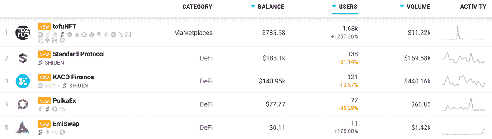
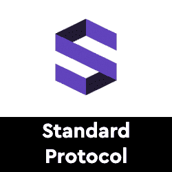
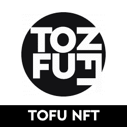
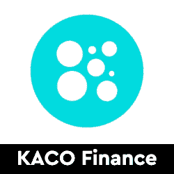

# 世登网络 Dapps 现已上线 DappRadar

> 原文：<https://web.archive.org/web/https://dappradar.com/blog/shiden-network-dapps-now-on-dappradar>

## 支持以太坊虚拟机和 web 程序集

**DappRadar 现在为用户提供访问 Shiden Network** **上的** [**dapps，这是草间弥生上的 EVM 兼容智能合约平台。DappRadar 的 100 万月度访客现在可以分析哪些 dapps 吸引了最多的量、最独特的用户钱包，或者处理了最多的交易。Shiden Network 排名让访问者能够深入了解哪些 dapps 和令牌构建了稳固的社区和价值。**](https://web.archive.org/web/20221127153130/https://dappradar.com/rankings/protocol/shiden)

世登网络是一个基于草间弥生网络的 dapps 智能合约平台，旨在支持第二层解决方案，即基于现有区块链构建的二级框架。这些额外的层提高了网络的可扩展性和交易速度。此外，由于通过可靠性和网络组装(WASM)支持 EVM 兼容性，dapps 可以很容易地移植到施登。

在谈论[石登网络](https://web.archive.org/web/20221127153130/https://dappradar.com/rankings/protocol/shiden)的时候要记住的重要一点是，这个项目只是一个大得多的项目的第一步: [Astar(原名 Plasm)](https://web.archive.org/web/20221127153130/https://docs.astar.network/) 。这意味着施登是 Astar 的测试网络。

## 在世登网上发现 dapps

最初，DappRadar 将[追踪 Shiden](https://web.archive.org/web/20221127153130/https://dappradar.com/rankings/protocol/shiden) 上五个 dapps 的活动。四大小吃和多连锁店[豆腐 NFT 市场](https://web.archive.org/web/20221127153130/https://dappradar.com/shiden/marketplaces/tofunft)。接下来的几周和几个月还会有更多。开发人员可以独立提交他们的 dapps，并通过[开发人员仪表板](https://web.archive.org/web/20221127153130/https://dappradar.com/dashboard/submit-dapp)获得对数千名参与用户的可见性。

标准协议是施登上领先的 DeFi dapp。一个由可互操作的 DAO 生态系统支持的自治 stablecoin 协议。Standard 希望通过多链 DEX、price oracle 和使用 NFTs 的无准备金债务抵押头寸设计，赋予用户完全控制权。 [Kaco Finance](https://web.archive.org/web/20221127153130/https://dappradar.com/shiden/defi/kaco-finance) 是基于币安智能链和草间弥生链的跨链去中心化交易平台。Kaco Finance 最初旨在提供流动性、代币交换和收益农场，并致力于实现草间弥生和 BSC 之间的资产桥接功能。

## Dapp 奖励或赌注

当人们使用[石登网络](https://web.archive.org/web/20221127153130/https://dappradar.com/rankings/protocol/shiden)时，它会生成新的区块，随之而来的是对生成的区块的奖励。一半的奖励给了部署在网络上的 dapps 的开发者。所以基本上，世登网络向 dapp 开发者付费，让他们在自己的生态系统中部署应用。或者更确切地说，它在网络内创建了一个激励系统，以帮助 dapps 得到发展和资助。点击了解更多关于奖励系统[的信息。](https://web.archive.org/web/20221127153130/https://docs.astar.network/utility/staking-on-dapps)

## 开发者支持

Astar / Shiden Network Builders 计划旨在通过支持团队在此基础上的建设，帮助进一步推动生态系统的发展、增长和采用。Stake Technologies 在 Parity Technologies 的指导下根据[Builders for Builders initiative](https://web.archive.org/web/20221127153130/https://www.parity.io/substrate-builders-program-update-builders-for-builders/)运营该项目。世登对建设基础设施和集成解决方案的高质量团队感兴趣，以帮助开发人员构建社区需要的应用程序。

[<picture></picture>](https://web.archive.org/web/20221127153130/https://dappradar.com/shiden/defi/standard-protocol)[<picture></picture>](https://web.archive.org/web/20221127153130/https://dappradar.com/shiden/marketplaces/tofunft)[<picture></picture>](https://web.archive.org/web/20221127153130/https://dappradar.com/shiden/defi/kaco-finance) NewsletterUnsubscribe at any time. [T&Cs](https://web.archive.org/web/20221127153130/https://dappradar.com/terms) and [Privacy Policy](https://web.archive.org/web/20221127153130/https://dappradar.com/privacy-policy)