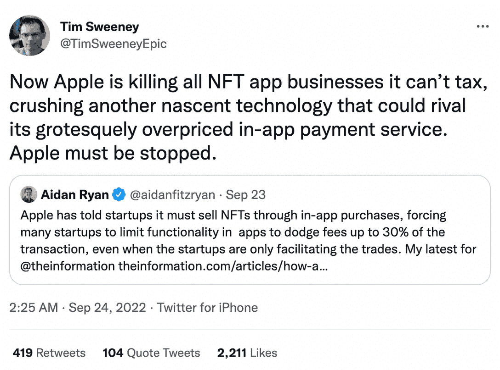
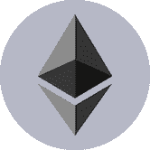
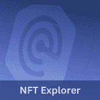

# 加密游戏应该担心苹果 30%的 NFT 税吗？

> 原文：<https://web.archive.org/web/https://dappradar.com/blog/should-crypto-games-be-worried-about-apple-nft-tax>

## 游戏开发商对苹果的应用内支付服务费并不满意

苹果宣布将对在 iOS 应用程序中销售的非功能性内容征收高达 30%的“苹果税”。随着越来越多的开发者考虑为他们的用户提供移动友好的去中心化应用，这项政策会对他们产生怎样的影响？

总结:

*   Epic Games 首席执行官蒂姆·斯维尼批评苹果公司收取过高的服务费。
*   这对使用原生移动应用的区块链游戏有什么影响？
*   市场上有很多手机友好的加密游戏吗？

苹果让基于 iOS 的游戏为其应用内销售支付 30%的税，这包括应用内购买 NFT。Epic Games 首席执行官蒂姆·斯维尼在推特上批评苹果，称其正在“扼杀”NFT 的应用业务。他补充说，“粉碎了另一项新生技术，这项技术可能会与其价格高得离谱的应用内支付服务相匹敌。”

信息显示，Solana 上领先的 NFT 市场 Magic Ede n 已经决定从 App Store 撤回其服务。[魔法伊甸园最近宣布](/web/20221202015444/https://dappradar.com/blog/opensea-and-magic-eden-add-arbitrum-and-ethereum-nfts/)它的社区现在可以访问以太坊上的 [NFTs。](https://web.archive.org/web/20221202015444/https://dappradar.com/nft/protocol/ethereum)

[<picture></picture>](https://web.archive.org/web/20221202015444/https://dappradar.com/rankings/protocol/solana)[<picture></picture>](https://web.archive.org/web/20221202015444/https://dappradar.com/solana/marketplaces/magic-eden)[<picture></picture>](https://web.archive.org/web/20221202015444/https://dappradar.com/rankings/protocol/ethereum)

## 这对使用原生移动应用的区块链游戏有什么影响？

事实上，苹果并不是唯一一个对应用内购买征收 30%税的公司，Google Play 也是如此。唯一的区别是，谷歌尚未明确表示会将 NFT 列为征税对象。

相比安卓用户，苹果用户确实有更强的购买力。[从披露的数据来看，](https://web.archive.org/web/20221202015444/https://www.pocketgamer.biz/news/78813/apple-made-more-games-revenue-than-google-2020-2021/)苹果应用商店在 2010 财年和 2011 财年的营收都超过了 Google Play，尽管后者拥有更多的用户。

谷歌此前宣布，2021 年 7 月 1 日，对于开发者每年赚取的第一笔 100 万美元，Google Play 将把其“税收”从 30%降至 15%。即针对年收入低于 100 万美元的小企业和独立开发者，将苹果税从 30%下调至 15%。此外，苹果也有类似的折扣条款。

考虑到以上信息，对于新兴的密码游戏来说，找到有效的用户接触点来增加曝光度可能比担心这些应用商店会征多少税更重要。

## 有哪些流行的手机友好加密游戏？

dappRadar 是世界上的 Dapp 商店，在这里用户可以找到他们想知道的关于 Dapp 的一切，无论是元宇宙、游戏、DeFi、社交等等。

[https://web.archive.org/web/20221202015444if_/https://www.youtube.com/embed/HSVvtpxWNWs?start=67&feature=oembed](https://web.archive.org/web/20221202015444if_/https://www.youtube.com/embed/HSVvtpxWNWs?start=67&feature=oembed)

在 DappRadar，我们跟踪各种区块链游戏及其实时指标表现。此外，我们发现许多基于区块链的优秀游戏都推出了 iOS 和 Android 应用，为用户提供了最流畅的原生游戏体验。

来看看最受欢迎的吧！

高地是一个受垄断启发的虚拟世界，允许玩家在模拟的土地上建造、购买和翻转数字房地产，以反映真实的城市。除了成为虚拟房地产大亨之外，高地玩家还可以收集游戏中的物品，如 [NFTs](https://web.archive.org/web/20221202015444/https://dappradar.com/nft) ，拥有并驾驶汽车，参加音乐会并开始他们的生意。

如果你想成为这款游戏的高手，请查看这篇文章。

Sweatcoin 将项目建在区块链附近。 [SWEAT Wallet](https://web.archive.org/web/20221202015444/https://dappradar.com/multichain/games/sweat-wallet) 是一款游戏化的健身 dapp，采用移动赚取概念。Sweatcoin 将项目建在靠近区块链的[。在 dapp 中，用户在行走时铸造汗水代币。Sweatcoin 是创建代币、应用程序和 Sweat coin 钱包的公司，这是通过步行赚取 SWEAT token 的必要条件。](https://web.archive.org/web/20221202015444/https://dappradar.com/rankings/protocol/near)

如果你对如何流汗挣钱感兴趣，请阅读这篇文章。

另一个最近用户激增的手机友好游戏 dapp 是 Benji Banana。游戏于 2013 年首次亮相。今年，它的创造者增加了[多边形功能的](https://web.archive.org/web/20221202015444/https://dappradar.com/rankings/protocol/polygon)游戏赚取元素。用户可以在树上荡来荡去，收集奖励。而且，是免费下载的。

想要掌握这些游戏赚钱的技巧，请点击此链接，继续阅读。

[<picture></picture>](https://web.archive.org/web/20221202015444/https://dappradar.com/rankings/category/games)[<picture></picture>](https://web.archive.org/web/20221202015444/https://dappradar.com/hub/nft-explorer)[<picture></picture>](https://web.archive.org/web/20221202015444/https://dappradar.com/blog/10-games-to-play-and-earn-for-less-than-10-dollars)

## 随身携带您的 Web3 之旅

使用 DappRadar 移动应用程序，再也不会错过 Web3。查看最受欢迎的 dapps 的性能，并关注您投资组合中的 NFT。您在 DappRadar 上的帐户会与我们的移动应用程序同步，这样您很快就可以选择实时接收提醒。

[Download the DappRadar app now](https://web.archive.org/web/20221202015444/https://dappradar.app.link/blog)[<picture></picture>](https://web.archive.org/web/20221202015444/https://play.google.com/store/apps/details?id=com.portfolio.dappradar)