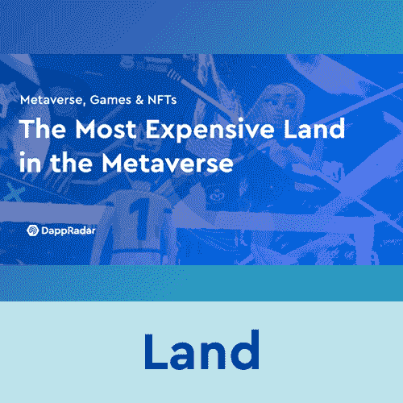
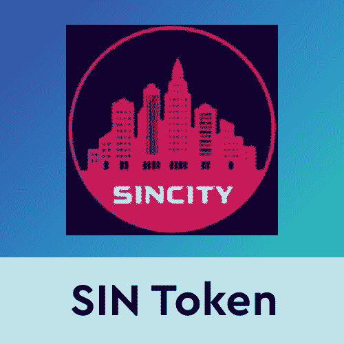

# 罪恶之城元宇宙一期地块售罄

> 原文：<https://web.archive.org/web/https://dappradar.com/blog/sin-city-metaverse-phase-one-land-plots-sold-out>

## 陆地 NFT 将在即将到来的游戏中扮演重要角色

元宇宙罪恶之城是一个崭露头角的 R 级虚拟世界项目，它刚刚完成了在 NFT 的首次土地出售。令人印象深刻的是，这次土地出售产生了超过 350 万美元的交易量，使该系列成为人们关注的焦点。重要的是，罪恶之城国家森林公园将在即将到来的 GTA 风格的区块链游戏中扮演重要角色。

现在，他们已经完成了土地销售，罪恶之城团队正在努力发布“营业执照”，这将允许持有者在游戏推出时开设商店和其他企业。随着罪恶之城路线图的继续推进，对罪恶之城元宇宙土地的需求持续增长。

在最初的土地销售中，收藏家们可以获得罪恶之城虚拟世界中 17 个区中的 4 个区的土地 NFT。每个地区都有自己的背景故事和游戏。重要的是，最明显的识别标记是一个区是低安全区还是高安全区。安全等级将决定该地区的经济支柱，进而决定玩家在罪恶之城虚拟世界中的角色。

[https://web.archive.org/web/20221208064318if_/https://www.youtube.com/embed/KJR-0jUSrxs?feature=oembed](https://web.archive.org/web/20221208064318if_/https://www.youtube.com/embed/KJR-0jUSrxs?feature=oembed)

## 更多关于罪恶之城虚拟世界的信息

罪恶之城元宇宙的目标是创建一个全功能的虚拟世界，其自身的经济以基于 BSC 的罪恶令牌为中心。陆地 NFT 是进入罪恶之城元宇宙的起点。拥有土地的玩家可以设计它们，并利用即将到来的营业执照来使用它们。

罪恶之城由 15，000 块土地组成，分成 17 个独立的区。重要的是，即将到来的罪恶之城游戏的前提是受游戏经典侠盗猎车手，或 GTA 的影响。罪恶之城背后的团队旨在重现区块链上的著名游戏。他们还引入了创新的游戏赚取机制和游戏中的 NFT 项目。

由于罪恶之城在不到两个小时的时间内成功售出了前四个区，游戏背后的团队现在正在准备第二次卖地。根据一份官方新闻稿，这应该发生在 2022 年 2 月的某个时候。此外，开发人员正致力于推出一个备受期待的游戏内 NFT 市场。它将允许玩家购买武器、防弹衣和 VIP 赛事门票等物品。

随着更多虚拟世界的出现，达普拉达将继续监视元宇宙。如果你想了解更多关于虚拟世界、罪恶之城和罪恶令牌的知识，请点击下面的链接。此外，您还可以利用 [DappRadar PRO](https://web.archive.org/web/20221208064318/https://dappradar.com/token/pro) ，获取最新的 NFT 销售数据。

[<picture></picture>](https://web.archive.org/web/20221208064318/https://dappradar.com/blog/most-expensive-land-in-the-metaverse/)[<picture></picture>](https://web.archive.org/web/20221208064318/https://dappradar.com/blog/5-alternative-virtual-worlds-cheaper-than-decentraland-and-the-sandbox/)[<picture></picture>](https://web.archive.org/web/20221208064318/https://dappradar.com/hub/token/bsc/SIN?from=0x6397de0f9aedc0f7a8fa8b438dde883b9c201010) NewsletterUnsubscribe at any time. [T&Cs](https://web.archive.org/web/20221208064318/https://dappradar.com/terms) and [Privacy Policy](https://web.archive.org/web/20221208064318/https://dappradar.com/privacy-policy)