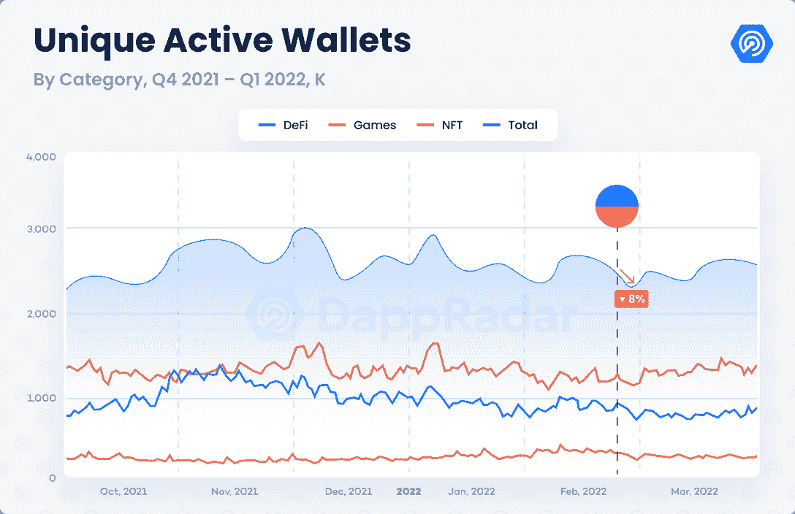

# SKALE 通过 1 亿美元的激励计划推动生态系统扩张

> 原文：<https://web.archive.org/web/https://dappradar.com/blog/skale-boosts-ecosystem-expansion-with-a-100-million-incentive-program>

## 该计划以 500 万美元的拨款开始，专门用于区块链博彩 dapps

为了加速网络扩张，SKALE 启动了一项价值 1 亿美元的生态系统激励计划。SKALE 是一个开源、无气体、分散的多链网络，旨在为数十亿用户提供高性能的区块链生态系统。

**总结**:

*   SKALE 网络是一个模块化、以太坊本地、支持可靠性、集装箱化的多链网络，允许开发人员为他们的用户提供终极的 dapp 体验，而无需支付天然气费用。
*   SKALE Innovator 计划帮助开发人员构建和启动他们的项目。
*   **SKALE 还推出了**[**【1 亿美元生态系统激励计划**](https://web.archive.org/web/20220925075531/https://skale.network/blog/skale-100million-usd-ecosystem-incentive-program/) **，其中 500 万美元的 SKALE MP Grant 计划专门用于区块链博彩业。**

进入 2022 年第二季度，加密社区对以太坊 2.0 的预期可能会再次引入一个 DeFi 夏天。Crypto 用户希望升级能够提供更加实惠和用户友好的以太坊体验。然而，与此同时，“以太坊通吃”不再是这样的情况，因为用户已经开始探索不同的区块链，提供各种功能和迎合他们的特定需求。

为了应对这样的竞争格局， [SKALE 推出了一个完全可与以太坊互操作和兼容的区块链网络](https://web.archive.org/web/20220925075531/https://dappradar.com/blog/the-multichain-future-with-skale-network)。此外，SKALE 还制定了一个稳健的网络扩张计划，启动了[1 亿美元的生态系统激励计划](https://web.archive.org/web/20220925075531/https://skale.network/blog/skale-100million-usd-ecosystem-incentive-program/)，

## 成为一名创新者，并开始行动

SKALE Network 提出了一个实用的解决方案来促进 Web3 的大规模采用。具体来说，它提供各种不同规模的 SKALE 连锁店，以支持不同的业务和项目。每个 SKALE 链组成了 SKALE 生态系统，并受到 SKALE 和以太坊的保护。此外，每个单独的链每秒支持多达 2，000 个事务。此外，该网络具有完全 EVM 兼容性，提交时间更快，无气体交易。此外，完全的 Solidity 语言支持允许熟悉以太坊开发环境的工程师立即开始他们的项目。

由于 SKALE 出色的基础设施设计和下一代区块链技术，开发人员可以享受其作为 dapps、协议和其他基于加密的项目的高吞吐量执行层的有效性。因此，许多项目已经倾向于 SKALE 的生态系统，以获得最终的 dapp 用户体验。

SKALE 的首发合作伙伴包括[柯维](https://web.archive.org/web/20220925075531/https://skale.network/blog/covey-io-launches-on-the-skale-network-targeting-the-300million-equities-intelligence-market)、[库里奥道](https://web.archive.org/web/20220925075531/https://skale.network/blog/skale-powered-capital-dex-from-curiodao/)、 [Ivy.cash](https://web.archive.org/web/20220925075531/https://skale.network/blog/ivy-cash-live-on-skale) 、[索丽达里亚](https://web.archive.org/web/20220925075531/https://skale.network/blog/solydaria-live-on-skale-demo-nft-nyc)、 [360NFT](https://web.archive.org/web/20220925075531/https://skale.network/blog/skale-360nft) 。这些 dapps 使用自己的专用 SKALE 链，为区块链的项目注入新的活力。希望与 SKALE 一起启动雄心勃勃的区块链计划的开发者可以很容易地注册 SKALE 创新者计划。SKALE 创新者计划为开发者带来了许多好处，包括赠款、工程支持、投资者介绍等，使开发者能够与 SKALE 不断扩大的生态系统一起成长。

## SKALE 启动了 1 亿美元的激励计划，其中 500 万美元用于区块链博彩业

除了通过创新者计划孵化项目，SKALE 还推出了生态系统激励计划，以加速 SKALE 生态系统的扩张，并迅速增加应用程序和项目的加入。

生态系统激励计划旨在用 1 亿美元邀请高质量的 dapps 和项目加入 SKALE 网络，以推动项目的开发进度。作为该计划的开始，SKALE 首先推出了 500 万美元的价值赠款，即 SKALE MP 计划，以推动区块链的游戏热潮。

### SKALE 区块链游戏资助计划

根据 DappRadar 行业报告，游戏继续主导区块链行业，占该行业联网钱包的 50.5%。值得注意的是，SKALE Network 致力于帮助区块链游戏优化其用户体验，通过无气体交易和快速终结处理高吞吐量。更重要的是，SKALE 希望通过 500 万美元的资助来增强区块链游戏开发者社区的能力。

所谓的 SKALE MP 计划将为区块链游戏、P2E 游戏和元宇宙项目的开发者提供资助。SKALE 团队参照游戏术语魔法点(或法力点)创造了该程序的名称 MP。正如所有游戏玩家所知，它是一种宝贵的资源，可以增强玩家在游戏中的角色与他人竞争的能力。区块链游戏领域的竞争比以往任何时候都激烈，开发者现在可以申请 SKALE MP 计划来升级他们的游戏项目。

了解有关 SKALE 和激励计划的更多信息:

[网站](https://web.archive.org/web/20220925075531/https://skale.network/)
[推特](https://web.archive.org/web/20220925075531/https://twitter.com/SkaleNetwork)
[不和](https://web.archive.org/web/20220925075531/http://skale.chat/)
[白皮书](https://web.archive.org/web/20220925075531/https://skale.network/whitepaper)

**免责声明** —这是一篇赞助文章。DappRadar 不认可本页面上的任何内容或产品。DappRadar 旨在提供准确的信息，但读者应该在采取行动之前总是自己做研究。DappRadar 的文章不能被认为是投资建议。