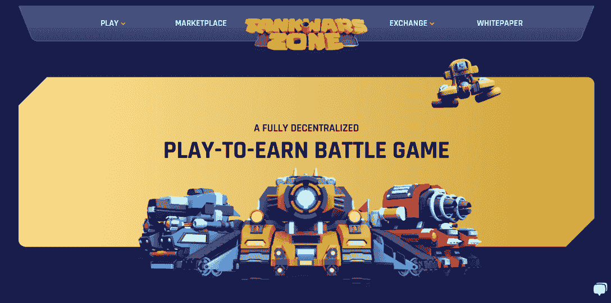

# 随着 NFT 采用率的上升，SKALE 看到交易激增

> 原文：<https://web.archive.org/web/https://dappradar.com/blog/skale-sees-transaction-surge-as-nft-adoption-rises>

## 10，000，000 SKL 赠款启动，使 NFT 系列在滑雪道上栩栩如生

过去几个月，SKALE 见证了显著的全面增长。20 家可互操作的 SKALE 连锁店为整个 SKALE 生态系统贡献了超过 1 **1** **百万笔交易。此外，随着 NFT 愿景资助计划的宣布，SKALE 将提供 10，000，000 SKL，帮助创作者和开发者在 EVM 兼容的区块链网络上实现他们的作品。**

**内容:**

*   [非功能性测试的采用率正在上升](https://web.archive.org/web/20221130142108/https://dappradar.com/blog/skale-sees-transaction-surge-as-nft-adoption-rises/#Adoption-of-NFTs-is-on-the-Rise)
*   [SKALE 网络正在获得动力](https://web.archive.org/web/20221130142108/https://dappradar.com/blog/skale-sees-transaction-surge-as-nft-adoption-rises/#SKALE-is-Gaining-Momentum)
*   [SKALE 生态系统中著名的 NFT 动力项目](https://web.archive.org/web/20221130142108/https://dappradar.com/blog/skale-sees-transaction-surge-as-nft-adoption-rises/#Prominent-NFT-powered-Projects-in-the-SKALE-Ecosystem)
*   [加入 SKALE 的 NFT 远见者资助计划](https://web.archive.org/web/20221130142108/https://dappradar.com/blog/skale-sees-transaction-surge-as-nft-adoption-rises/#Join-SKALE‘s-NFT-Visionaries-Grant-Program)

一年前，当听到 NFT 这个词时，大多数人可能会首先将其与数字项目联系起来，如头像、数字艺术、收藏品和游戏中的道具。但是今天，这种区块链技术已经被应用在许多不同的和创新的方面。

8 月份，NFT 贸易公司注册了超过 100 万个独立钱包，售出了 724 万张 NFT。这些公司的交易总额超过 8 亿美元。

NFT 也可以附在有形资产上，如实物艺术品，或作为会员系统的载体。一个最好的例子是彪马发射了自己的元宇宙空间称为黑色站。它配有独家 NFT 系列，允许持有者兑换实物产品并解锁定制体验。

## 非功能性测试的采用正在增加

非功能性测试正在被越来越多的人采用。[根据 DappRadar 第三季度 NFT 报告](https://web.archive.org/web/20221130142108/https://dappradar.com/blog/nft-financials-falling-in-q3-but-on-chain-metrics-remain-bullish/#Industry-Overview)中的数据，与 2021 年第三季度相比，独立交易商的数量增加了 36%。

除了采用率的增加，NFT 地区网络多样化的趋势也越来越明显。看看更广泛的以太坊生态系统，包括无数的 EVM 兼容网络，我们注意到 SKALE 的增长在过去几个月里呈爆炸式增长。

更重要的是，SKALE 最近推出的 NFT 基金将进一步推动这种增长。

## 斯卡莱势头越来越大

SKALE 不是一个单独的区块链，而是一个由许多 EVM 兼容的区块链组成的网络，具有可伸缩性和互操作性。无气体交易、零成本铸造、链上文件存储、高吞吐量和即时终结等功能可以确保 SKALE 上沉浸式、响应性和无缝的用户体验。

许多希望利用分散网络为用户服务的开发人员将 SKALE 作为首选。因此，游戏、交易所和各种各样的 NFT 驱动的项目等继续涌向 SKALE 生态系统。

让我们看看 SKALE 的指标，以便更好地了解它的快速增长。

在撰写本文时，SKALE 已经为开发商节省了高达 62，027，741 美元(39，202 ETH)的天然气费用。在过去的 30 天里，区块链网络处理了超过 450 万笔交易。

在 10 月的中点过后不久，SKALE 已经赶上了上个月的用户群，在 10 月 1 日至 19 日期间，有 32，500 名用户与 SKALE Dapps 互动。

[点击此链接](https://web.archive.org/web/20221130142108/https://skale.space/stats)查看 SKALE 网络的完整数据成果。

Source: [SKALE](https://web.archive.org/web/20221130142108/https://skale.space/stats)

## 斯卡莱生态系统中著名的 NFT 动力项目

如前所述，越来越多的 NFT 项目利用了 SKALE 的零排放、环保和多功能基础设施。让我们来看看 SKALE 上突出的几个例子。

### 丰富 NFT 用例的项目

SKALE 与参与式娱乐平台 [Fireside](https://web.archive.org/web/20221130142108/https://skale.space/blog/100-million-ecosystem-grant-program-will-be-leveraged-to-catalyze-creatives-unleashed-program-for-fireside-creators-to-accelerate-transition-to-web3) 达成独家合作，启动一项价值 1 亿美元的创意释放资助计划。马克·库班支持的企业旨在授权给那些渴望进入 Web3 的创作者。

参与者可以利用 FiresideWeb3 内容工作室，并利用 SKALE 网络来建立 NFT 支持的项目。创作者现在将能够以前所未有的有趣和创新的方式与他们的粉丝互动。Fireside 和 SKALE 之间的伙伴关系允许创作者将 Web3 引入他们的社区，同时开启新的商业模式。

Renfter 是一个不可信的 NFT 租用协议。它允许 NFT 项目在产品本身中创建一个无担保的 NFT 租赁协议，以满足特定的需求。Renfter 在进一步推动采用非功能性测试方面发挥着关键作用。有了 Renfter，游戏等项目可以让任何人参与到他们的生态系统中，用户现在只需要通过 Renfter 协议借用 NFT。通过 NFT 贷款，伦福特降低了进入 NFT 市场的主要障碍之一。

### 赌博

坦克战争区是一款总部位于 NFT 的坦克主题战斗游戏，它为用户提供了利用他们的时间和游戏热情的机会。Dapp 为用户提供了各种令人兴奋的游戏选项，如 PvE、PvP、皇家战役等。

Fantom 生态圈中的顶级游戏《坦克大战区》希望通过在 SKALEverse 推出来增加他们的增长和用户群。

[CryptoBlades](https://web.archive.org/web/20221130142108/https://skale.space/blog/cryptobladers-can-now-enjoy-fast-gasfree-gaming-on-the-skale-network) 是一款多链 NFT RPG 游戏，可在 BNB 链、雪崩和 SKALE 上使用。这款游戏让玩家带着他们的角色和武器 NFT 进入战斗以赢得技能，这是游戏中的标志。

另外值得注意的是，如果用户通过 SKALE 连接游戏，就可以享受 100%无气的游戏体验。CryptoBlades 用户每周在其 SKALE 链上处理超过 100 万笔交易，共同为社区节省了数千 ETH 和数百万美元的汽油费。

### 交换

NFT 并不是游戏项目的专利。 [Ruby Exchange 是 SKALE 生态系统中一个由 NFT 驱动的交易所](https://web.archive.org/web/20221130142108/https://skale.space/blog/ruby-exchange)。通过将 NFTs 整合到整个平台的用户体验中，Ruby 实现了一个游戏化的奖励系统，从而提高了参与度和忠诚度。Ruby Exchange 目前是 SKALE 生态系统的主要流动性中心。

### 虚拟空间

元宇宙入侵者是一个以太空为主题的虚拟世界，用户可以在这里探索、管理土地和资源、社交等等。在《元宇宙入侵者》中，有一支由 1000 名士兵组成的跨次元军队。如果与其他游戏中的 NFT 一起使用，这些角色可以帮助你建立一个统治宇宙的强大帝国。

《元宇宙入侵者》是首批完全集成为移动应用的 P2E 游戏之一，可以从 App Store 下载。

## 加入 SKALE 的 NFT 远见者资助计划

备受期待的以太坊合并已经完成，标志着区块链正式转向 PoS 共识机制。然而，以太坊还没有完全完成网络的扩展或解决昂贵的天然气问题。相反，区块链仍然要面对未来的一系列升级。

因此，SKALE 对于攀登以太坊来说一如既往的重要。希望立即采用 NFTs 的艺术家、项目和创作者可以加入 SKALE 的 NFT 远见者基金。

该计划从之前宣布的 1 亿美元生态系统激励计划中拨款 1000 万 SKL。因此，无论您是希望创作 NFT 艺术品、提高社区参与度，还是构建基于 NFT 的游戏，该计划都可以加速这一过程，并为您的项目顺利启动保驾护航。

被选中的申请者不仅将获得 SKL 代币资助，还将获得持续的教育、网络和营销支持。此外，创作者将从 SKALE 增加的存在、与合作伙伴的接触以及参与 SKALE 促销和营销活动中获得推动。

如果你已经有了一个关于 NFTs 的好主意，不要错过让你的项目快速启动的机会！

我们已经在不同场合报道过 SKALE。阅读 [SKALE 的混合模块化第一层网络](https://web.archive.org/web/20221130142108/https://dappradar.com/blog/how-skales-hybrid-modular-layer-1-stands-out-as-a-blockchain-scalability-solution)和 [SKALE 的充满活力的游戏生态系统](https://web.archive.org/web/20221130142108/https://dappradar.com/blog/gaming-dapps-are-thriving-on-skales-zero-gas-blockchain-network)以深入了解 SKALE。

通过官方社交媒体平台了解更多关于斯卡勒和 NFT 远见者资助计划的信息:

[网站规模](https://web.archive.org/web/20221130142108/https://skale.space/)

[申请 NFT 梦想者资助计划](https://web.archive.org/web/20221130142108/https://skaleverse.skale.space/nftgrants)

[SKALE Docs](https://web.archive.org/web/20221130142108/https://docs.skale.network/develop/)

[白皮书](https://web.archive.org/web/20221130142108/https://skale.space/whitepaper)

[推特](https://web.archive.org/web/20221130142108/https://twitter.com/SkaleNetwork?ref_src=twsrc%5Egoogle%7Ctwcamp%5Eserp%7Ctwgr%5Eauthor)

[博客](https://web.archive.org/web/20221130142108/https://skale.space/blog)

[不和](https://web.archive.org/web/20221130142108/https://discord.com/invite/gM5XBy6)

[电报](https://web.archive.org/web/20221130142108/https://t.me/skaleofficial)