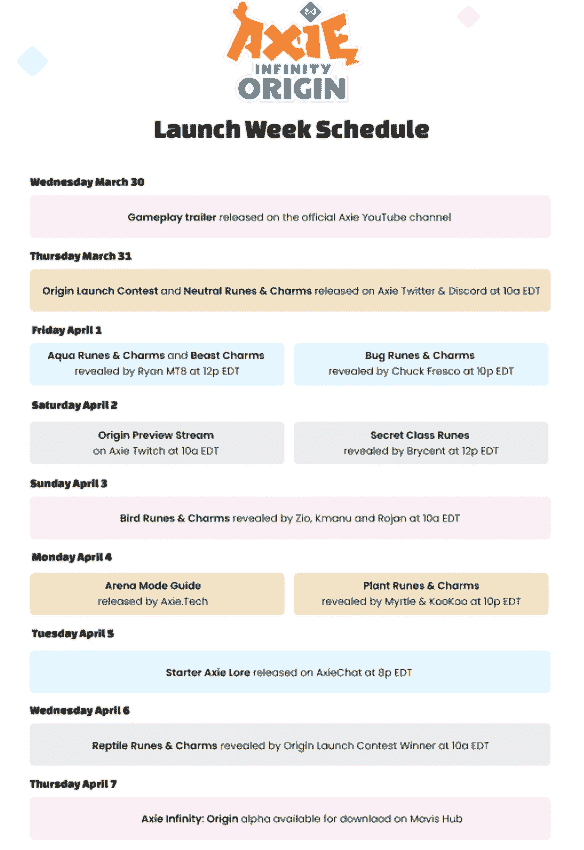

# Sky Mavis 将推出 Axie Infinity:黑客危机中的起源

> 原文：<https://web.archive.org/web/https://dappradar.com/blog/sky-mavis-to-launch-axie-infinity-origin-amidst-hack-crisis>

## Axie Infinity: Origin 将于 4 月 7 日通过 Mavis Hub 推出

在 Sky Mavis 面临的最大危机中，Axie Infinity 团队正在推进 Axie Infinity: Origin 的计划推出。备受期待的更新最初打算在 3 月 31 日推出。然而， [**团队宣布**](https://web.archive.org/web/20221206175418/https://axie.substack.com/p/originsoftlaunch?s=r) **在他们的浪人之桥出现超过 6 亿美元被利用的安全漏洞后，他们将把原产地的发布日期推迟一周。**

[*黑客通过利用允许用户在 Axie Infinity 生态系统中移动资产的浪人桥，窃取了 173,600 ETH 和 2550 万 USDC*](https://web.archive.org/web/20221206175418/https://dappradar.com/blog/axie-infinity-activity-plummets-after-600-million-ronin-exploit) *。Sky Mavis 团队* [*表示*](https://web.archive.org/web/20221206175418/https://roninblockchain.substack.com/p/community-alert-ronin-validators?s=w) *他们致力于确保追回或偿还所有被盗资金，并将继续与利益相关方和更广泛的机构群体进行讨论，以确定最佳行动方案。DappRadar 将尽力让读者及时了解事态的发展。*

## 演出必须继续

该团队宣布了为期一周的一系列活动，通过视频预告片先睹为快。从 3 月 31 日开始，Origin 启动竞赛开始，为玩家提供多种参与方式。这包括设计定制卡片和迷因，讲述游戏中角色 Acro Beast 的背景故事，以及参与 cosplay 的机会。

Axie Infinity : Origin 的官方游戏预告片已经发布，展示了升级后的 Axie 美术和动画以及新的游戏升级。包括连续回合、能量重置、卡片更换、眼睛&耳朵卡片、符文/符咒、新的愤怒机制等等。

[https://web.archive.org/web/20221206175418if_/https://www.youtube.com/embed/X2z_YIeettE?feature=oembed](https://web.archive.org/web/20221206175418if_/https://www.youtube.com/embed/X2z_YIeettE?feature=oembed)

大赛于 3 月 31 日正式开始，投稿截止日期为 4 月 5 日。想要参与的人需要在 Twitter 上使用#OriginLaunch 标签发布内容。Sky Mavis 团队成员将对提交的作品进行评判，选出获胜者，并邀请他们在 4 月 6 日正式发布爬行动物符文和符咒。你可以在下面找到完整的活动时间表。

Source: [Axie Infinity](https://web.archive.org/web/20221206175418/https://axie.substack.com/p/originsoftlaunch?s=r)

## Axie Infinity: Origin Alpha 将于 4 月 7 日上线

尽管本周 Sky Mavis 和 Axie Infinity 经历了一周的负面和危机，但该团队希望他们准备的视频和内容将有助于玩家为下周备受期待的发布做好准备。此外，美国东部时间 4 月 2 日上午 10 点，Axie 团队将在官方 [Axie Twitch](https://web.archive.org/web/20221206175418/https://www.twitch.tv/axieinfinity) 账户上直播一个内部游戏会议，让社区首次有机会看到完整的 alpha 版本。

## 不大高明

事实证明，2022 年对于黑客来说是忙碌的一年。浪人的最新漏洞利用和几个高调的针对网桥的漏洞利用，包括 T2 的虫洞漏洞利用，已经表明令牌网桥可能是交换盔甲中的一个弱点。这一最新的黑客行为应该为开发商和更广泛的区块链社区提供一个边界动力，开始更多地关注和解决问题，以重建对桥梁技术的信心，作为 [DeFi 经济](https://web.archive.org/web/20221206175418/https://dappradar.com/defi)的一个组成部分。

此外，记住整个行业有多新是很重要的。诸如此类的挑战可以提供学习机会，并最终加强该部门及其主要参与者。

[<picture></picture>](https://web.archive.org/web/20221206175418/https://dappradar.com/ethereum/games/axie-infinity)[<picture></picture>](https://web.archive.org/web/20221206175418/https://dappradar.com/blog/axie-infinity-biggest-contributor-to-august-game-nft-trading/)[<picture></picture>](https://web.archive.org/web/20221206175418/https://dappradar.com/hub/swap/eth/ETH/AXS?to=0xbb0e17ef65f82ab018d8edd776e8dd940327b28b)

***以上不构成投资建议。此处给出的信息仅供参考。请行使尽职调查，做你的研究。作者持有多种加密货币的头寸，包括 BTC、瑞士法郎和雷达。***