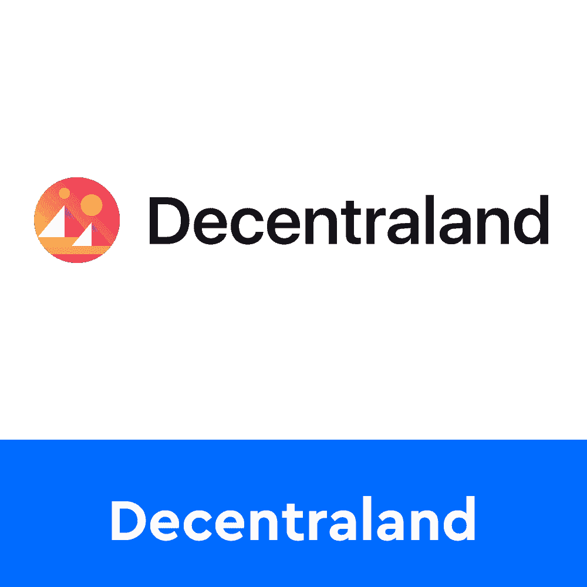
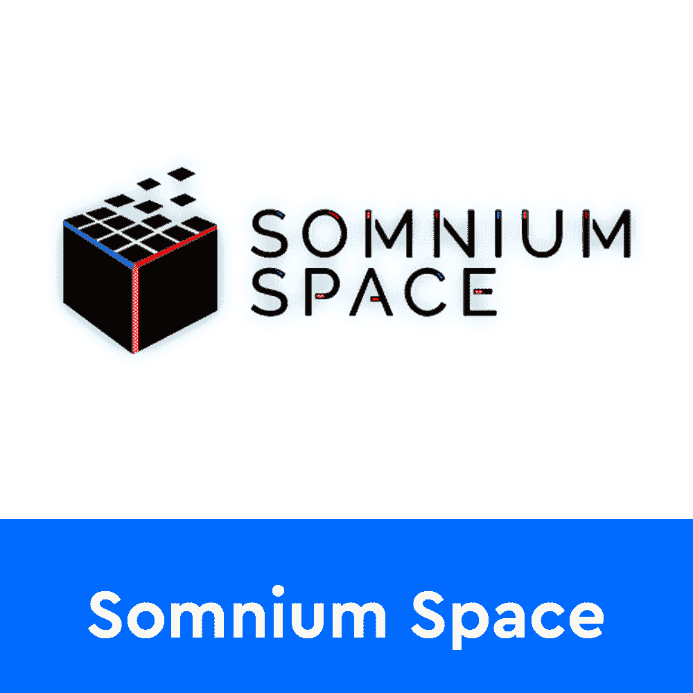
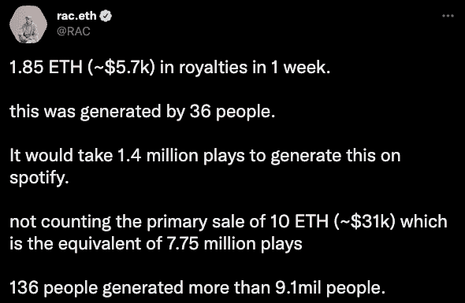

# 活结进入元宇宙与沙盒伙伴关系

> 原文：<https://web.archive.org/web/https://dappradar.com/blog/slipknot-enters-the-metaverse-with-the-sandbox-partnership>

## 虚拟音乐体验正成为大型乐队和表演者的主要选择

音乐史上最受欢迎的金属乐队之一 Slipknot 通过与 Sandbox 合作加入了 web3 运动。该乐队对 Knotverse 有很大的计划，这是一种在国际 Knotfest 大获成功后设计的数字体验。

***概要:***

*   *活结会在沙盒中创建[Knotverse](https://web.archive.org/web/20221002002220/https://dappradar.com/blog/slipknot-enters-the-metaverse-with-the-sandbox-partnership/#Knotverse-in-The-Sandbox)*
*   [*元宇宙*](https://web.archive.org/web/20221002002220/https://dappradar.com/blog/what-is-the-metaverse) *是连接世界、人和信息的宇宙，没有权限，没有界限*
*   *音乐家像* [*史努比狗狗*](https://web.archive.org/web/20221002002220/https://dappradar.com/hub/wallet/eth/0xce90a7949bb78892f159f428d0dc23a8e3584d75/nfts/1) *和* [*帕丽斯希尔顿*](https://web.archive.org/web/20221002002220/https://dappradar.com/hub/wallet/eth/0xb6aa5a1aa37a4195725cdf1576dc741d359b56bd/nfts) *已经在 web3*
*   *[web 3 能给音乐行业带来革命吗？](https://web.archive.org/web/20221002002220/https://dappradar.com/blog/slipknot-enters-the-metaverse-with-the-sandbox-partnership/#Web3-will) DJ RAC 说可以*

## 在沙盒中启动 Knotverse 的活结

活结乐队的 Knotverse 将是一个 24/7 永不结束的虚拟体验，围绕着与乐队有关的任何事情和一切。参观者可以期待全方位的虚拟音乐体验，从音乐会到与乐队见面打招呼。

路线图将会看到独特的 NFT 和生殖系列，加上元宇宙演唱会、游戏、粉丝体验、独特的合作、可穿戴设备等等。所有这些都是为了在元宇宙增加重金属文化的存在。此外，该合作伙伴关系将包括通过访问新音乐、IRL 活动、节日体验、商品、装备、面具等重要的实用元素。

根据[官方公告](https://web.archive.org/web/20221002002220/https://knotfest.com/culture/slipknot-partner-with-the-sandbox-to-plant-their-flag-in-the-metaverse/)，Knotverse 将按照 Slipknot 的风格设计。20 多年的影像和黑暗狂欢元素将在 web3 空间找到新家。

官方 [Knotfest 钱包](https://web.archive.org/web/20221002002220/https://dappradar.com/hub/wallet/eth/0x3bf4b00616eccf42c4366a2a3fa05a13cc88cd01/nfts)已经在沙盒中保存了 9 个地块。Knotverse 将位于 [Deadfellaz](https://web.archive.org/web/20221002002220/https://dappradar.com/ethereum/collectibles/deadfellaz) 庄园附近。官方路线图还暗示活结 web3 体验将引入许多令人兴奋的合作。然而，关于这些的细节还不清楚。活结成员也在用稀有收藏品戏弄个别 NFT 项目，以吸引粉丝的注意力。

## 什么是元宇宙，为什么它变得如此流行？

元宇宙比区块链或任何其他技术都重要。这是一个虚拟的世界，每个人都可以与其他人互动，而数据和价值可以在没有许可的情况下共享。与此同时，重要的是要明白，一个虚拟世界永远不可能是元宇宙，因为我们谈论的是几个世界的互联，如果不是同时的话。

从这个意义上说，Knotverse 只是全球元宇宙体验的一部分。这是一个虚拟世界，与元宇宙的其他虚拟体验相连。像沙盒、T2、分散、T4、隐体素和空间这样的平台都为人们提供了进入虚拟世界的机会。这些虚拟世界的结合创造了元宇宙。

当然，元宇宙是一个相当新的概念，在达到最终需要的互联性水平之前，它将经历成百上千次的开发和迭代。尽管如此，像 Slipknot 这样的大品牌和名字正在进军 web3 和虚拟体验，这一事实是一个强烈的信号，表明元宇宙将继续存在。

Knotverse 并不是唯一的虚拟体验。看看这些音乐家，他们也发现了为粉丝创造 web3 体验的价值。

[<picture></picture>](https://web.archive.org/web/20221002002220/https://dappradar.com/ethereum/games/the-sandbox)[<picture></picture>](https://web.archive.org/web/20221002002220/https://dappradar.com/ethereum/marketplaces/decentraland)[<picture></picture>](https://web.archive.org/web/20221002002220/https://dappradar.com/ethereum/games/somnium-space)

## 活结加入了元宇宙的史努比·道格和帕丽斯·希尔顿

活结并不是第一个加入 web3 运动的音乐大腕。可以说，史努比·道格是在元宇宙留下最重要印记的明星。这位说唱歌手是第一批在元宇宙建立自己的虚拟体验的人。他在沙盒中的庄园名为 Snoopverse，去年九月开始接待粉丝。

从那以后，史努比·道格推出了几个 NFT 系列，包括一个头像系列和一个独家的 NFT 通行证项目，让人们可以使用史努比。此外，这位说唱歌手与 Gala Music 合作，以 NFT 的身份发布了他的最新专辑 B.O.D.R。

其他名人也已经过渡到数字和虚拟体验。帕丽斯·希尔顿也推出了自己的虚拟世界体验。去年年底，她与 Roblox 合作创建了巴黎世界。最近，这位明星还与沙盒达成了一项协议，与史努比·多格的方式非常相似。

人们对元宇宙的兴趣正在迅速增长，然而，web3 空间可以为音乐家和他们的粉丝提供更多的东西。请继续阅读，了解 DJ RAC 对此有何评论。他最近启动了名为 racOS 的 web3 项目。

## Web3 将彻底改变音乐产业

web3 空间和音乐产业已经进入了一场有趣的革命之舞。NFTs 和区块链有潜力解决音乐行业收入和公平报酬方面的重要问题。新流媒体服务的引入给音乐粉丝带来了很多好处，但表演者和创作者长期以来一直认为这是一个不足的收入来源。

DJ RAC 决定将他的艺术和音乐转移到 web3 空间，以对抗流媒体平台日益减少的利润。RacOS 是他第一次涉足 web3。最近，他与 sound.xyz 合作推出了一个音乐 NFT 项目，收入的对比令人震惊。RAC 今天早些时候在 Twitter 上发布了这个[故障](https://web.archive.org/web/20221002002220/https://twitter.com/RAC/status/1516578113634725890)。

虽然这是一位艺术家指出了 web3 给他带来的好处，但有一个更全球化的趋势值得注意。Web3 允许艺术家和音乐家给他们的作品贴上价格标签，最重要的是从二次销售中获益。RAC 上面概述的收益仅仅来自他的音乐 NFTs 的二次销售版税。正如他所说，136 人产生了超过 910 万人会通过流媒体。差别是巨大的。

从这个意义上说，web3 空间和元宇宙有着未开发的潜力，可以为艺术家带来全新的收入来源。此外，乐迷和音乐爱好者将能够参与一种全新的音乐体验。

随着音乐在 web3 空间的流动，DappRadar 将继续监测元宇宙，并为整个行业带来创新。活结、史努比·道格、帕丽斯·希尔顿、DJ RAC——加入 web3 的音乐巨头名单只会越来越多。要了解最新的元宇宙新闻，请加入 DappRadar PRO 和我们的独家 Discord 频道。此外，你可以在[的 Twitter](https://web.archive.org/web/20221002002220/https://twitter.com/dappradar) 上关注 DappRadar，并打开你的通知，首先获得最新的推文。

 NewsletterUnsubscribe at any time. [T&Cs](https://web.archive.org/web/20221002002220/https://dappradar.com/terms) and [Privacy Policy](https://web.archive.org/web/20221002002220/https://dappradar.com/privacy-policy)