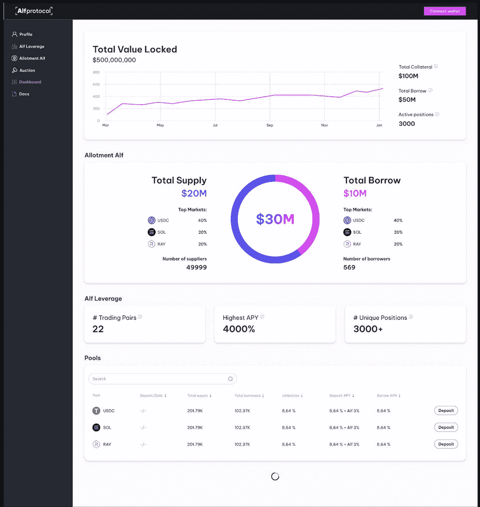
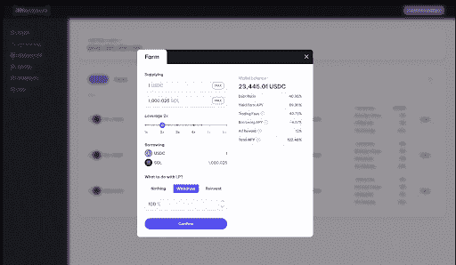
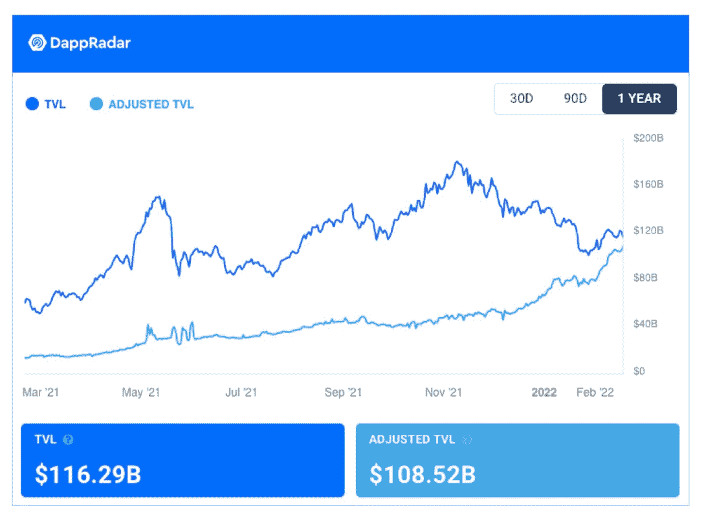

# 先睹为快 200 倍杠杆产量农业的 Alf 协议

> 原文：<https://web.archive.org/web/https://dappradar.com/blog/sneak-peek-at-200x-leveraged-yield-farming-on-alf-protocol>

## Alf 协议为用户提供 Solana 上最好的杠杆流动性供应解决方案

**Alf 协议是一系列协议，用户可以在索拉纳区块链享受 200 倍的杠杆产量。该协议为交易所操作和短期贷款的货币市场引入了基于不变量的自动做市商协议。Alf 的目标是成为区块链流动性的最佳去处，最大限度地提高各类投资者的资本效率。**

随着区块链市场的成熟，用户需要更复杂的金融服务。Alf 协议和它的杠杆产量农业允许人们以更大的风险和回报进行交易。该团队现已首次展示了他们的创新产品。但是让我们先来看看 DeFi 和杠杆交易，这意味着什么？

分散金融(DeFi)正在不断改变传统金融(TradiFi)的生态系统。原则上，DeFi 可以提供任何现有的金融服务，而不需要集中的中介，如银行。在如此短暂的历史中，DeFi 的最新创新已经使人们能够用他们的加密资产进行交易、借贷和投资。

随着 DeFi 用户的快速增长，他们的投资需求也迅速多样化。Alf 提供解决方案来满足用户对资本效率的要求。通过将向贷款协议提供流动性的低风险、低努力的投资者与关注杠杆流动性供应和收益农业头寸的寻求风险、积极管理的投资者联系起来，Alf 可以促进更具流动性的市场。

## 什么是杠杆，为什么它很重要

金融中的杠杆指的是使用借来的钱的投资策略。具体来说，它是利用各种金融工具来借入资本，以增加投资的潜在回报。当涉及到为公司或个人管理财富时，我们通常需要用有限的资源做出谨慎的决定。利用杠杆作用，当借款的收益高于债务的应付利息时，我们总投资的收益就会增加。

为了更好地理解杠杆是如何促进资本配置的，让我们来看看金融杠杆的基本概念:

*   **抵押品**是担保和偿还贷款所需的最低存款。
*   **杠杆**衡量你从借贷资金交易中获得的额外购买力。通常表示为乘数(2 倍、3 倍等。)
*   **清算**当您的头寸因其未实现价值低于您的抵押品而自动平仓时，就会发生清算。清算确保借款人损失的不会超过他们的抵押品。

## Alf 使杠杆收益农业变得容易

Alf 为不同风险承受能力的用户提供杠杆和非杠杆产品。非杠杆化的流动性产品是 AlfMM(一种分散的交易所服务)和 AAlf(一种过度抵押的借款服务)。这两个协议的核心目的是为交易者和规避风险的投资者提供切入点。

杠杆收益农业是 Alf 的产品，它使流动性提供者能够使用其流动性提供者(LP)或任何其他受支持的令牌来获得更多 LP 令牌。因此，用户可以为分散的交易所提供更多的流动性，并获得额外的收益。此外，Alf 独特的 LP 令牌抵押模式和清算拍卖机制使 Solana 生态系统中的杠杆收益率高达 200 倍。

Alf 协议仪表板为市场表现提供了直观的界面。仪表板旨在确保用户始终跟上市场的最新趋势。仪表板显示 TVL、总供需、表现最佳的配对和其他信息，以确保它们始终跟上市场动态。

**农业小组**

该团队展示了一个易于使用的农业面板，具有清晰直观的视觉设计。在 Farming Panel 界面上，用户可以在给定的配对上自由选择利用或不利用的耕作选项。此外，用户可以轻松查看他们的余额信息和预期 APY 的详细信息。此外，该小组将提供所有必要的信息，以帮助投资者在投入资金前做出重要决定。

用户可以使用同一个面板来设置他们的偏好。由于 Solana 的快速处理和低拥塞，Alf 协议将允许用户利用高达 200 倍的安全监控和清算不健康的头寸。

## 用 Alf 协议实现 DeFi 回报最大化

[根据 DappRadar DeFi 追踪](https://web.archive.org/web/20230116234202/https://dappradar.com/defi)，截至本文撰写之时，DeFi 协议锁定的最新总价值(TVL)达到 1160 亿美元。TVL 是衡量对加密行业 DeFi 领域兴趣的一个重要指标。下图显示了过去 12 个月 TVL 的整体上升趋势，直观地反映了 DeFi 的日益普及。

不管 DeFi 回报有多丰厚，用户都在不断寻找最大化收益的方法。为了满足用户不同的风险偏好，杠杆收益农业已经成为有经验的 DeFi 用户的潜在选择，以比常规 DeFi 协议更显著的资本效率优化他们的回报。

尽管杠杆对于想要优化回报的投资者来说非常有益，但它也伴随着风险。Alf 团队一直致力于让任何人都可以使用杠杆流动性供应和产量农业的复杂功能。尽管如此，初学者需要仔细研究其背后的机制。

**免责声明** —这是一篇赞助文章。DappRadar 不认可本页面上的任何内容或产品。DappRadar 旨在提供准确的信息，但读者应该在采取行动之前总是自己做研究。DappRadar 的文章不能被认为是投资建议。