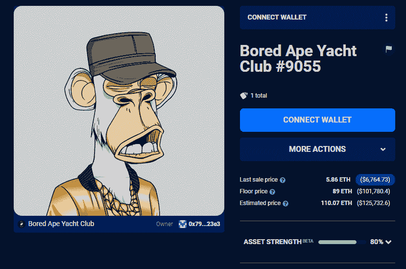

# 史努比·道格和艾米纳姆使用 NFT 的所有权制作新的音乐视频

> 原文：<https://web.archive.org/web/https://dappradar.com/blog/snoop-dogg-and-eminem-use-nft-ownership-for-new-music-video>

## 阿姆和史努比·道格在纽约 ApeFest 上变成了他们的猿猴化身。

两位说唱歌手都以他们无聊的猿类游艇俱乐部的另一个自我出现

美国说唱歌手 Snoop Dogg 和 Eminem 首次推出了他们的新音乐视频，其中有他们扮演的无聊的猿 NFT 角色。纽约 ApeFest 的参观者是第一批看到来自 D 2 的音乐录影带的人。

虽然史努比·道格在 NFT 的空间里一直很活跃，但阿姆的出现总是在幕后。尽管如此，两位说唱歌手都拥有一家无聊的 NFT 猿猴游艇俱乐部。因为这些 NFT 给了持有者一个商业许可证，可以将他们的 NFT 用于商业目的，所以这两位说唱歌手决定在 D 2 The LBC 的音乐视频*中使用这些无聊的猿类。*

[https://web.archive.org/web/20220829212645if_/https://www.youtube.com/embed/RjrA-slMoZ4?feature=oembed](https://web.archive.org/web/20220829212645if_/https://www.youtube.com/embed/RjrA-slMoZ4?feature=oembed)

在音乐视频中，两个说唱歌手从史努比的特制雪茄中获得快感，突然他们变成了他们无聊的猿猴化身。这是一个有趣的发展，我们已经在赛斯·格林身上看到了，他正在用他无聊的猩猩制作一部电视连续剧。此外，环球音乐公司正与吉米·麦克尼斯合作[推出一个虚构的无聊猿乐队，名为王权](https://web.archive.org/web/20220829212645/https://dappradar.com/blog/universal-music-creates-virtual-band-with-bored-ape-nfts)。NFT 正在成为超级明星。

这不是凭空而来的。Bored Ape 游艇俱乐部和他们的 NFT 已经成为 Web3 中的[精英品牌。事实上，所有无聊的猿 NFT 所有者对他们的资产拥有商业权利，这给了他们一个强大的工具。像](https://web.archive.org/web/20220829212645/https://dappradar.com/blog/how-yuga-labs-nfts-became-a-dominant-force-with-an-8-1b-market-cap)[凯文·哈特](https://web.archive.org/web/20220829212645/https://dappradar.com/hub/wallet/eth/0xbbdac7ba85af15420afd1f4aa3313c3535b15cde/nfts)、[麦当娜](https://web.archive.org/web/20220829212645/https://dappradar.com/hub/wallet/eth/0x6ef962ea7e64e771d3a81bce4f95328d76d7672b)、[格温妮丝帕特洛](https://web.archive.org/web/20220829212645/https://dappradar.com/hub/wallet/eth/0x31185f782a7c11044566d70dfcf1c8175486f451)、[小内马尔](https://web.archive.org/web/20220829212645/https://dappradar.com/hub/assets/eth/0xbc4ca0eda7647a8ab7c2061c2e118a18a936f13d/6633)、[斯蒂芬·库里](https://web.archive.org/web/20220829212645/https://dappradar.com/hub/wallet/eth/0x3becf83939f34311b6bee143197872d877501b11)、[吉米·法伦](https://web.archive.org/web/20220829212645/https://dappradar.com/hub/wallet/eth/0x0394451c1238cec1e825229e692aa9e428c107d8/nfts)等名人都跳上了游艇。在 DappRadar 上，我们收集了一份活跃在 crypto、DeFi 或 NFTs 领域的名人名单。

## 看看视频里无聊的猿猴

史努比·多格拥有 6723 号无聊猿，一只猎豹毛猿，戴着越南头盔，穿着皮条客外套。NFT 最初为吉米·麦克尼斯所有，他以未披露的月收入出售了它。他们充当了管家的角色，把 NFT 交到了史努比·道格的手里，然后史努比·道格把 NFT 存放在了死亡之路的钱包里。是的，史努比·道格推出了他自己的 NFT 音乐唱片公司。

同时阿姆拥有[百无聊赖猿#9055](https://web.archive.org/web/20220829212645/https://dappradar.com/hub/assets/eth/0xbc4ca0eda7647a8ab7c2061c2e118a18a936f13d/9055) 。这只白毛猿戴着军帽，戴着金链子，穿着夹克。这个 NFT 几经易手，最终落入了阿姆的钱包。

Source: [DappRadar´s NFT Explorer](https://web.archive.org/web/20220829212645/https://dappradar.com/hub/nft-explorer/collection/bored-ape-yacht-club)

有了 DappRadar 的 NFT 探索者,我们就有了发现新的和即将推出的 NFT 系列的完美工具。此外，用户可以搜索和过滤现有的 NFT 收藏，找到他们正在寻找的 NFT。

Snoop Dogg 的 6723 号无聊猿估计价值 168，864 美元或 147.83 ETH。与此同时，阿姆的无聊猿#9055 以 125，732 美元或 110.07 ETH 进入。DappRadar 通过使用机器学习算法、NFT 元数据和过去的销售来计算这些价格。

估计价值总是根据实际的市场变动而波动。例如，由于音乐视频，猎豹毛皮猿可能变得更受欢迎，这反过来可以提高它们在市场上的价格。这将反映在 DappRadar 的机器学习算法预测的估计值中。

发现新推出的和即将推出的 NFT 系列，并使用超级先进的 [NFT 浏览器](https://web.archive.org/web/20220829212645/https://dappradar.com/hub/nft-explorer)根据机器学习算法、历史销售和元数据获得估计的 NFT 价值！

[<picture></picture>](https://web.archive.org/web/20220829212645/https://dappradar.com/hub/nft-explorer)