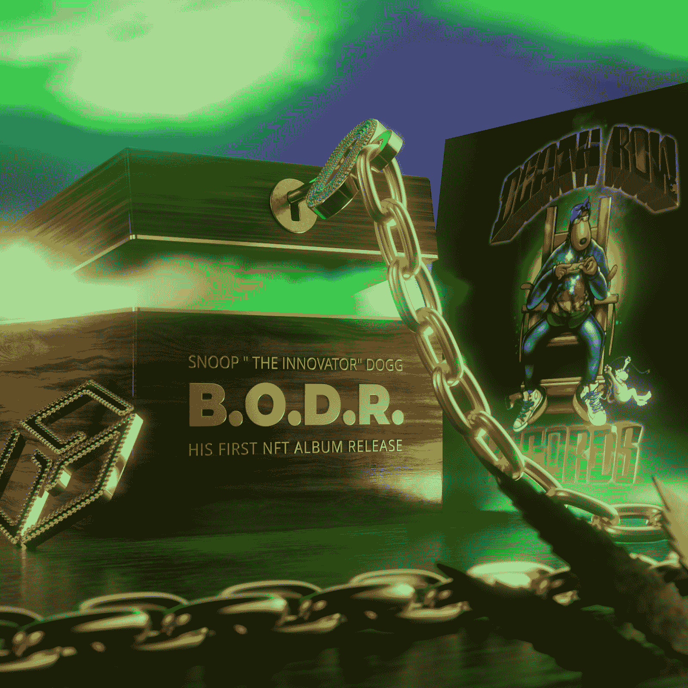

# 史努比狗狗和节日音乐下降 NFT 藏箱

> 原文：<https://web.archive.org/web/https://dappradar.com/blog/snoop-dogg-and-gala-music-drop-nft-stash-boxes>

## 听赚 NFT 是说唱歌手的下一个加密项目

Snoop Dogg 是最热衷于秘密空间的名人之一，现在他与 Gala Music 合作了一个新的音乐主题项目。Stash Boxes 出现在官方音乐网站上，代表这位说唱歌手的新专辑《死囚之歌》(Bacc On Death Row)的 NFTs。

总共有 25000 个储藏盒。每个盒子打开后，都包含了史努比·道格新专辑中 17 首歌曲中的一首。此外，盒子的持有者可以期待收到电影、漫画、图像和独特的音乐会出席机会等独家优惠。

更重要的是，那些设法获得全部 17 首歌曲并完成整张专辑的收藏者将获得更多的额外津贴。这些包括现实生活和数字奖励，独家音乐会体验，以及与史努比狗狗一起参加预派对的机会。此外，最忠实的粉丝将得到一条限量版的死囚锁链。虽然这些额外津贴很重要，但这里要寻找的主要概念是“听赚机制”。关于这一点的细节仍然很少，但是根据 Gala Music 的说法，B . o . d . r NFT 可以作为资产在 Gala Games 产品中获得奖励。

## Gala Music 的“听赚”概念

节日音乐是快速发展的节日游戏生态系统中的一个新分支。通过引入一个专注于音乐的部门，Gala Games 也在推进“听赚”这样的新概念。虽然没有太多关于这种新游戏机制的细节，但根据官方的 Gala Music 网站，一些 NFT(如藏物盒)将使玩家获得奖励。

这很可能会发生，因为游戏玩家在众多的游戏项目中使用他们的音乐 NFT。当一个收藏家打开一个藏物盒来展示 Snoop Dogg 音乐时，他们解锁了整个 Gala 游戏生态系统的未来游戏内实用程序。一个藏东西的盒子可以让你为你的游戏制作音乐。

重要的是，根据最近的声明，Gala Music 的目标是将自己定位为第一家非集中化的唱片公司。当然，听赚机制是这种革命性商业模式的核心。然而，Gala Music 也将致力于在整个 Gala Games 生态系统中为艺术家提供支持，音乐公司有权合理公平地分配奖励。关于 Gala Music 将提供的全部功能的更多细节将于 2 月 11 日公布。

## “创新者”史努比·道格

NFTs 上展示的艺术作品揭示了史努比·道格现在称自己为“创新者”。这个新绰号很可能是受这位说唱歌手在加密领域的大量参与的启发。

随着 B.O.D.R 的发行，Snoop Dogg 是第一批将整张专辑丢在区块链的音乐家之一。更不用说，由于节日游戏和节日音乐生态系统，他是第一批提供听赚 NFTs 的人。

除了最近的声明之外，史努比·道格一直是加密领域最活跃的名人之一。他在沙盒里拥有一处巨大的地产，他的另一个身份是 NFT 顶级收藏家 T2·科佐莫·德·美第奇。从这个意义上说，“创新者”是一个相当合适的昵称。

DappRadar 将继续监督 Snoop Dogg 和 Gala Music，因为更多的公告来自这一合作伙伴关系。如果你想看一眼史努比狗狗的作品集，你可以点击这里查看。此外，你还可以点击这里查看其他名人的钱包，这些钱包已经得到了 dappardar[的验证。](https://web.archive.org/web/20221201203327/https://dappradar.com/blog/celebrity-wallets-a-dive-into-crypto-hollywood)

 NewsletterUnsubscribe at any time. [T&Cs](https://web.archive.org/web/20221201203327/https://dappradar.com/terms) and [Privacy Policy](https://web.archive.org/web/20221201203327/https://dappradar.com/privacy-policy)