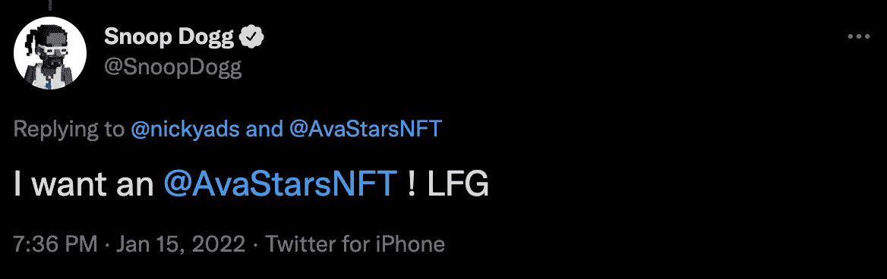
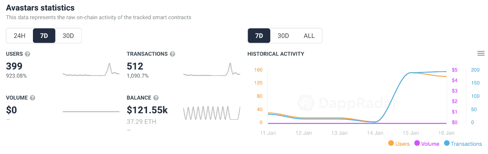
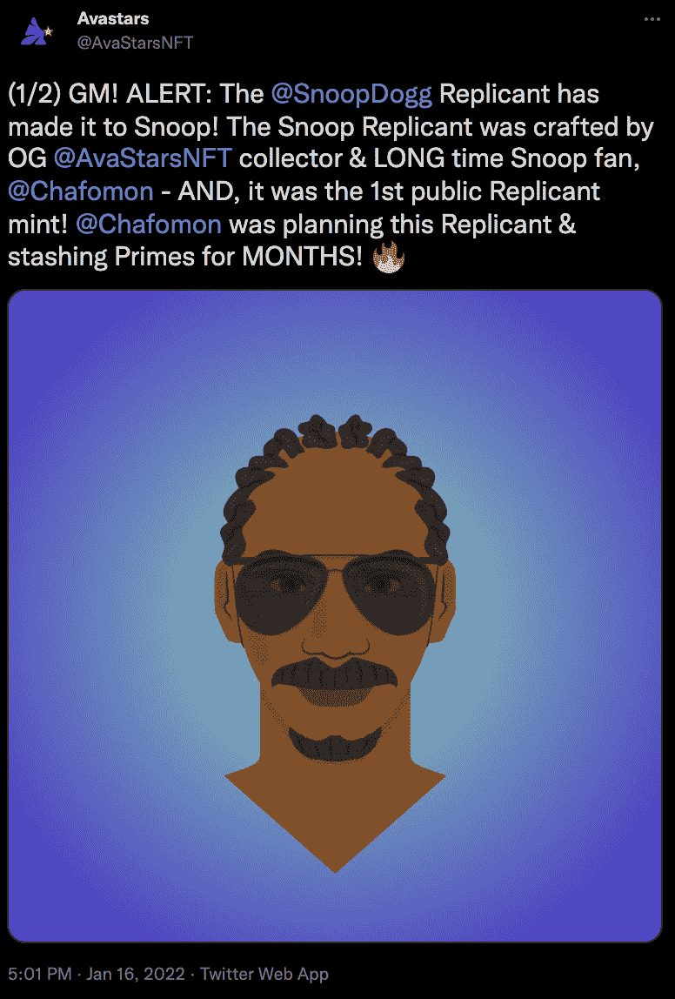

# 史努比狗狗创造了对虚拟化身 NFT 的强劲需求

> 原文：<https://web.archive.org/web/https://dappradar.com/blog/snoop-dogg-creates-strong-demand-for-avastars-nfts>

## 底价翻了一倍，交易量增加了 923%

Snoop Dogg 是目前最活跃的名人 NFT 收藏家之一，周末他将他的影响力用于 Avastars 收藏。在这位说唱巨星发了一条推文之后，Avastars 的底价从 0.1 ETH 短暂飙升至 0.25 ETH。此外，在过去的一周里，与收藏互动的用户飙升了 923%。

Avastars 是以太坊上第一个完全在链上繁殖的 NFT 系列，于 2020 年 2 月推出。从那时起，NFT24 团队已经为这个项目引入了多种额外津贴和功能，包括[复制人的后续集合](https://web.archive.org/web/20221127163408/https://dappradar.com/blog/avastars-shoot-for-the-moon-with-9478-boost-in-trading-volume)。

1 月 15 日，史努比狗狗公开代言 Avastars 系列。这位说唱歌手回复了 Nickyads 的一条[推特，说他想要一个 Avastars NFT。在过去的 48 小时里，名人效应导致了该系列活动的增加。](https://web.archive.org/web/20221127163408/https://twitter.com/SnoopDogg/status/1482406407278268416?s=20)

## 史努比狗狗代言后的头像推送

Snoop Dogg 可能是过去一周加入 Avastars 热潮的最知名的名字。然而，即使在名人代言之前，该系列也有着出色的七天表现。

在过去的七天里，Avastars 吸引了 399 个独特的活动钱包，与前一周相比，这一数字增长了近 1000%。此外，集合的智能合约处理的交易数量在七天内增加了 1090%，达到 512 笔交易。

当然，最突出的活动高峰出现在加密领域的知名人士就 Avastars 展开对话的时候。史努比·道格的加入给了这个系列更多的动力。在交易量大幅飙升之后，1 月 16 日，avastar NFT 平均价格飙升至 0.35 ETH。

令人印象深刻的是，Avastars 在过去几天里记录了几笔超过 2 ETH 的重大销售。过去一周转手的最贵的 Avastars NFT 卖出了 10 ETH，约合 33000 美元。

目前，史努比狗狗还没有购买 Avastars NFT。仔细看看他的作品集会发现他最近购买的是几幅 1989 年的姐妹 NFT。尽管如此，即使提到他想要一个 Avastars NFT 也对该系列的交易活动产生了显著的积极影响。由于 Avastars 育种系统，用户可以创建复制人。当然，[有人](https://web.archive.org/web/20221127163408/https://twitter.com/AvaStarsNFT/status/1482729835483090952)造了一个和史努比一样的 Avastar。

DappRadar 将继续监视 Avastars 和 Snoop Dogg 在加密空间的活动。要获得最新的 NFT 销售数据和最新的 NFT 新闻，请加入 DappRadar PRO。使用 PRO，您还可以访问独家 Discord 频道和讨论。要了解更多关于 Snoop Dogg、Avastars 和 DappRadar PRO 的信息，请查看下面的链接。

[<picture></picture>](https://web.archive.org/web/20221127163408/https://dappradar.com/ethereum/collectibles/avastars)[<picture></picture>](https://web.archive.org/web/20221127163408/https://dappradar.com/hub/wallet/eth/0xce90a7949bb78892f159f428d0dc23a8e3584d75/nfts)[<picture></picture>](https://web.archive.org/web/20221127163408/https://dappradar.com/token/pro) NewsletterUnsubscribe at any time. [T&Cs](https://web.archive.org/web/20221127163408/https://dappradar.com/terms) and [Privacy Policy](https://web.archive.org/web/20221127163408/https://dappradar.com/privacy-policy)