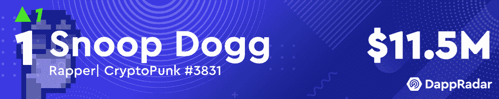
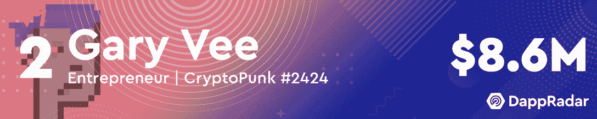
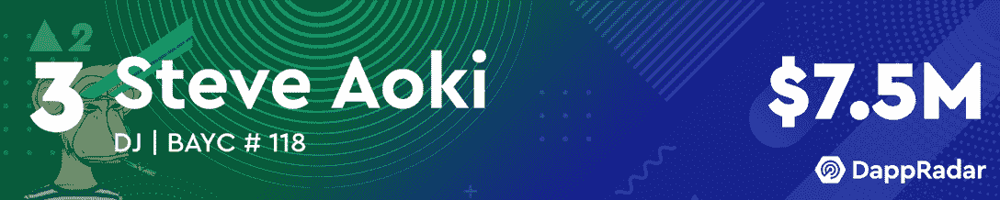
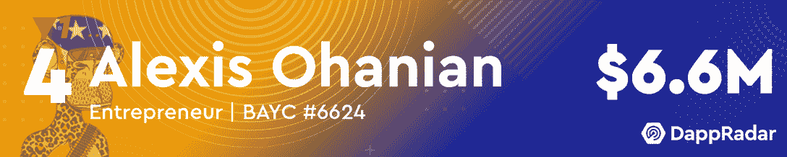
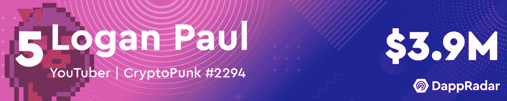
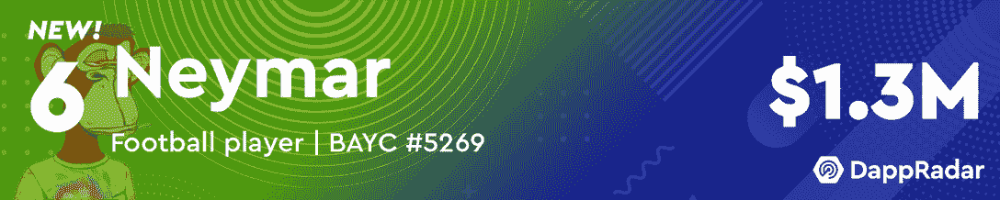
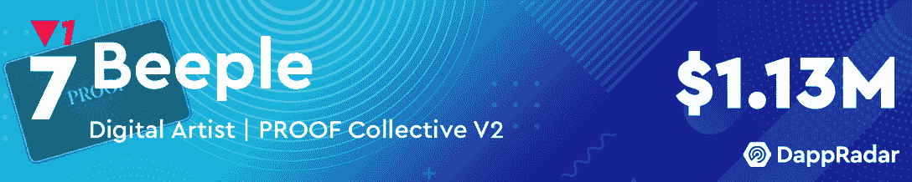
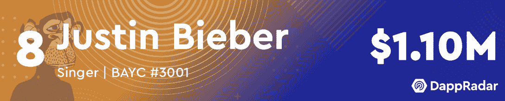
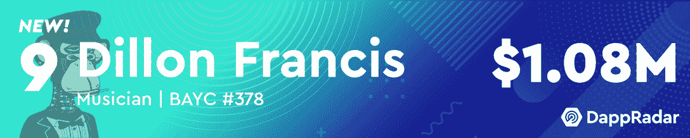
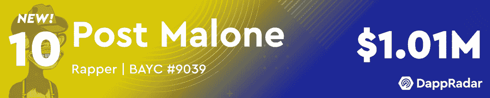

# 史努比·道格取代加里·维成为最富有的 NFT 名人收藏家

> 原文：<https://web.archive.org/web/https://dappradar.com/blog/snoop-dogg-dethrones-gary-vee-as-the-richest-nft-celebrity-collector>

## 2022 年 4 月十大最有价值的名人 NFT 作品集

2022 年 4 月，史努比·道格重返最有价值名人 NFT 投资组合榜首。他废黜了投资组合价值刚刚超过 800 万美元的加里·维。尽管推出了第二波 VeeFriends NFTs，但在谈到他的个人投资组合时，加里·维似乎已经失去了一点他的魔力。

亚历克西斯·奥哈尼安跌至第四位，尽管他的 NFT 投资组合价值超过 75 万美元。Reddit 的联合创始人似乎声称，他的 PROOF Collective 会员资格附带了两只 Moonbirds NFTs，这有助于他提高自己投资组合的整体价值。奥哈尼安还在新推出的无聊猿元宇宙之地上下了重注，他的钱包里有 8 本《彼岸》杂志。

DJ 史蒂夫·青木在他的投资组合中增加了超过 300 万美元的 NFTs 后，与 3 月份相比上升了两个位置。他模仿了威纳斯体育通行证，买了两个月鸟 NFT，几个 8 比特 Me NFTs，以及令人印象深刻的 19 个彼岸陆地 NFT。

排名的另一个令人印象深刻的变化是内马尔的回归。这位足球运动员上个月跌出了前十名，然而，他现在又回到了第六名。在过去的 30 天里，内马尔在他的 NFT 投资组合中增加了超过 62 万美元。令人印象深刻的是，他只购买了 MAYC #10953 ，然而他持有的其他资产也升值了。

狄龙·弗朗西斯和波斯特·马龙也将于本月进入排行榜。弗朗西斯在他的钱包里增加了超过 40 万美元的 NFT 后排名第九。其中包括 [2 个其他方 NFT](https://web.archive.org/web/20221004133048/https://dappradar.com/hub/wallet/eth/0x58473e9ac681c4424ca74619281ff71801d002d6/nfts/1/otherdeed-for-otherside)。随着他的 [2 BAYC NFTs](https://web.archive.org/web/20221004133048/https://dappradar.com/hub/wallet/eth/0xbea020c3bd417f30de4d6bd05b0ed310ac586cc0/nfts/1/bored-ape-yacht-club-3) 升值，Post Malone 在 4 月份的投资组合价值增加了 17 万多美元。有趣的是，马龙还没有认领他的另一面 NFT，或者已经认领并转移到另一个钱包，因为它们在[的投资组合](https://web.archive.org/web/20221004133048/https://dappradar.com/hub/wallet/eth/0xbea020c3bd417f30de4d6bd05b0ed310ac586cc0/nfts)中不可见。

继续阅读，找出四月份最有价值的名人 NFT 作品集的完整列表。

***这里需要注意的一点是，名人会吸引大量注意力到他们的钱包，并收到数千份 NFT 作为礼物。我们已经手动筛选了所有这些名人钱包，给读者带来了一个更加过滤的视角。为了实现这一点，我们已经排除了赠送给这些钱包的 NFT。如果您看到此列表与 DappRadar 投资组合跟踪器上显示的值之间存在差异，请考虑这一点。***

## 四月份十大最有价值的名人 NFT 作品集

[<picture></picture>](https://web.archive.org/web/20221004133048/https://dappradar.com/hub/wallet/eth/0xce90a7949bb78892f159f428d0dc23a8e3584d75/nfts/1)[<picture></picture>](https://web.archive.org/web/20221004133048/https://dappradar.com/hub/wallet/eth/0xd6a984153acb6c9e2d788f08c2465a1358bb89a7/nfts/1)[<picture></picture>](https://web.archive.org/web/20221004133048/https://dappradar.com/hub/wallet/eth/0xe4bbcbff51e61d0d95fcc5016609ac8354b177c4/nfts)[<picture></picture>](https://web.archive.org/web/20221004133048/https://dappradar.com/hub/wallet/eth/0x0ed1e02164a2a9fad7a9f9b5b9e71694c3fad7f2/nfts)[<picture></picture>](https://web.archive.org/web/20221004133048/https://dappradar.com/hub/wallet/eth/0xff0bd4aa3496739d5667adc10e2b843dfab5712b/nfts/1)[<picture></picture>](https://web.archive.org/web/20221004133048/https://dappradar.com/hub/wallet/eth/0xc4505db8cc490767fa6f4b6f0f2bdd668b357a5d)[<picture></picture>](https://web.archive.org/web/20221004133048/https://dappradar.com/hub/wallet/eth/0xc6b0562605d35ee710138402b878ffe6f2e23807/nfts)[<picture></picture>](https://web.archive.org/web/20221004133048/https://dappradar.com/hub/wallet/eth/0xe21dc18513e3e68a52f9fcdacfd56948d43a11c6/nfts)[<picture></picture>](https://web.archive.org/web/20221004133048/https://dappradar.com/hub/wallet/eth/0x58473e9ac681c4424ca74619281ff71801d002d6)[<picture></picture>](https://web.archive.org/web/20221004133048/https://dappradar.com/hub/wallet/eth/0xbea020c3bd417f30de4d6bd05b0ed310ac586cc0/nfts)

## 史努比·道格在上面，然而另一边的 NFTs 占据了中心舞台

四月是 NFT 几次大降水的月份。首先，PROOF Collective 推出了其头像系列 [Moonbirds](https://web.archive.org/web/20221004133048/https://dappradar.com/ethereum/collectibles/moonbirds) 。这些像素化的鸟很快声名鹊起，目前的底价为 31 ETH，接近 9 万美元。一些名人很早就加入了证明集体，并得到了免费空投的月鸟。

四月初，证据主导了这个领域，而宇迦实验室在过去几周占据了舞台。BAYC 和 MAYC 背后的团队将备受期待的虚拟世界 Otherside 的发布日期定在了 4 月 30 日。整个 NFT 市场都感受到了这一事件的重要性，因为收藏家们正争先恐后地为造币厂筹集足够的流动性。

另一边的 NFT 目前的底价大约是 1 万美元。然而，顶级收藏家和这份名单上的一些名人正在堆积无数其他作品。[史蒂夫·青木在这个月快速攀升到前三名主要是因为他的 19 个其他行为。从这个意义上说，宇迦实验室理所当然地在 2022 年 4 月占据了市场领导者的位置。令人印象深刻的是，位居富豪榜榜首的史努比·道格并没有任何贝茨、MAYC 或其他球队的 NFT。](https://web.archive.org/web/20221004133048/https://dappradar.com/hub/wallet/eth/0xe4bbcbff51e61d0d95fcc5016609ac8354b177c4/nfts)

令人印象深刻的是，本月富豪榜上所有名人的钱包里都有价值超过 100 万美元的 NFT。在加密和传统金融市场整体看跌的背景下，这一点非常显著。

达普拉达将继续监测最有价值的名人 NFT 投资组合，为您带来最热门的发展。如果你想探索更多名人钱包，请查看官方 DappRadar 页面。此外，你可以在[的推特](https://web.archive.org/web/20221004133048/https://twitter.com/dappradar)上关注 DappRadar，抢先获得最新的 NFT 名人独家新闻。

 NewsletterUnsubscribe at any time. [T&Cs](https://web.archive.org/web/20221004133048/https://dappradar.com/terms) and [Privacy Policy](https://web.archive.org/web/20221004133048/https://dappradar.com/privacy-policy)