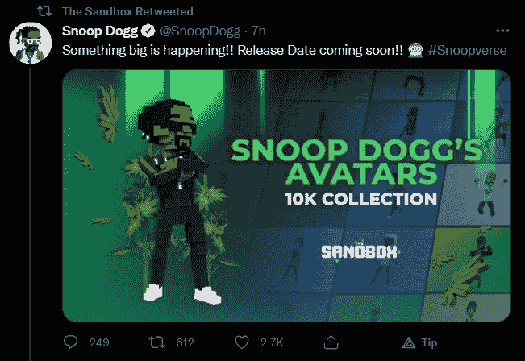
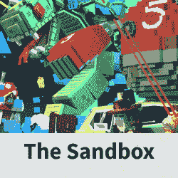

# 史努比·道格在沙盒里推出 NFT 头像

> 原文：<https://web.archive.org/web/https://dappradar.com/blog/snoop-dogg-launching-nft-avatars-in-the-sandbox>

## 不是 420 个化身，而是一万个强有力的集合

**史努比狗狗已经** [**宣布**](https://web.archive.org/web/20221206110148/https://twitter.com/SnoopDogg/status/1481791560500928514) **一群化身来到沙箱。在 Twitter 上，这位说唱歌手和连续投资者用一张图片和“一些大事情正在发生”的文字透露了这个项目。发布日期即将到来。**

关于 NFT 收藏的细节肯定是缺失的，但是史努比·道格已经和沙盒合作了很长一段时间。这位美国说唱歌手在推特上与他的粉丝分享说，每个持有 [Snoopverse Pass NFT](https://web.archive.org/web/20221206110148/https://www.sandbox.game/en/assets/snoopverse-early-access-pass/dd501112-05a7-4ed2-baa0-3a10f6800df5/?__cf_chl_jschl_tk__=C.FGa2q596AxiyraMvEHH6AAFr3IbMEXy1VMRnE1hl8-1642149557-0-gaNycGzNDdE) 的人都自动获得销售权。这些通行证供应有限，价格为 525 沙，相当于 2539 美元。

图像显示将会有 10000 个 NFT 头像，但玩家如何在沙盒中或游戏世界之外通过 Snoop 使用这些角色尚未可知。2021 年末，Snoop Dogg [发布了](https://web.archive.org/web/20221206110148/https://dappradar.com/blog/snoop-dogg-moves-into-the-sandbox) Snoopverse，这是沙盒游戏世界的一部分。在 12 月的早期访问活动中，玩家可以在沙盒的体相关虚拟世界中第一次看到 Snoop Dogg 的存在。

Twitter/Snoop Dogg

## 沙盒炒作很强

沙盒已经成为市场上最热门的元宇宙项目之一。自从脸书改名为梅塔后，土地价格直线上升。对土地需求的增加和本地[沙石](https://web.archive.org/web/20221206110148/https://dappradar.com/hub/token/eth/SAND?from=0x3845badade8e6dff049820680d1f14bd3903a5d0)的更高价值推高了价格。在撰写本报告时，二级市场上最便宜的地块价格相当于 11，700 美元。

对元宇宙的主流关注也吸引了各种品牌。史努比·道格不是唯一一个。在沙盒中，玩家会发现像爱心熊、蓝精灵、雅达利、行尸走肉和阿迪达斯这样的品牌。在其他虚拟世界[有几十个其他品牌](https://web.archive.org/web/20221206110148/https://dappradar.com/blog/10-major-brands-in-the-metaverse)，真正显示了虚拟现实产生了多大的兴趣。

有了分散土地、隐体素、Somnium 空间和沙盒，我们只是触及了将成为一个巨大的虚拟世界网络的表面。全部由区块链技术驱动，形成了元宇宙。脸书成为元后，元宇宙土地交易繁荣起来。虚拟世界[在 2021 年创造了 5 亿美元](https://web.archive.org/web/20221206110148/https://dappradar.com/blog/2021-dapp-industry-report)的交易额，总市值达到 35 亿美元。元宇宙的土地[以豪华别墅](https://web.archive.org/web/20221206110148/https://dappradar.com/hub/assets/eth/0x959e104e1a4db6317fa58f8295f586e1a978c297/4339)的价格出售。

虽然元宇宙是一个热门话题，但名人正蜂拥进入这个新领域。帕丽斯·希尔顿已经在分散地举办了一场音乐会，迪德莫在沙盒里买了块地，这样的例子不胜枚举。在 DappRadar [上，我们追踪各种名人和他们的钱包](https://web.archive.org/web/20221206110148/https://dappradar.com/blog/celebrity-wallets-a-dive-into-crypto-hollywood)，让你深入了解他们收集了什么。

[<picture></picture>](https://web.archive.org/web/20221206110148/https://dappradar.com/ethereum/games/the-sandbox)[<picture></picture>](https://web.archive.org/web/20221206110148/https://dappradar.com/hub/token/eth?to=0x3845badade8e6dff049820680d1f14bd3903a5d0)[<picture></picture>](https://web.archive.org/web/20221206110148/https://dappradar.com/blog/the-sandbox-land-valuation-report)