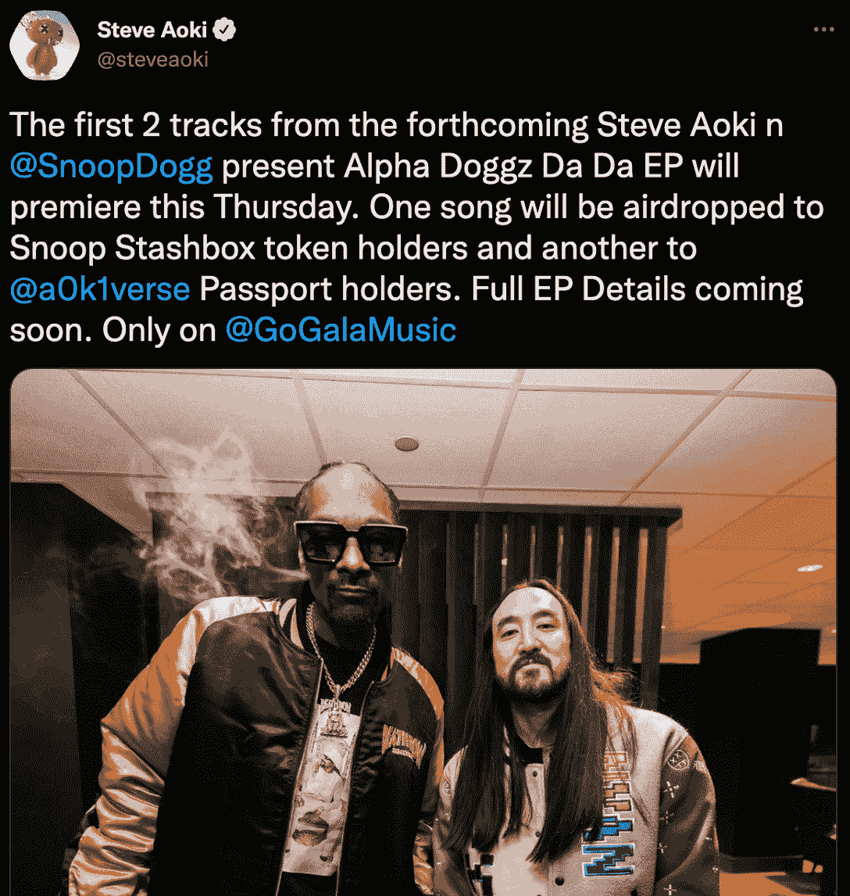
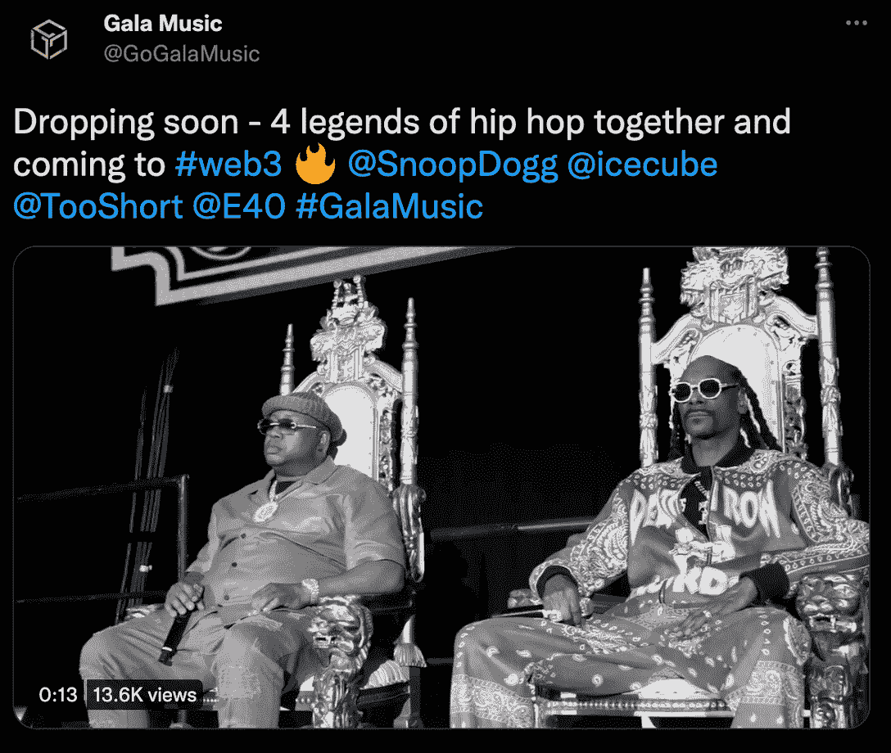

# 史努比·道格和史蒂夫·青木合作独家 NFT 音乐专辑

> 原文：<https://web.archive.org/web/https://dappradar.com/blog/snoop-dogg-steve-aoki-collaborate-on-exclusive-nft-music-album>

## 这对组合将在周四向精选收藏者空投一首阿尔法狗哒哒的歌曲

音乐先锋史努比·道格和史蒂夫·青木联手推出了一张 NFT 的独家专辑。专辑中的前两首歌曲将于下周上市。令人印象深刻的是，持有 Snoop Stashbox 令牌或 NFT Aoki verse 护照的收藏者将免费获得一首歌曲。

## 总结:

*   史努比·道格和史蒂夫·青木在音乐领域开创了网络 3 革命
*   阿尔法狗哒哒哒的专辑将分阶段发行，前两首歌曲将于下周发行
*   独家 NFT 概念和有限的收藏品和信息
*   Gala Music 与四位嘻哈传奇人物展开了令人兴奋的新合作

## 史努比·道格和史蒂夫·青木先锋网 3 音乐

音乐行业还远远没有采用区块链技术和 NFTs 作为通向未来的道路。但是，也有像[史努比狗狗](https://web.archive.org/web/20220706102110/https://dappradar.com/hub/wallet/eth/0xce90a7949bb78892f159f428d0dc23a8e3584d75/nfts/1)、[史蒂夫·青木](https://web.archive.org/web/20220706102110/https://dappradar.com/hub/wallet/eth/0xe4bbcbff51e61d0d95fcc5016609ac8354b177c4)、 [DJ RAC](https://web.archive.org/web/20220706102110/https://dappradar.com/blog/music-flows-through-the-crypto-world/) 这样的离群值。音乐人现在转向 NFTs，让他们的粉丝从独家权利和利益中受益，而他们最喜欢的创作者从增加的版税收入中受益。

Snoop Dogg 已经与 Gala Music 合作发行了他的 B.O.D.R NFT 专辑。史蒂夫·青木参加了许多元宇宙的活动，随着他的 Aokiverse 护照 NFT 通行证的发布，他完全融入了 web3 空间。

这两位音乐明星之间的新合作进一步证明了音乐界的大牌对 web3 越来越喜爱和感兴趣。更重要的是，即将发行的 Alpha Doggz Da Da 专辑将为那些已经持有创作者之前 NFT 作品的收藏者带来众多好处。

## 阿尔法狗哒哒滴

根据史蒂夫·青木最近的一条推文，新的 Alpha Doggz Da Da 专辑将包括一首歌曲的免费空投，以选择收藏家。持有 Snoop Stashbox 代币或 NFT Aoki verse 护照的 NFT 爱好者将免费获得一首歌曲。

该推文还详细说明了专辑将分阶段推出，更多细节将会推出。独家发行的前两首歌曲将于下周上市。整个合作是在 Gala Music 的支持下完成的。Gala Music 是 Gala Games 的音乐子公司，旨在吸引更多的音乐人加入并扩大 web3 音乐产业。

## Gala Music 与 Snoop Dogg 一起调侃新项目

除了即将推出的阿尔法狗哒哒专辑，Gala Music 正在积极地与史努比狗合作一个不同的项目。虽然关于该项目的细节仍然非常缺乏，但音乐工作室上个月发布了一条挑逗性的推文。

根据预告，四个嘻哈和说唱传奇将联手拥抱 web3。史努比·道格、艾斯·库伯、图肖特和 E40 将携手合作一个独家的 NFT 项目，利用 Gala Music 的区块链力量。

## 作为访问通行证的专用 NFT

独家 NFT 正在成为 NFT 领域的新亮点。随着创作者想方设法探索 web3 专属俱乐部并获得通行证，NFT 正成为该空间的一个重要部分。Snoop Dogg 和史蒂夫·青木的独家音乐专辑 drop 也是这一趋势的一部分。因为持有这两位音乐家前两张专辑的人将免费获得一首歌曲。

例如，像 PROOF Collective 这样的其他独家俱乐部，让持有者能够进入梦寐以求的社区。这种 NFT 通行证已经形成了一种新的趋势，越来越多的项目倾向于授予他们的收藏家额外的访问权限。

随着 Gala Music 将更多的大音乐家引入 web3，DappRadar 将继续关注 NFT 空间。如果你想了解最新的 NFT 音乐新闻，请在 Twitter 上关注 DappRadar。此外，你可以加入独家的 [DappRadar PRO](https://web.archive.org/web/20220706102110/https://dappradar.com/token/pro) 社区，以获得私人的 [Discord](https://web.archive.org/web/20220706102110/https://discord.gg/4ybbssrHkm) 讨论频道。

 NewsletterUnsubscribe at any time. [T&Cs](https://web.archive.org/web/20220706102110/https://dappradar.com/terms) and [Privacy Policy](https://web.archive.org/web/20220706102110/https://dappradar.com/privacy-policy)