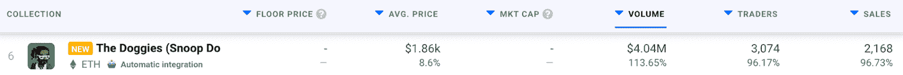
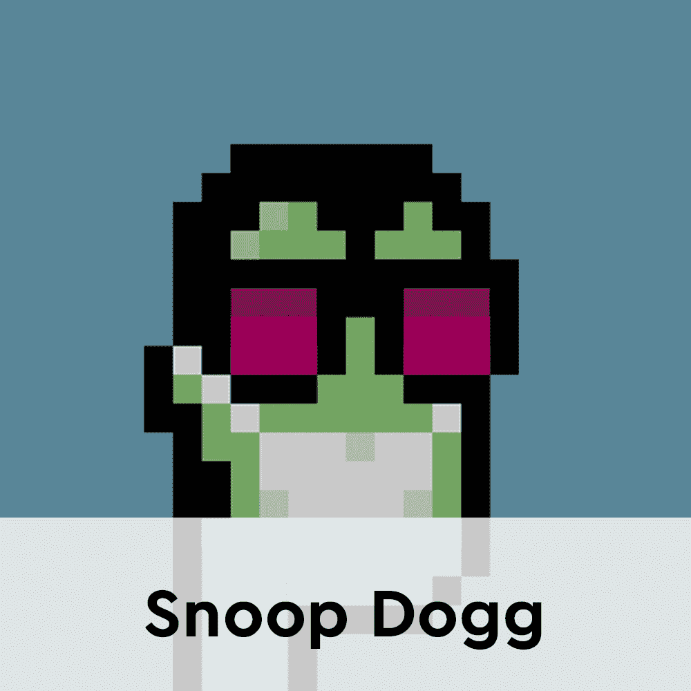
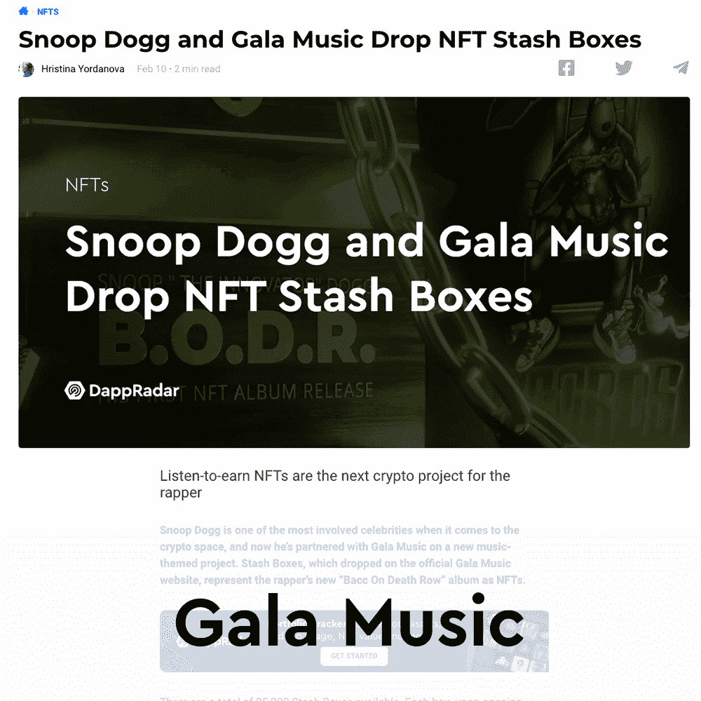
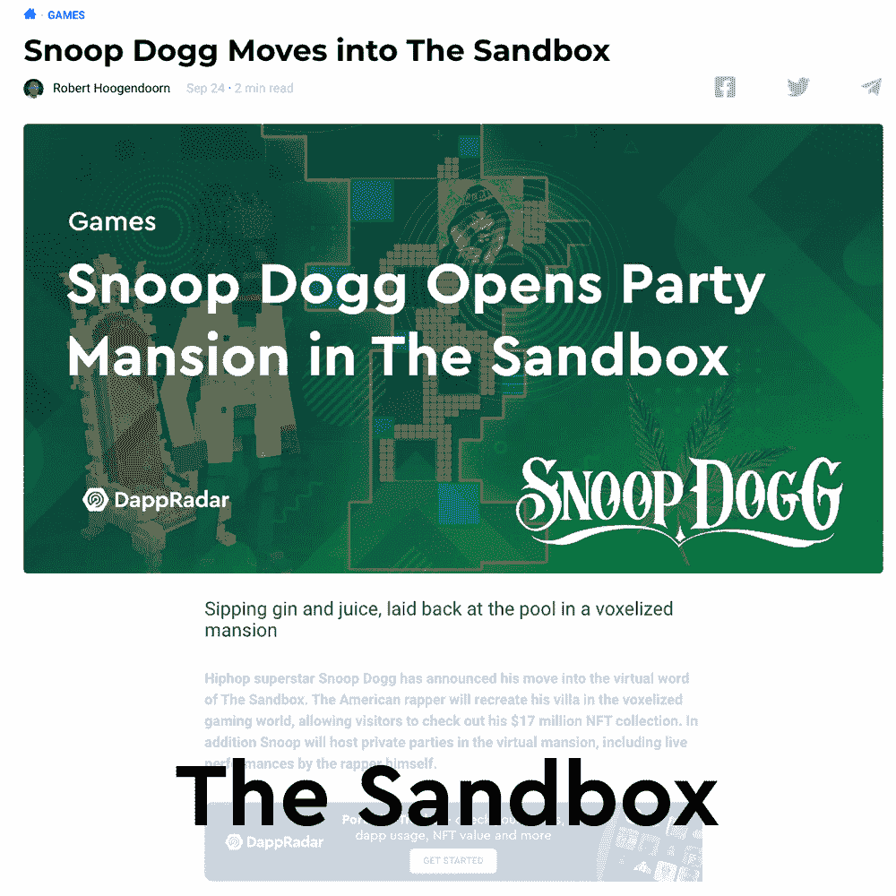

# 史努比狗狗 NFT 地板价格在上升

> 原文：<https://web.archive.org/web/https://dappradar.com/blog/snoop-dogg-the-doggies-nft-floor-price-on-the-rise>

## 该项目在短短 24 小时内将底价推高了 1400 多美元

史努比狗狗昨天正式推出了他的狗狗 NFT 系列，底价已经超过了 1900 美元。令人印象深刻的是，这比 150 砂的薄荷价格增加了 1400 多美元，约合 500 美元。

仅在过去的 24 小时内，狗狗们就登记了 2168 笔交易，产生了超过 400 万美元的交易量。根据 DappRadar 顶级 NFT 收藏排名，Snoop Dogg 的头像收藏中一件 NFT 的平均价格是 1860 美元。

小狗系列由 10，000 个模仿著名说唱歌手的独特头像组成。这个项目是史努比狗狗与沙盒长期合作的自然进展。去年，这位音乐明星[在虚拟世界](https://web.archive.org/web/20221127145236/https://dappradar.com/blog/snoop-dogg-moves-into-the-sandbox%5C)获得了一处相当大的地产，这也是他开发窥探器的主要场地。

Doggies collection 的发布是 Snoop Dogg 主要涉足加密领域的下一步。令人印象深刻的是，该系列已经引起了人们的浓厚兴趣，而官方设计尚未透露。发布会定于世界协调时 2 月 24 日晚上 10 点举行。

狗狗们的一个突出元素是，收集 10000 个 NFT 已经统计了 7657 个主人。项目中只有少数鲸鱼，包括拥有 1300 万美元投资组合的[Coco](https://web.archive.org/web/20221127145236/https://dappradar.com/hub/wallet/eth/0x721931508df2764fd4f70c53da646cb8aed16ace)和拥有 260 万美元投资组合的[saint bayview](https://web.archive.org/web/20221127145236/https://dappradar.com/hub/wallet/eth/0xb3ee5011a7965905cde351ea4905ff4725189a3b)。

## 史努比·道格接管了加密空间

狗狗头像系列是史努比狗狗元宇宙之旅的下一个重大进展。这位说唱歌手已经朝着融合主流音乐产业和秘密空间的方向迈出了重要的一步。

最近，这位明星[与 Gala Games 的新音乐平台 Gala Music](https://web.archive.org/web/20221127145236/https://dappradar.com/blog/snoop-dogg-and-gala-music-drop-nft-stash-boxes/) 合作推出了他的最新专辑 B.O.D.R。这是一个强烈的信号，表明史努比正在元宇宙和 NFT 大举投资。这张专辑作为 NFT 藏盒精选落选，成为第一张作为 NFT 落选的音乐专辑。

这样的先锋举动使得史努比·道格成为了密码领域的核心人物。除了革命性的 NFT 专辑，这位说唱歌手还是一个狂热的收藏家。他的[作品集](https://web.archive.org/web/20221127145236/https://dappradar.com/hub/wallet/eth/0xce90a7949bb78892f159f428d0dc23a8e3584d75/nfts/1)每个月都会登上[达普拉达名人富豪榜](https://web.archive.org/web/20221127145236/https://dappradar.com/blog/top-10-most-valuable-celebrity-nft-portfolios-in-january/)的排行榜，这要归功于其储存的大量 NFT 收藏。更重要的是，史努比·多格已经成为加密推特上最活跃的贡献者之一，他的另一个自我简介是科佐莫·德·美第奇。

DappRadar 将继续监视小狗和 Snoop Dogg 进入元宇宙的进一步行动。要密切跟踪他最新的 NFT 购买，并了解更多关于这位说唱歌手在加密领域的参与，请查看下面的链接。此外，你可以在 Twitter 上关注 DappRadar，首先了解 NFT 和 T2 的最新消息。

[<picture></picture>](https://web.archive.org/web/20221127145236/https://dappradar.com/hub/wallet/eth/0xce90a7949bb78892f159f428d0dc23a8e3584d75/nfts/1)[<picture></picture>](https://web.archive.org/web/20221127145236/https://dappradar.com/blog/snoop-dogg-and-gala-music-drop-nft-stash-boxes/)[<picture></picture>](https://web.archive.org/web/20221127145236/https://dappradar.com/blog/snoop-dogg-moves-into-the-sandbox%5C) NewsletterUnsubscribe at any time. [T&Cs](https://web.archive.org/web/20221127145236/https://dappradar.com/terms) and [Privacy Policy](https://web.archive.org/web/20221127145236/https://dappradar.com/privacy-policy)