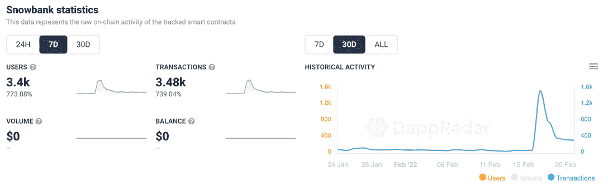
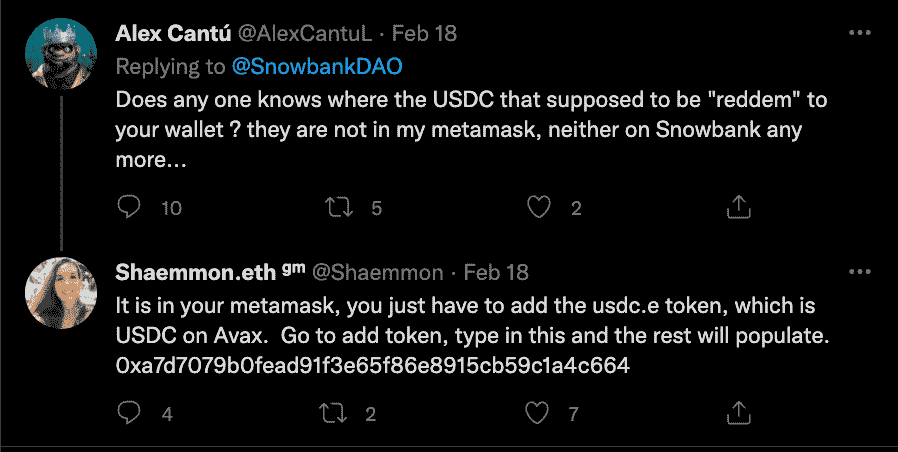

# 雪堆关闭引发大逃亡& USDC 声称

> 原文：<https://web.archive.org/web/https://dappradar.com/blog/snowbank-shut-down-sparks-exodus-usdc-claim>

## 雪崩式分散储备货币屈服于压力

雪崩区块链 DeFi dapp SnowBank 宣布结束该项目，因为今年对重定基础项目的整体兴趣降至历史最低点。尽管有 v2 计划，SnowBank 表示，一个全新的新项目可以更好地抓住机会。投资者可以将任何持有的 SB 代币换成 USDC 的最终发行活动，是本周 dapp 指标出现飙升的原因。

达到峰值的 dapp 指标通常预示着积极的事件，如推出新的市场、产量农场或 NFT 下降。然而，事情并不总是像它们出现的那样，因为越来越多的钱包连接到一个平台也可能因为这样或那样的原因而离开。在这种情况下，对重定基础项目的兴趣普遍下降。

连接到 SnowBank 的钱包数量跃升超过 700%,超过 3400 个，在 2 月 17 日[官方宣布](https://web.archive.org/web/20221127143554/https://twitter.com/SnowbankDAO/status/1494259215539572740)的那一天达到了一个明显的高峰，因为用户纷纷涌入认领他们的 USDC。

## 雪堤刀是什么？

Snowbank DAO 是 Avalanche 上基于 SB 令牌的分散储备货币协议。每个 SB 代币由 Snowbank DAO treasury 中的一篮子资产支持，如 MIM、SB-AVAX LP 代币等，赋予其不可跌破的内在价值。

## 哪里可以把我的 SB 换成 USDC？

重要的是，重新分配没有截止日期，代币持有者可以随时用 SB 交换固定的 USDC 价值，不会出现滑动。你可以在这里用你的 SB 代币兑换 USDC:[https://dapp.snowbank.finance/#/redeem](https://web.archive.org/web/20221127143554/https://dapp.snowbank.finance/#/redeem)

无论互换何时执行，每个人都将获得相同数量的 USDC。每个 SB 的当前无风险值(RFV)已经在 SnowBank 仪表盘上显示出来:[https://dapp.snowbank.finance/#/dashboard](https://web.archive.org/web/20221127143554/https://dapp.snowbank.finance/#/dashboard)

***Some were quick to find issues caused by user error***

## 什么是重置基础？

2020 年的 DeFi 宣传引起了人们对旨在改变传统金融范式的项目的关注。DeFi 在 2020 年夏天达到顶峰，受到了最多的关注，并引发了人们理财方式的转变。炒作中出现的一个产品是重新设定协议的基础。

重定基数或价格弹性代币被设计成根据代币的价格波动自动调整流通代币的供应量。Rebase tokens 相对类似于 stablecoins，因为它们都有价格目标。然而，与稳定硬币不同的是，重配硬币的供给是有弹性的，这意味着流通的供给会根据供求关系进行调整，而不会改变用户钱包中硬币的价值。

## 它是如何工作的

重定基数经常发生。例如，Ampleforth 的 AMPL 每 24 小时就有一次调整，目标价格为 1 美元。如果其价格超过 1 美元，在重定基数期间，流通供应量会扩大，从而降低每枚 AMPL 币的价值。相反，如果 AMPL 价格跌至 1 美元以下，当前供应在重定基数期间收缩，从而增加了每枚代币的价值。

从用户的角度来看，每个钱包中的代币数量会相应增加或减少。然而，由于重定基数机制，每个钱包的总价值不会改变。这种投资方法可以被证明是非常有利可图和高风险的，因为投资者可以很容易赚钱，也可以很快失去它。

## 现在怎么办？

根据 SnowBank 文档和 Twitter，该团队暂停了 Snowbank v2 的计划，并表示另一个团队可以在未来接手该项目。进一步鼓励任何愿意开发这种流动性即服务协议的人自由使用文档中提供的第一版规范[。](https://web.archive.org/web/20221127143554/https://docs.snowbank.finance/)

重置代币可以帮助对冲通货膨胀或通货紧缩，从本质上保护和帮助储存投资价值。它们不仅可以在法定货币价值方面提供帮助，而且如果你大量投资于数字资产，它们还可以为你的加密货币投资组合提供对冲。

现在，随着通货膨胀问题对地球上几乎每个人来说都变得越来越严重，似乎像 [Ampleforth 这样的平台已经推出了一些严肃的教育](https://web.archive.org/web/20221127143554/https://twitter.com/ampleforthorg),让那些寻求战胜通货膨胀的投资者更接近重定基础，更好地理解机制的工作方式。

[<picture></picture>](https://web.archive.org/web/20221127143554/https://dappradar.com/blog/introducing-the-avalanche-blockchain)[<picture></picture>](https://web.archive.org/web/20221127143554/https://dappradar.com/rankings/protocol/avalanche)[<picture></picture>](https://web.archive.org/web/20221127143554/https://dappradar.com/avalanche/defi/pangolin-exchange)

***以上不构成投资建议。此处给出的信息仅供参考。请行使尽职调查，做你的研究。作者持有 ETH、BTC、AGIX、HEX、LINK、GRT、CRO、OMI、不可变 X、GALA、AVASTR、GMEE、CUBE、RADAR、FLOW、FTM、BNB、SPS、WRLD、ATOM 和 ADA。***

 NewsletterUnsubscribe at any time. [T&Cs](https://web.archive.org/web/20221127143554/https://dappradar.com/terms) and [Privacy Policy](https://web.archive.org/web/20221127143554/https://dappradar.com/privacy-policy)