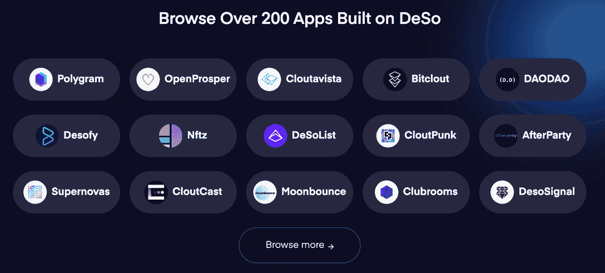
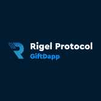

# 社交区块链 DeSo 集成 MetaMask，实现无缝 SocialFi

> 原文：<https://web.archive.org/web/https://dappradar.com/blog/social-blockchain-deso-integrates-metamask-enabling-seamlessly-socialfi>

## DeSo 努力推动 Web3 社交大规模采用

DeSo 本周宣布了其 MetaMask 集成，开启了互操作性的新时代。用户现在可以使用 MetaMask 作为中心枢纽，自由地与 DeSo social dapps 进行交互。以太坊是第一个加入 DeSo 扩张计划的，未来还将整合许多其他区块链生态系统。

**概要:**

*   Web3 可以用来建立对社交媒体的信任，将用户从 Web2 平台的垄断政策中解放出来。
*   去中心化社交区块链 DeSo 已经集成了 [MetaMask，](https://web.archive.org/web/20220926001332/https://dappradar.com/ethereum/defi/metamask-swap)允许以太坊用户在 DeSo 上体验超过 200 个 dapps。
*   DappRadar 帮助用户找到新兴的 Web3 社交平台。例如，[镜头协议](https://web.archive.org/web/20220926001332/https://dappradar.com/polygon/social/lens-protocol)和 [GiftDAPP](https://web.archive.org/web/20220926001332/https://dappradar.com/steem/social/steemit) 都是增长最快的社交应用。

Web2 社交媒体改变了我们与互联网互动的模式。但是，另一方面，他们也引起了很多不满。这些垄断平台定义了所有规则，规定了谁可以使用和用户可以说什么，并剥夺了用户对他们创建的内容的所有权。

Web3 有望开启社交网络的新时代。

DeSo 是一款定制的第一层区块链，用于扩展分散式社交应用，为数十亿用户提供服务。这是一年前引起轰动的 Web3 社交媒体 Bitclout 的潜在区块链。

DeSo 在 Twitter 上宣布，任何拥有元面具的人现在都可以在 DeSo 上无缝地创建一个去中心化的社交身份。注册过程不到 30 秒，为 MetaMask 用户带来 Web3 社交体验，零油费，零摩擦，100%在线。

## 使用元掩码在 DeSO 上创建 Web3 社交身份

DeSo 是一个独立于[以太坊](https://web.archive.org/web/20220926001332/https://dappradar.com/rankings/protocol/ethereum)的第一层区块链，这意味着 MetaMask 本身并不与 DeSo 集成。整合 MetaMask 是 DeSo 扩展 Web3 社交媒体的基本步骤。

要了解更多关于 DeSo 如何在技术上实现这个过程，你可以阅读 DeSo 博客上的这篇文章。这里有一个简单的分类。

当用户第一次使用 MetaMask 上的 [ETH](https://web.archive.org/web/20220926001332/https://dappradar.com/hub/token/eth/ETH) 帐户登录 DeSo 支持的社交 dapp 时，MetaMask 会提示用户签署一条消息。这一步要求用户授权一个随机生成的派生密钥代表帐户进行操作。

此派生密钥将允许 Identity 代表 MetaMask 用户执行 DeSo 交易，并有助于在 DeSo 上创建帐户。对于那些不熟悉 DeSo 的人来说，身份服务提供了一种方便而安全的方式来管理基于 DeSo 构建的应用程序中的用户凭证(密钥对)。

经过测试，我可以确认整个过程是顺利的，不需要一分钟。完成注册的人可以开始浏览 DeSo 上的 200 多个社交 dapps。

同时，你可以通过 [DappRadar 社交排名发现最受欢迎的社交媒体 dapps。](https://web.archive.org/web/20220926001332/https://dappradar.com/rankings/category/social)

## Web3 社交网络正在酝酿新趋势

Web3 正在撼动游戏、音乐、时尚，社交网络也在其野心范围之内。尽管网络效应尚未发生，但 Web3 social 无疑正在酝酿新的趋势。

你可以自己使用 DappRadar 社交排名来查找区块链社交网络的最新动态。所以让我们深入图表，看看哪些社交 dapps 正在获得关注。

[Lens Protocol](https://web.archive.org/web/20220926001332/https://dappradar.com/polygon/social/lens-protocol) 是一个用户拥有的、开放的社交图，任何应用程序都可以插入其中。它允许 dapps 实现一些功能，比如创建个人资料、关注他人、创建内容、收集出版物等等。值得注意的是，所有这些功能都是完全在链上的，由 Polygon 提供支持。

Rigel 协议上的 GiftDApp 允许用户赢取奖品和发送礼物。它旨在为 dapps、社区和有影响力的人提供一个分散的礼物系统，以奖励他们的粉丝。

Web3 social 正在等待更多的创新者来进一步释放它的潜力。除了上面提到的项目，蜂巢上的[peak](https://web.archive.org/web/20220926001332/https://dappradar.com/hive/social/peakd)，克莱顿上的[some sing](https://web.archive.org/web/20220926001332/https://dappradar.com/klaytn/social/somesing)，还有更多正在崛起。当然，不要忘记开创性的 Steemit 仍在发挥作用。

#### 镜头协议

[<picture></picture>](https://web.archive.org/web/20220926001332/https://dappradar.com/polygon/social/lens-protocol)

#### GiftDapp

[<picture></picture>](https://web.archive.org/web/20220926001332/https://dappradar.com/multichain/social/giftdapp)

#### 斯蒂米特

[<picture></picture>](https://web.archive.org/web/20220926001332/https://dappradar.com/steem/social/steemit)

## 随身携带您的 Web3 之旅

有了 DappRadar 移动应用程序，再也不要错过 Web3。查看最受欢迎的 dapps 的性能，并关注您投资组合中的 NFT。您在 DappRadar 上的帐户会与我们的移动应用程序同步，这样您很快就可以选择实时接收提醒。

[<picture></picture>](https://web.archive.org/web/20220926001332/https://play.google.com/store/apps/details?id=com.portfolio.dappradar)[Download the DappRadar app now](https://web.archive.org/web/20220926001332/https://dappradar.app.link/blog)