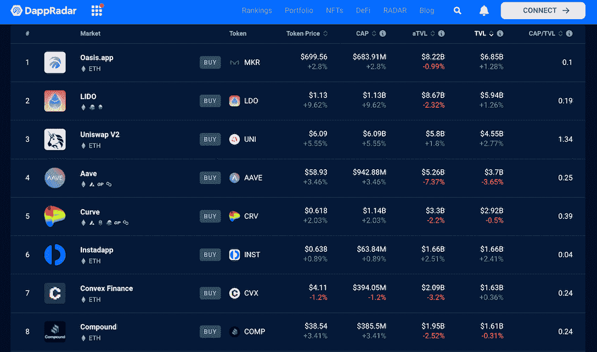

# 索拉纳陷入更大的麻烦，而以太坊在 CeFi 的不信任中集会

> 原文：<https://web.archive.org/web/https://dappradar.com/blog/solana-in-more-trouble-while-ethereum-rallies-amidst-cefi-distrust>

## 该行业呼吁提高透明度，并依靠智能合约来消除人为操纵

soBTC 和 soETH 是索拉纳区块链上的比特币和以太的包装版本，它们已经失去了与基础资产的挂钩。这一事件是由 FTX 的破产引发的，并导致了索拉纳生态系统的混乱。但这一系列事件并没有影响用户对 DeFi 的整体信心。

**高亮显示**

*   soBTC 目前的交易价格为 1006 美元，而 soETH 目前的交易价格为 251 美元。
*   与此同时，以太坊 DeFi 生态系统表现稳定，甚至在 11 月 10 日见证了 TVL 的飙升。

重要的中央交易所 FTX 的崩溃导致加密货币在过去一周大幅波动。其中，与 FTX 关系密切的 sola(SOL)比其他加密货币受到的冲击更大。这种情况反映在溶胶价格的急剧下降上。此外，它引发了用户对其摇摇欲坠的 DeFi 生态系统的担忧。

但是 FTX 的灾难并没有阻止用户在以太坊这样一个真正去中心化的生态系统中信任 DeFi dapps。

## soBTC 和 soETH 依赖索拉纳

由于比特币和以太不是索拉纳区块链上的本地代币，用户不能直接使用或交易这些代币索拉纳。这就是为什么 BTC 和 ETH 的包装版本被创造出来。他们允许索拉纳用户参与更广泛的加密生态系统。

Solana 上的桥协议持有比特币或 ETH，并在 Solana 上发行等量的衍生版本，即 soETH 和 soBTC。理论上，用户可以一对一的方式将 soETH 和 soBTC 兑换成 BTC 和 ETH。

根据喵的推特，代币是由 FTX 发行的。随着 FTX 宣布破产，索拉纳区块链上用于支持 soETH 和 soBTC 的基础资产的状况不明。这两种包装好的代币的价格已经与瑞士联邦理工学院和 BTC 大学脱钩。

soBTC 目前的交易价格为 1006 美元，不到比特币价格的 10%。此外，soETH 目前的交易价格为 251 美元，不到 ETH 价格的 20%。

[View more DeFi dapps on DappRadar](https://web.archive.org/web/20221130133508/https://dappradar.com/rankings/protocol/ethereum/category/defi)

## DeFi dapps 仍然被广泛信任

看看 Solana 的竞争对手以太坊，DeFi 生态系统表现稳定。11 月 8 日之后，TLV 计算的 ETH 指数反弹，在 10 日达到峰值。根据 DappRadar DeFi 跟踪， [Oasis.app](https://web.archive.org/web/20221130133508/https://dappradar.com/ethereum/defi/oasis-app) ， [LIDO](https://web.archive.org/web/20221130133508/https://dappradar.com/ethereum/defi/lido) ， [Uniswap V2](https://web.archive.org/web/20221130133508/https://dappradar.com/ethereum/exchanges/uniswap-1) ， [Instadapp](https://web.archive.org/web/20221130133508/https://dappradar.com/ethereum/defi/instadapp) ，数十家看到了 TLV、marketcap、token 涨价。

[Fastest recovering DeFi dapps on Ethereum](https://web.archive.org/web/20221130133508/https://dappradar.com/rankings/protocol/ethereum/category/defi)

FTX 的灾难再次提醒人们去中心化和透明化对加密社区的重要性。用户再次意识到，只有通过智能合同执行并由社区拥有的 DeFi dapps 才是值得信任的，因为没有个人可以私人访问他们的资金。即使像 FTX 这样的悲剧在市场上引起恐慌，公开透明的 DeFi dapps 通常可以在相对较短的时间内恢复。

我们将继续关注 FTX 事件的发展，通过各种报道和文章为您还原事件的全貌。同时，要了解 DeFi 空间或单个 dapps 的性能，您可以利用 DappRadar 丰富的跟踪工具。

[Check out these recently revived DeFi dapps](https://web.archive.org/web/20221130133508/https://dappradar.com/rankings/protocol/ethereum/category/defi)[DappRadar DeFi Tracking](https://web.archive.org/web/20221130133508/https://dappradar.com/defi)

## 随身携带您的 Web3 之旅

使用 DappRadar 移动应用程序，再也不会错过 Web3。查看最受欢迎的 dapps 的性能，并关注您投资组合中的 NFT。您在 DappRadar 上的帐户会与我们的移动应用程序同步，这样您很快就可以选择实时接收提醒。

[Download the DappRadar app now](https://web.archive.org/web/20221130133508/https://dappradar.app.link/blog)[<picture></picture>](https://web.archive.org/web/20221130133508/https://play.google.com/store/apps/details?id=com.portfolio.dappradar) NewsletterUnsubscribe at any time. [T&Cs](https://web.archive.org/web/20221130133508/https://dappradar.com/terms) and [Privacy Policy](https://web.archive.org/web/20221130133508/https://dappradar.com/privacy-policy)