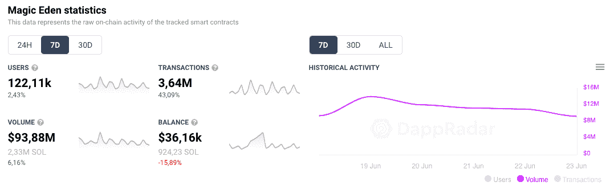
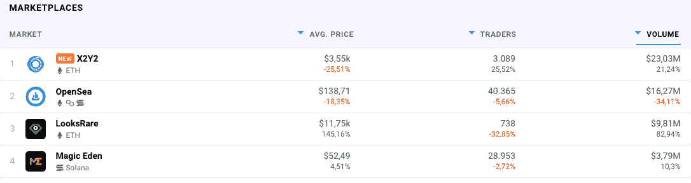
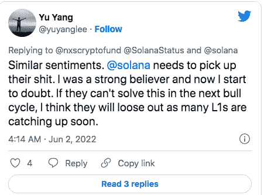
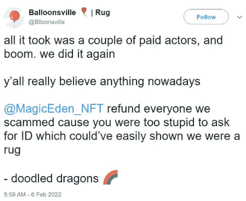

# 索拉纳用移动网络 3 电话创造了历史

> 原文：<https://web.archive.org/web/https://dappradar.com/blog/solana-makes-history-with-a-mobile-web3-phone>

## Solana 将自己推销为以太坊更快更便宜的解决方案，尽管网络中断。随着 Magic Eden 获得 16 亿美元，Solana 寻求用 Web3 手机彻底改革加密技术。

最近，索拉纳的 NFT 市场 Magic Eden 在最近一轮融资后获得了 16 亿美元的估值。

Solana 生态系统一直在增长，这一次，一个新的 Solana 部门开始将支持 Web3 的 Saga 手机推向市场。这款智能手机将支持各种 Solana 应用程序，包括领先的 NFT 市场 Magic Eden。

新宣布的 Solana 驱动的 Saga 智能手机将于 2023 年初推出。它运行在 Android 上，同时通过一个定制的工具包进行了增强。他们将这个工具包命名为 SMS，或 Solana Mobile Stack。该 SDK 将帮助开发者在 Solana 上构建专为智能手机定制的 dapps。它包括一个移动钱包适配器，一个安全种子库和方便支付的 Solana Pay。

Solana 目前是世界上最快的区块链之一，其金融、NFT 和其他 web3 项目的生态系统正在快速扩展。区块链生态系统将自己定位为以太坊的更快替代品，并且自成立以来已经取得了惊人的增长。

[https://web.archive.org/web/20220813144551if_/https://www.youtube.com/embed/dDGarcu5er4?feature=oembed](https://web.archive.org/web/20220813144551if_/https://www.youtube.com/embed/dDGarcu5er4?feature=oembed)

Source: [Bloomberg Technology](https://web.archive.org/web/20220813144551/https://www.youtube.com/c/BloombergTech)

Solana 目前在 DeFi 协议中记录了 26.8 亿美元的总价值，并以较低的费用提供了一个有竞争力和负担得起的交易环境。根据 [DappRadar 数据](https://web.archive.org/web/20220813144551/https://dappradar.com/rankings/protocol/solana)，Magic Eden 在 Solana 网络十大 dapps 中排名第二。

发现新推出的和即将推出的 NFT 系列，并使用超级先进的 [NFT 浏览器](https://web.archive.org/web/20220813144551/https://dappradar.com/hub/nft-explorer)根据机器学习算法、历史销售和元数据获得估计的 NFT 价值！

[<picture></picture>](https://web.archive.org/web/20220813144551/https://dappradar.com/hub/nft-explorer)

## 魔法伊甸园是如何变身为另一只 Web3 独角兽的？

Magic Eden 是一个位于 NFT 索拉纳的市场，它在以太坊和蜡上的表现超过了 NFT 市场。根据 DappRadar 的数据，Magic Eden 在过去一周的交易量增加到了 9388 万美元，SOL token 目前为 40.98 美元，增值 13.2%。

Source: DappRadar´s Top Decentralized Marketplaces

在 DappRadar 追踪的所有 NFT 市场中，这一数据目前将 Magic Eden 排在第四位。

Source: DappRadar´s Top NFT Marketplaces

Magic Eden 支持 13 个钱包提供商，包括 Phantom、Solflare、Solet 和 Exodus。低费用和简单的购买结构可能有助于它的成功。

Solana NFTs 最近最令人印象深刻的成功之一是 Okay Bears 系列。它席卷了 NFT 市场，超过了所有连锁品牌，如 Bored Ape Yacht Club、Axie Infinity 和 CryptoPunks。

但索拉纳并不都是桃子和奶油，它也因反复的网络中断、魔法伊甸园的模仿收藏和地毯拉而留下了坏名声。

## 魔法伊甸园:好、坏、丑

尽管 Magic Eden 通过提供较低的费用、酷的 NFT 收藏和快速的交易在加密界引起了共鸣，但这个故事并不像看上去那样简单。

让我们来看看围绕魔法伊甸园的主要问题

### 网络停机时间

首先，索拉纳区块链频繁断电引发了关于其可靠性和区块链是否足够分散的辩论。

索拉纳今年已经经历了 5 次网络中断，第五次发生在本月。cryptoverse 在社交媒体上做出反应，引发了 SOL= SQL 笑话，甚至质疑索拉纳相对于其他区块链的未来。

此外，当这种情况发生时，Solana 周围的许多应用程序，如 Magic Eden、Phantom wallet 和[Exodus crypto browser extension](https://web.archive.org/web/20220813144551/https://www.exodus.com/news/exodus-launches-browser-extension/)，都会向用户报告中断。

### 模仿系列

《魔法伊甸园》中大量的抄袭作品也引起了密码界许多人的注意。索拉纳生态系统一直在复制利润丰厚的以太坊项目，如[crypto punk](https://web.archive.org/web/20220813144551/https://dappradar.com/hub/nft-explorer/collection/cryptopunks)和 [Bored Ape 游艇俱乐部](https://web.archive.org/web/20220813144551/https://dappradar.com/hub/nft-explorer/collection/bored-ape-yatch-club)。

一个有趣的转折是，以太坊对索拉纳最成功的系列 [Okay Bears](https://web.archive.org/web/20220813144551/https://dappradar.com/blog/new-dapps-report-okay-bears-bulls-in-a-bear-market) 做出了同样的反应，推出了模仿系列，没有相同艺术品的 Okay Bears——只是熊面向左而不是右。

### 鲁格拉

在 crypto 中，褶皱并不奇怪，但在 Magic Eden 中，它们似乎很常见。最臭名昭著的一次发生在 2022 年 2 月，当时 NFT 项目气球城变成了一个主要的金钱掠夺者。

这次抢劫总计 5000 索尔，在当时价值近 60 万美元。魔术伊甸园的另一个高调骗局是棋王从投资者那里窃取了 645 索尔(当时为 58000 美元)。

在这两次严重的地毯拉后，魔术伊甸园采取措施，通过执行 KYC 对创作者的要求来加强其安全性。这迫使新的 NFT 创造者“私下里”向公司表达自己的意见。

通过阅读[“你应该预见到的 10 种 NFT 地毯拉花”](https://web.archive.org/web/20220813144551/https://dappradar.com/blog/how-to-avoid-nft-rug-pulls)来避免地毯拉花

## 结束语

索拉纳推出移动加密电话的计划目前正在市场上引发看涨情绪。这款手机的名字叫 Saga，它标志着一个革命性的事件，试图将 Web3 技术从桌面扩展到每个人的口袋。

Saga 将基于操作系统 Android，并提供对 dapps 的访问，就像普通 Android 用户今天可以下载应用程序一样。

再加上魔法伊甸园同时变成独角兽，这是相当了不起的。有了这么多新资本在手，很难想象索拉纳的下一步行动会是什么，但达普拉达尔将继续关注索拉纳和魔法伊甸园的最新进展。在 [Twitter](https://web.archive.org/web/20220813144551/https://twitter.com/dappradar) 、 [Discord](https://web.archive.org/web/20220813144551/https://discord.gg/4ybbssrHkm) 和 [Youtube](https://web.archive.org/web/20220813144551/https://www.youtube.com/c/DappRadar) 上关注我们，跟上区块链世界的动态。

 NewsletterUnsubscribe at any time. [T&Cs](https://web.archive.org/web/20220813144551/https://dappradar.com/terms) and [Privacy Policy](https://web.archive.org/web/20220813144551/https://dappradar.com/privacy-policy)