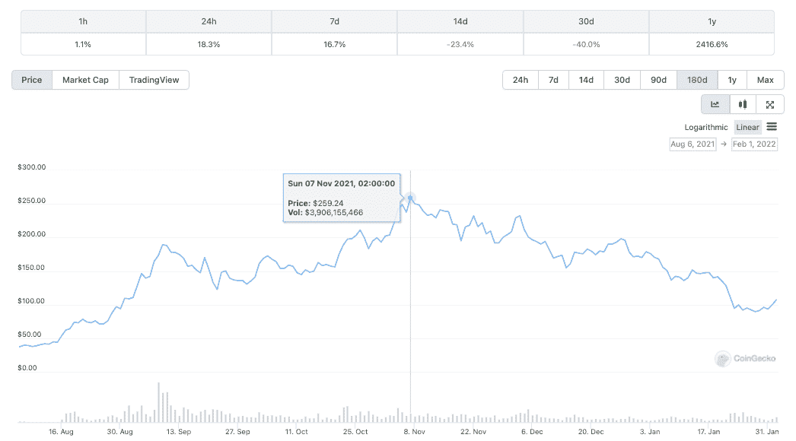
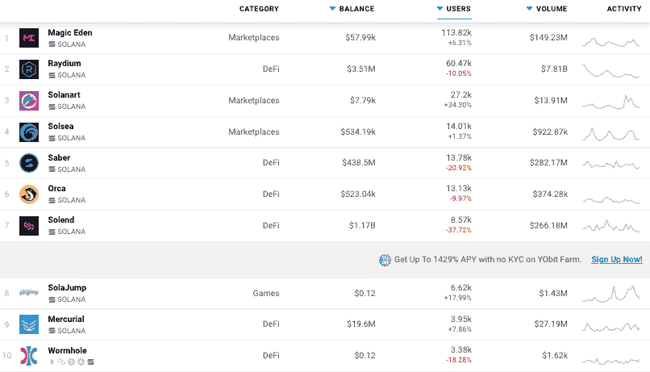
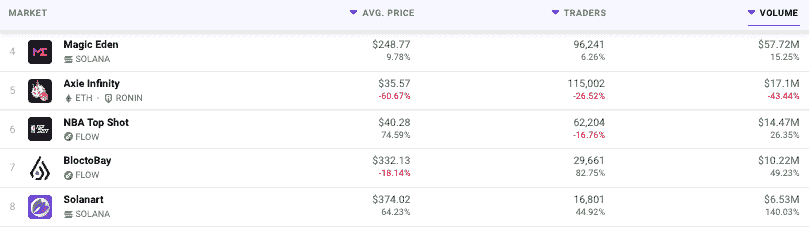
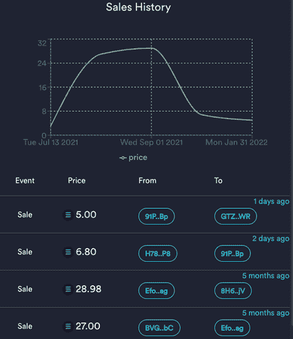

# SOL 价格下滑，索拉纳 NFT 市场上涨

> 原文：<https://web.archive.org/web/https://dappradar.com/blog/solana-nft-marketplaces-get-a-lift-as-sol-price-slides>

## solana 上 nft 市场的活跃用户

索拉纳母语 SOL token 的价格已经从去年 11 月 260 美元的历史高点大幅下跌至今天的 105 美元左右。尽管如此，随着索尔价值的下降，索拉纳市场上以索尔计价的 NFT 数字收藏品的价值也在下降。价格下跌导致活动激增，因为 NFT 收藏家希望抓住机会。

索拉纳在 2021 年的表现令人印象深刻，其 SOL token 的价值在一年内上涨了 2400%以上。然而，在撰写本文时，从 11 月开始并在 2022 年 1 月达到顶峰的价格暴跌已经使价值下跌了 50%以上。

虽然 SOL 价格的下跌可能预示着该网络的 DeFi 和 finance dapps 将迎来更平静的时代。Solana 上的 NFT 主要市场的活跃钱包、交易和交易量显著增加。

## 一月 NFT 大拍卖

核心原因是索拉纳上的 NFT 是以 SOL 定价的。简而言之，11 月 7 日售价 20 索尔(约合 5100 美元)的 NFT，现在的价格约为 2000 美元。此外，一些 NFT 的崇拜者可能在峰值时买入了股票，现在可能希望挽回一些损失。

在熊市期间，投资者可以将 NFT 作为价值储存手段，希望一旦 SOL 的价值上升，NFT 的估值也会随之上升。此外，一些收藏家可能会对他们现在可以以折扣价购买的高价物品产生反感。

回顾索拉纳过去的七天，我们看到，当 DeFi 和 finance dapps 都在经历与他们的平台互动的活跃钱包下降时，索拉纳上的 NFT 市场却在飙升。有趣的是，随着区块链游戏继续吸引大量观众，我们看到该平台的首批游戏之一 SolaJump 迅速聚集用户。

在撰写本文时，Magic Eden 已经有超过 96，000 名交易者产生了超过 5，700 万美元的交易量。而 Solanart 的交易量增加了 140%以上，在过去的七天里达到了 650 万美元。

Solanart 上一个很受欢迎的系列是 SolPunks。向以太坊上的原始密码朋克致敬，这些仿制品虽然只是 OG 的一小部分，但仍然不是最便宜的。

查看该商品的交易历史记录可以更清楚地显示买家目前可以获得的大幅折扣。一个朋克五个月前才卖 27 索尔，现在卖 5 索尔。即使价格保持在 27 索尔，折扣也很大。然而，随着收藏者希望卖掉在顶峰时期购买的非交易型艺术品，他们似乎愿意接受低于他们支付的价格。在一定程度上显示了一些新的 NFT 投资者的心态和知识水平。

有趣的是，索朋克的原始造币价格是 3 索尔，这意味着今天的价格可能比 2021 年 8 月 NFT 热高峰期更符合现实。

虽然 NFT 的崇拜者正在 Solana 上挑选打折的收藏品，但以太坊上的其他收藏品却不是这样，尽管加密价格下降，但它们似乎仍然保持着价值。仅在过去两周，贾斯汀比伯就以超过 130 万美元的价格买下了一辆 BAYC NFT，而伊娃·朗格利亚和格温妮丝帕特洛在加密公司 Moonpay 的帮助下一头扎进了 NFTs。

 NewsletterUnsubscribe at any time. [T&Cs](https://web.archive.org/web/20230116152733/https://dappradar.com/terms) and [Privacy Policy](https://web.archive.org/web/20230116152733/https://dappradar.com/privacy-policy)

***以上不构成投资建议。此处给出的信息仅供参考。请行使尽职调查，做你的研究。作者持有 ETH、BTC、AGIX、HEX、LINK、GRT、CRO、OMI、不可变 X、GALA、AVASTR、GMEE、CUBE、RADAR、FLOW、FTM、BNB、SPS、WRLD、ATOM 和 ADA。***