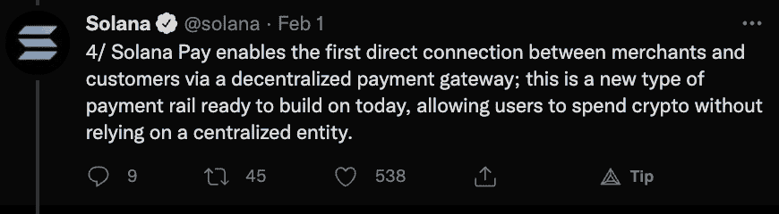

# Solana Pay 为主流购物者带来 Web3 支付

> 原文：<https://web.archive.org/web/https://dappradar.com/blog/solana-pay-brings-web3-payments-to-mainstream-shoppers>

## 索拉纳的新支付协议旨在让数字货币成为主流

Solana Pay 是 Solana 区块链支持的众多服务中的最新功能。新的支付协议旨在让索拉纳的支付更容易。**它为用户和商家提供了从区块链分散的权力中获益的机会。**

Solana Pay 开创了支付和商业的新时代。索拉纳团队的目标是为数字货币盛行的未来铺平道路。此外，他们还展望了数字货币像数据一样在互联网上流动的未来。让主流消费者购买数字资产变得更加容易。

目前，这个新平台的主要目标是允许客户用与美元挂钩的数字货币支付。这包括像 USDT 和 USDC 这样的代币。重要的是，这将允许交易立即结算，精确到美分。更重要的是，用户将不必等待第三方的批准。

根据官方新闻稿，加入这项服务的第二个好处是增加信任度。由于 Solana 允许不可变的交易并提供完全的透明度，客户和商家在他们的经济互动中都将感到更安全。

## Solana Pay 为商家提供了新的建立关系的工具

除了增加客户和商家之间的信任，Solana Pay 还将允许卖家和服务提供商定制新产品和促销活动。这反过来将使他们能够通过定制服务与客户建立更紧密的联系。

目前，这种量身定制的体验是有可能的。然而，能够访问客户所有交易的透明分类账，给商家提供了更多的数据。从这个意义上说，他们可以更好地预测客户的需求，并根据他们以前的活动向个人提供更有吸引力的产品。虽然加密货币和数字货币的全球采用仍然很遥远，但 Solana Pay 认为他们的服务只是第一步。

看到这样一个服务如何在一个相当不利的立法环境中坚持下去将是有趣的。DappRadar 将继续监督 Solana Pay 的主流采用情况。如果你想了解更多关于索拉纳区块链的情况，请查看官方的索拉纳排名。此外，你可以在[的 Twitter](https://web.archive.org/web/20221127144827/https://twitter.com/dappradar) 上关注 DappRadar，首先了解索拉纳的最新消息。

 NewsletterUnsubscribe at any time. [T&Cs](https://web.archive.org/web/20221127144827/https://dappradar.com/terms) and [Privacy Policy](https://web.archive.org/web/20221127144827/https://dappradar.com/privacy-policy)