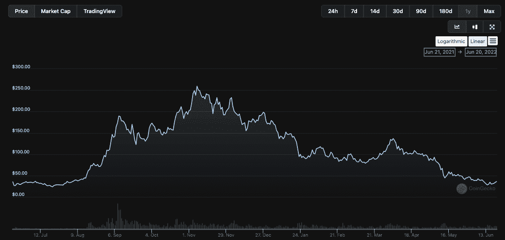
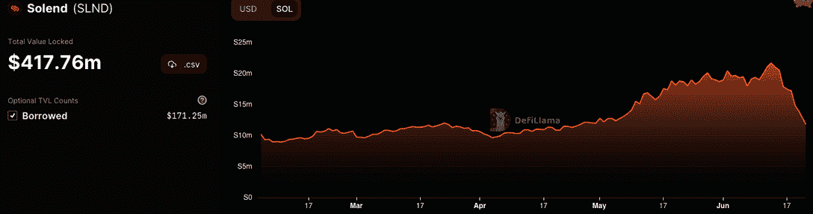
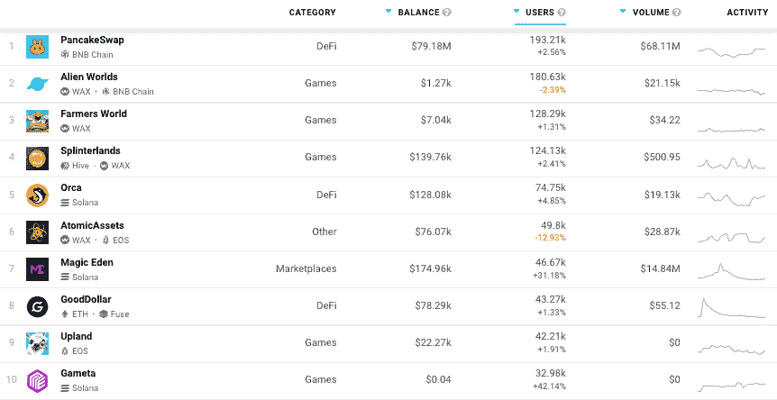

# 索伦德重新思考鲸钱包收购计划

> 原文：<https://web.archive.org/web/https://dappradar.com/blog/solend-rethinks-whale-wallet-takeover-plan>

## DeFi 协议投票控制鲸的账户，以暂时减轻清算风险

solena 网络领先的分散式金融(DeFi)贷款协议之一 Solend 通过创建另一个协议来否定第一个协议，从而对治理提案的批评做出了反应。最近批准的投票提交给索伦德实验室紧急权力进入鲸鱼的钱包，以避免清算。新的提议否定了这一点，给索伦德留下了一个难题。

首先，6 月 19 日周日， [Solend](https://web.archive.org/web/20220930130205/https://dappradar.com/solana/defi/solend) 发起了一项名为“SLND1:减轻鲸鱼带来的风险”的治理投票这一提议将允许 Solend 通过让贷款平台进入鲸鱼的钱包并实现柜台清算，来降低鲸鱼清算给市场带来的风险。据索伦德称，如果他们不能接管钱包，这可能会导致熔毁，推动溶胶的价格为零。投票通过。

该社区谴责了索伦德的这一举动，这完全违背了分散金融的原则。然而，在分权治理结构中，并非所有的声音都是平等的，那些拥有最大权力的人将拥有最大的发言权，也可能失去最多的发言权。此外，对于现在在金融领域工作的任何人来说，在[测试时间](https://web.archive.org/web/20220930130205/https://dappradar.com/blog/insolvency-looms-as-celsius-freezes-customers-out)中，似乎[规则书正在被抛弃](/web/20220930130205/https://dappradar.com/blog/insolvency-looms-as-celsius-freezes-customers-out/)。

[<picture></picture>](https://web.archive.org/web/20220930130205/https://dappradar.com/blog/what-is-a-dapp-on-the-blockchain)[<picture></picture>](https://web.archive.org/web/20220930130205/https://dappradar.com/blog/what-is-defi-or-decentralized-finance)[<picture></picture>](https://web.archive.org/web/20220930130205/https://dappradar.com/rankings)

## 索伦德提议了什么？

提案的细节包括 whale 的钱包地址和关于为什么这个帐户会给 Solend 带来问题的更深层次的信息。问题的一部分是，extensive 账户正面临清算，这将给 Solend 及其用户带来压力。

根据该提案，如果 SOL 跌至 22.30 美元，whale 的账户将被清算高达 20%的借款，这相当于价值 2100 万美元的 SOL。该提议旨在控制鲸鱼的账户，并通过场外交易进行清算。

场外交易(OTC)是指通过经纪人和交易商网络而不是在集中交易所进行证券交易的方式。在这种情况下，Solend 希望将清算分成可管理的部分并找到买家，而不是一次大规模的撤资，这将削弱分散交易所的流动性，并可能影响 SOL。

尽管如此，在严重的批评下，Solend 团队发起了第二次治理提案投票，以使之前批准的提案无效，最终以 1，480，264 票赞成忽略 SLND1 提案。新提案取代了之前的投票，并将迫使索伦德寻找另一个解决方案。一个不涉及接管用户账户的方法。

## 幻灯片上的 SOL

Solana 的本地令牌 SOL 已经在最近的加密崩溃中遭受了损失，从 2021 年 11 月的高点 260 美元左右下跌了近 85%，目前约为 35 美元。

6 月 13 日至 16 日期间，随着 BTC 和 ETH 进一步下跌，超过 2700 万个 Solana 令牌离开了其智能合约生态系统。而 Solana smart contracts)锁定的总价值在 6 月 16 日跌至 7465 万索尔，或约 22.5 亿美元，在短短三天内下跌了近 30%。

Solend 同期 TVL 大幅下降，截至 6 月 16 日，该公司持有 1060 万 SOL，约合 3.6 亿美元。尽管如此，它仍然是 TVL 在[索拉纳生态系统](https://web.archive.org/web/20220930130205/https://dappradar.com/defi/protocol/solana)中的[领先平台。主要的担心是，另一次大规模的撤资将引发对索拉纳的挤兑，这可能会大幅降低价格。](https://web.archive.org/web/20220930130205/https://dappradar.com/defi/protocol/solana)

此外，索伦德的举动使去中心化金融及其原则受到质疑，因为这样的举动确实违背了 DeFi 所代表的一切。尽管 Celcius 等集中式平台[开始冻结用户，但人们认为分散式平台将保持完整。](/web/20220930130205/https://dappradar.com/blog/insolvency-looms-as-celsius-freezes-customers-out/)

## 价格可能在下降，但 dapp 的使用在上升

虽然许多人现在关注的是不断下跌的代币价格和即将到来的熊市，但在 DappRadar，人们很兴奋地看到在我们更喜欢称之为建筑者市场的环境中，dapps 迎来了什么样的创新和使用浪潮。

一些人不知道他们最喜欢的令牌驱动 dapp 或网络。比如 [UNI 为 Uniswap](https://web.archive.org/web/20220930130205/https://dappradar.com/multichain/exchanges/uniswap-v3) 供电，而 [SLP 和 AXS 为 Axie Infinity](/web/20220930130205/https://dappradar.com/blog/600000-accounts-have-registered-with-axie-infinity-origin/) 游戏经济供电。 [ETH 为以太坊网络](https://web.archive.org/web/20220930130205/https://dappradar.com/rankings/protocol/ethereum)供电，而[多边形网络](https://web.archive.org/web/20220930130205/https://dappradar.com/rankings/protocol/polygon)本地令牌为 MATIC。价格可能在下降，但使用率却在上升。此外，看看在这些令人沮丧的时期表现出色的 dapp 类别，我们看到游戏占了用户[十大 dapp 的 50%](https://web.archive.org/web/20220930130205/https://dappradar.com/rankings)。

每个市场场景都会出现趋势。在 2018 年崩溃的后端，我们见证了 DeFi 和 2020 年高产农业的诞生。当用户[发现 NFTs](https://web.archive.org/web/20220930130205/https://dappradar.com/hub/nft-explorer) 和一个新的令人兴奋的资产类别时——它几乎将[的叙事引向了今天](/web/20220930130205/https://dappradar.com/blog/dapp-industry-report-q3-2021-overview/)。现在，我们看到用户拿着一袋袋的加密货币，但在如何使用它们的问题上，他们面前有许多选择。

可以说，对于那些想在经济低迷时期继续充实自己的人来说，游戏是最有吸引力的选择。在熊市中赚取代币，然后在牛市中兑现，这是明智之举。游戏也是进入 dapps 的第一个切入点。[索拉纳不仅仅是 DeFi](/web/20220930130205/https://dappradar.com/blog/trading-solana-nfts-magic-eden-vs-opensea/) dapps，用户可以在 DappRadar 上探索所有的[索拉纳 dapps。](https://web.archive.org/web/20220930130205/https://dappradar.com/rankings/protocol/solana)

 NewsletterUnsubscribe at any time. [T&Cs](https://web.archive.org/web/20220930130205/https://dappradar.com/terms) and [Privacy Policy](https://web.archive.org/web/20220930130205/https://dappradar.com/privacy-policy)

加入 DappRadar 社区，访问增强的区块链分析，并使用 [DappRadar 投资组合中心](https://web.archive.org/web/20220930130205/https://dappradar.com/hub/wallet/)控制自己的资产。不仅 DappRadar 给你更多的见解，而且每个成员都可以加入[我们每周的加密空投赠品](https://web.archive.org/web/20220930130205/https://dappradar.com/hub/airdrops)。

[<picture></picture>](https://web.archive.org/web/20220930130205/https://dappradar.com/hub/wallet/)[<picture></picture>](https://web.archive.org/web/20220930130205/https://dappradar.com/hub/airdrops)[<picture></picture>](https://web.archive.org/web/20220930130205/https://dappradar.com/hub/nft-explorer)