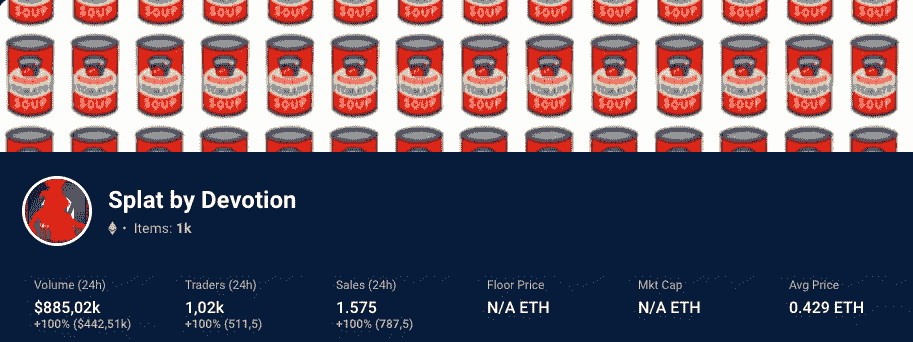
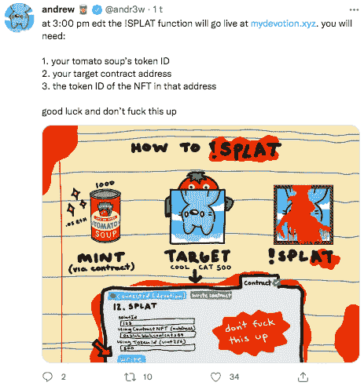

# “汤”你的 NFTs 与！纵长背板

> 原文：<https://web.archive.org/web/https://dappradar.com/blog/soup-your-nfts-with-splat>

## 不，NFT 在西红柿汤的冲击下是安全的！

气候抗议者最近用罐装番茄汤泼溅文森特·梵高的向日葵引发了泼溅，这是一个 NFT 收藏，允许持有者用数字汤覆盖任何 NFT。造币价格是 0.05 ETH，现在地板已经是 0.45 ETH 了。这是 NFT 娱乐的下一个前沿吗？让我们揭开数据背后的故事。

**亮点**

*   Splat 是以太坊区块链上的 1000 个汤罐 NFT 的集合。
*   它的灵感来自于两个气候活动家把番茄汤罐头倒在文森特·梵高的后印象派艺术作品《向日葵》上的事件
*   通过使用 Splat 合同，持有者可以输入他们想要购买的 NFT 的 NFT 合同地址和 NFT 令牌 ID。
*   Splat 合同直接从该集合的合同中提取所选 NFT 的图像数据，并用数字汤覆盖该 NFT。

## 什么是 Splat？

Splat 是一个有趣的 1000 个汤罐 NFT 的集合，由区块链以太坊的奉献者与纽约艺术家 Danny Cole 合作创建。

这个创新概念的灵感来自两位气候活动家最近的行动，他们将汤泼在文森特·梵高的向日葵上，以抗议化石燃料。

[Discover Splat](https://web.archive.org/web/20221207031935/https://dappradar.com/hub/nft-explorer/collection/splat-by-devotion/sales-activity?period=all)

自铸造以来的 24 小时内，该系列已经从 1，575 的总销售额中积累了 885，020 美元的交易量。

这是他们作为 NFT 项目的第一个集合，旨在改善 UX，开源小说代码，并融合探索 NFT 空间无数可能性的想法。美味的汤有所有正确的成分:文化，技术和紧迫性都在一个辣碗！

[<picture></picture>](https://web.archive.org/web/20221207031935/https://dappradar.com/hub/nft-explorer/collection/splat-by-devotion/sales-activity?period=all)

“虔诚”由记者、NFT 影响者、艺术家王晓康以及 sighduck 和 Backseats 共同创立。你可以把奉献视为一个创意工厂，让人想起安迪·沃霍尔标志性的纽约工作室，但在一个“艺术改变你，艺术改变你”的数字世界里。

## 为什么炒作，它是如何工作的？

该系列背后的理念和技术都非常出色。它抓住了一个及时的真实世界的反叛事件的本质，并允许我们在一个想象的环境中把它变成我们自己的，没有自我表达的限制。

它既大胆又有趣，最棒的是，你甚至不必拥有自己的非功能性食物，就能创造出你自己的飞溅版本。它是这样工作的:

*   NFT 持有者可以通过 Splat 合同加入汤，允许他们输入他们想要加入汤的 NFT 的 NFT 合同地址和 NFT 令牌 ID。
*   Splat 契约直接从该集合的契约中提取所选 NFT 的图像数据，并用数字图像覆盖它。

## 不知道该拍什么？使用我们的 NFT 探险家

你可以泼溅任何 NFT，并创建自己的泼溅版本。此外，根据王晓康的说法，汤罐元数据转换为 splat NFT，总供应量锁定在 1000，没有任何时间窗口。

[https://web.archive.org/web/20221207031935if_/https://www.youtube.com/embed/fkEaXYLOW-s?feature=oembed](https://web.archive.org/web/20221207031935if_/https://www.youtube.com/embed/fkEaXYLOW-s?feature=oembed)

我们迫不及待地想知道哪些 NFT 系列将最受持有者欢迎，所以使用我们的 NFT 浏览器来浏览最受欢迎的 NFT 系列以获取灵感。

## 随身携带您的 Web3 之旅

使用 DappRadar 移动应用程序，再也不会错过 Web3。查看最受欢迎的 dapps 的性能，并关注您投资组合中的 NFT。您在 DappRadar 上的帐户会与我们的移动应用程序同步，这样您很快就可以选择实时接收提醒。

[Download the DappRadar app now](https://web.archive.org/web/20221207031935/https://dappradar.app.link/blog)[<picture></picture>](https://web.archive.org/web/20221207031935/https://play.google.com/store/apps/details?id=com.portfolio.dappradar)