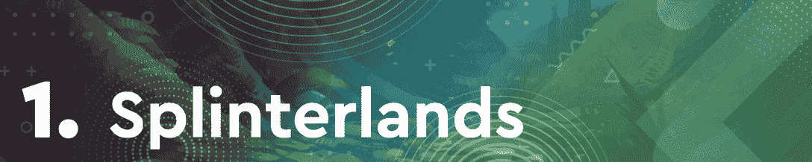
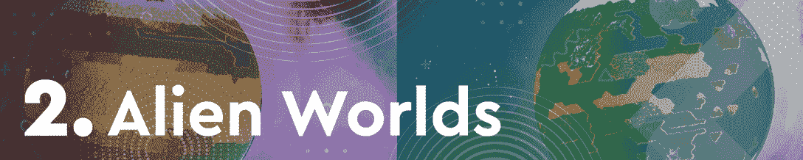
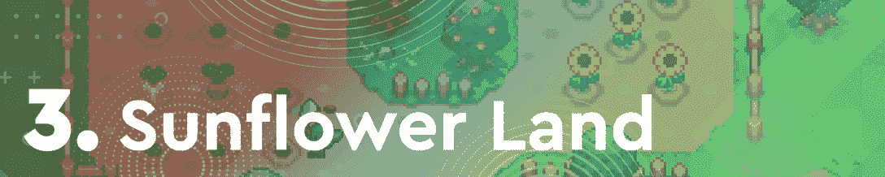
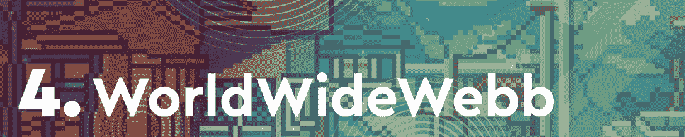
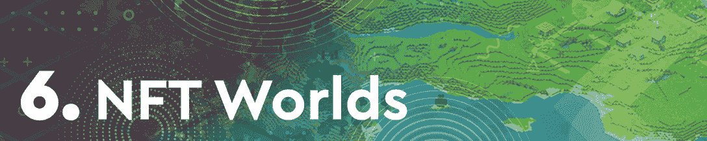
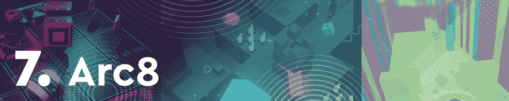
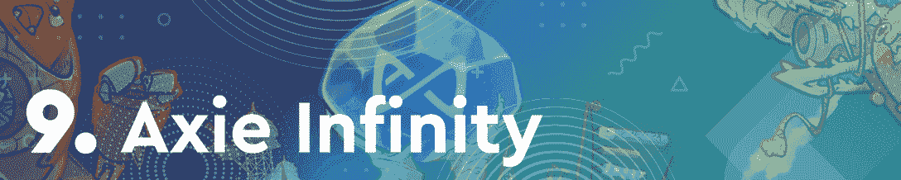

# 夹板地重回巅峰，向日葵地崛起

> 原文：<https://web.archive.org/web/https://dappradar.com/blog/splinterlands-back-on-top-sunflower-land-on-the-rise>

## 《分裂之地》和《外星世界》本周正在争夺榜首

在过去的七天里，超过 50 万个独立的活跃钱包连接到了这款游戏。紧随其后的是更多的用户，但其本地令牌的价值略有下降，我们有外星世界。

令人印象深刻的是，向日葵地完成了本周的前三名。尽管仍处于测试阶段，该团队现在正在为玩家推出重要的功能。这些发展极大地促进了平台上的活动。

几个月来，区块链游戏一直处于加密活动的前沿。通过这篇文章，DappRadar 看了本周最热门的游戏 dapps。为了编制这个排名，我们考虑了链上活动，NFT 交易量，令牌估值，以及围绕每个 dapp 的新闻和事件。

在下面浏览本周十大区块链游戏的完整列表。单击相应的图片，了解每个平台的更多信息。或者，看看下面的视频，它总结了排名，可以快速查看。

[https://web.archive.org/web/20221007091138if_/https://www.youtube.com/embed/L3DKBe7X0zc?feature=oembed](https://web.archive.org/web/20221007091138if_/https://www.youtube.com/embed/L3DKBe7X0zc?feature=oembed)

## 区块链十大游戏–第 15 周

[<picture></picture>](https://web.archive.org/web/20221007091138/https://dappradar.com/hive/games/splinterlands)

### 分裂之地再次占据主导地位

交易纸牌游戏[夹板王国](https://web.archive.org/web/20221007091138/https://dappradar.com/hive/games/splinterlands)在每周区块链游戏排名中名列榜首并不陌生。在过去的七天里，Splinterlands 看到了其原生令牌 SPS 的积极轨迹，同时也吸引了超过 50 万个独特的活跃钱包。

[<picture></picture>](https://web.archive.org/web/20221007091138/https://dappradar.com/multichain/games/alien-worlds)

### 外星世界推动蜡上游戏

本周 Wax 巨兽[外星世界](https://web.archive.org/web/20221007091138/https://dappradar.com/multichain/games/alien-worlds)排名第二，有超过 50 万个独特的活动钱包连接到该平台。采矿游戏比票房最高的《碎片之地》吸引了更多的用户，然而，其本土标志 TLM 的价值小幅下跌阻止了它夺取榜首的位置。

[<picture></picture>](https://web.archive.org/web/20221007091138/https://dappradar.com/polygon/games/sunflower-land)

### 葵花宝地迈向新的成功

多边形热门游戏向日葵农民的第一次迭代几乎打破了整个协议。现在它的继承人[向日葵地](https://web.archive.org/web/20221007091138/https://dappradar.com/polygon/games/sunflower-land)正走在同样的道路上。这款游戏见证了超过 72，000 个用户钱包连接到它的智能合约，尽管它仍处于测试阶段。该团队刚刚在游戏中推出了手工艺功能，这进一步推动了活动。

[<picture></picture>](https://web.archive.org/web/20221007091138/https://dappradar.com/ethereum/collectibles/worldwide-webb-land)

### 万维网宣布土地所有者的利益

虚拟世界本周卷土重来，WorldWideWebb 排名第四。游戏背后的团队最近宣布了一份土地所有者额外津贴和福利的完整清单，这对活动和二级市场销售价格产生了积极影响。

[<picture></picture>](https://web.archive.org/web/20221007091138/https://dappradar.com/wax/games/farmers-world)

### 农民世界 NFTs 着火了

[Farmers World](https://web.archive.org/web/20221007091138/https://dappradar.com/wax/games/farmers-world) 本周排名第五，过去七天在 NFT 交易量超过 152，000 美元。这款游戏拥有长期的用户基础，这样的交易量并不令人惊讶。最近，该平台在其开心农场世界版本中引入了会员功能，这也促进了 dapp 的活动。

[<picture></picture>](https://web.archive.org/web/20221007091138/https://dappradar.com/ethereum/games/nft-worlds)

### NFT 世界领先的土地 NFT 销售

NFT 世界是增长最快的虚拟世界之一，这一刺激使其在本周排名第六。除了在过去的七天里创造了超过 1000 万美元的土地 NFT 销售额外，这款游戏还见证了其本土标志 WRLD 升值超过 9%。

[<picture></picture>](https://web.archive.org/web/20221007091138/https://dappradar.com/polygon/games/arc8-by-gamee-1)

### Arc8 推出第二季

基于多边形的移动迷你游戏平台 Arc8 刚刚发布了第二季正式版。这对于游戏的活跃性产生了积极的影响，在过去的一周中吸引了超过 23，000 个独特的活跃钱包。随着未来几周几款新迷你游戏的推出，这种上升趋势有望继续。

[<picture></picture>](https://web.archive.org/web/20221007091138/https://dappradar.com/binance-smart-chain/games/mobox-nft-farmer)

### Mobox 主宰 BSC 上的游戏

NFT 农业游戏 [Mobox](https://web.archive.org/web/20221007091138/https://dappradar.com/binance-smart-chain/games/mobox-nft-farmer) 继续统治 BSC 游戏领域。NFT 的交易量超过 400 万美元，是这个链条上交易量最大的 NFT 藏品。更重要的是，在过去的七天里，该游戏吸引了超过 172，000 个独特的活动钱包。

[<picture></picture>](https://web.archive.org/web/20221007091138/https://dappradar.com/ronin/games/axie-infinity)

### 轴无限原点是活的

整个 Axie Infinity 生态系统仍在从几周前发生的 Ronin 桥大规模黑客攻击中恢复。尽管出现了不幸的情况，但 Sky Mavis 推出了备受期待的 Origin 版本，这重新激起了人们对 Axie Infinity 平台的兴趣。重要的是，[天空专家也透露了关于即将到来的陆地游戏](https://web.archive.org/web/20221007091138/https://dappradar.com/blog/6-things-you-need-to-know-about-axie-infinity-land-alpha/)的新细节。

[<picture></picture>](https://web.archive.org/web/20221007091138/https://dappradar.com/binance-smart-chain/games/bomb-crypto)

### 炸弹密码带回炸弹人风格的游戏

[Bomb Crypto](https://web.archive.org/web/20221007091138/https://dappradar.com/binance-smart-chain/games/bomb-crypto) 是 BSC 上一颗冉冉升起的新星，首次跻身游戏排行榜前十名。随着用户群的稳步增长，这款游戏正在成为一种主食，带回了一种有点怀旧的炸弹人体验。在过去的七天里，炸弹加密吸引了超过 56，000 个不同的活动钱包，而其原生令牌 BCOIN 升值。

## 分裂之地混乱军团统治着

作为所有连锁游戏中访问量最大的区块链游戏之一,《碎片之地》继续统治着区块链游戏界。随着新角色的定期发布，混乱军团战役正在全力进行。重要的是，任何购买混乱军团卡包的人都是新角色空投计划的一部分。

这种不断出现的获取新卡的机会使得平台的活跃程度一直很高。更重要的是，在过去的七天里，游戏的原生令牌 SPS 扭转了过去几周的负面趋势。这种积极的变化对夹板固定的活动也有积极的影响。

DappRadar 将继续监测区块链游戏空间，因为已建立的项目不断创新和革命性的空间。要查看区块链游戏在过去一周的表现的更详细的细分，请查看完整的[顶级区块链游戏排名](https://web.archive.org/web/20221007091138/https://dappradar.com/rankings/category/games)。你也可以加入 [DappRadar PRO](https://web.archive.org/web/20221007091138/https://dappradar.com/token/pro) 社区，获得最新的统计数据，并有机会加入私人 [PRO Discord](https://web.archive.org/web/20221007091138/https://dappradar.com/discord) 频道的独家讨论。

 NewsletterUnsubscribe at any time. [T&Cs](https://web.archive.org/web/20221007091138/https://dappradar.com/terms) and [Privacy Policy](https://web.archive.org/web/20221007091138/https://dappradar.com/privacy-policy)