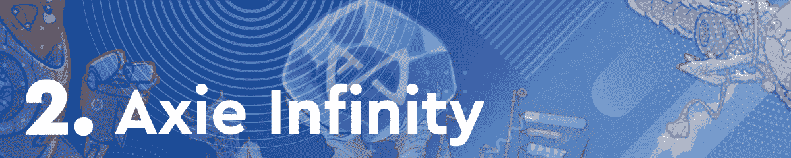
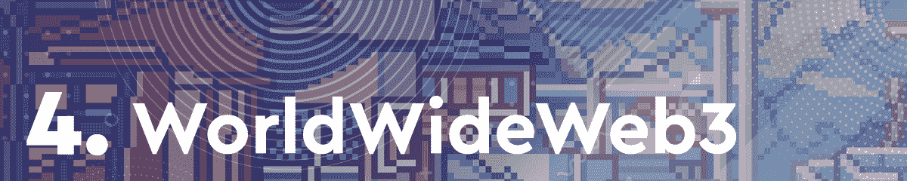
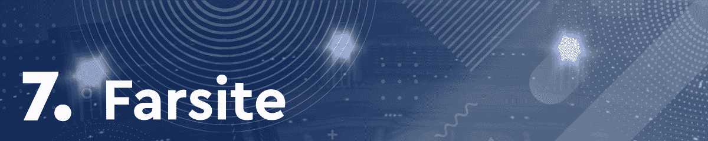
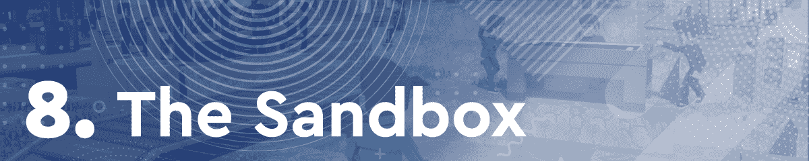
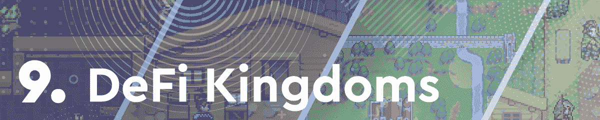

# 夹板地混乱军团继续吸引玩家

> 原文：<https://web.archive.org/web/https://dappradar.com/blog/splinterlands-chaos-legion-continues-to-attract-players>

## 基于卡牌的游戏本周排名第一，其次是虚拟世界和采矿游戏

本周，Splinterlands 抢尽风头，吸引了大量观众，混乱军团卡牌包发布进入最后阶段。基于 Hive 的卡牌战斗游戏在过去的七天里取得了巨大的成功，玩家们为赢得两张新发布的空投奖励卡而战。

紧随其后的是本周我们推出的虚拟世界，如万维网 3、分散土地和沙盒。令人印象深刻的是，像 Aavegotchi 这样的新词条也入选了。

在过去的几个月里，区块链游戏一直处于加密活动的前沿。在这篇每周一期的文章中，DappRadar 将会关注最热门的游戏 dapps。为了编制这个排名，我们考虑了连锁活动、NFT 交易量、代币估值以及围绕每个 dapp 的新闻和事件。

浏览本周十大区块链游戏的完整列表，并点击相应的图片，了解每个平台的更多信息。或者，看看下面的视频，它总结了快速浏览的排名。

[https://web.archive.org/web/20220929042500if_/https://www.youtube.com/embed/szYfhCuzzUs?feature=oembed](https://web.archive.org/web/20220929042500if_/https://www.youtube.com/embed/szYfhCuzzUs?feature=oembed)

## 本周区块链十大游戏

在这个排名中，Splinterlands 凭借所有游戏 dapps 中记录的最独特的活动钱包位居本周排行榜榜首。在过去的七天里，超过 515，000 个独特的钱包连接到游戏的智能合约。

此外，Splinterlands 看到了其混乱军团卡包销售第二阶段的结束。这意味着幸运的玩家将被空投两张新的特殊卡片。尽管原生 SPS 令牌的价值下降，但由于其越来越受欢迎，Splinterlands 再次占据榜首。

Axie Infinity 本周的排名也在攀升。过去一周，这款手机友好型游戏在 NFT 的交易额接近 3000 万美元。Axie 还吸引了 279.140 个独特的钱包加入其智能合约。

然而，将 Sky Mavis 游戏推上第二名的是著名脱口秀主持人乔·罗根为游戏呐喊的事实。这是一个不小的成就，因为罗根是美国乃至全球最受欢迎的主持人之一。

基于 EOS 的虚拟财产交易游戏《高地》本周跻身前三。虽然 Upland 在顶级游戏 dapps 排行榜上经常出现，但这是它有史以来的最高位置。

由于包括广场酒店在内的几笔重要的里程碑式的销售，Upland 度过了相当成功的一周。此外，房地产业务似乎正在吸引越来越多的区块链用户。在过去的七天里，Upland 看到超过 230，000 个不同的活动钱包连接到该平台。

随着元宇宙继续成为密码领域最受欢迎的话题之一，虚拟世界也越来越受到关注。例如，在过去的七天里，WorldWideWeb3 在 NFT 产生了超过近 400 万美元的交易量。

更重要的是，该平台继续宣布其社区的新集成。将在 WWW3 上以虚拟形象出现的最新 NFT 系列是 Doodles。这是朝着正确方向迈出的一大步，因为 Doodles 是自 2022 年初以来最热门的收藏之一。

另一个虚拟世界，结合了 DeFi 和 play-to-earn，本周排名第五。Aavegotchi 是第一个建立在区块链上的虚拟世界。然而，这是这款游戏首次进入前 10 名。

推动 Aavegotchi 本周统计数据的一个重要因素是即将到来的可穿戴抽奖活动。这将是迄今为止 Aavegotchi 生态系统中最大的可穿戴事件。考虑到抽奖的规模和重要性，难怪 Aavegotchi 在过去 7 天里在 NFT 产生了近 100 万美元的交易量。

由于庞大的玩家群体,《异形世界》经常出现在 DappRadar 游戏排行榜的榜首。本周，基于蜡的采矿游戏排名第六，注册了超过 340，000 个独特的活动钱包。

随着外星世界继续主导 Wax 上的游戏空间，竞争对手也越来越突出。这种日益激烈的竞争环境，加上游戏的本地令牌 TLM 的估值下降了 12%，使《外星世界》在本周的排行榜上垫底。尽管如此,《异形世界》仍然是游戏界最受欢迎的游戏之一，它在这个领域的突出地位是不可否认的。

Farsite 是一个基于多边形的 DeFi 供电的 MMO，再次进入区块链游戏周排名前十。虽然 Farsite 仍在游戏社区中寻找立足点，但该平台一直在努力为其玩家创建一个完整的功能生态系统。

Farsite 团队的最新公告之一是，该平台将通过不可阻挡的域集成 web3 域名。这是使 Farsite 易于访问和使用的重要一步。互操作性是业内许多平台的重要目标，Farsite 是这一运动的先锋。

沙盒是目前领先的虚拟世界之一，它在游戏玩家中的突出地位是不可否认的。在过去的七天里，该平台产生了超过 1300 万美元的 NFT 交易量。然而，这并不足以将它推到每周游戏排行榜的首位。

对沙盒中虚拟土地的需求持续增长，地块每周售价高达数千美元。尽管如此，该平台的原生令牌 SAND 最近一直在贬值，仅在过去七天就下跌了 7.5%。尽管如此，沙盒本周举行了一场重要的土地拍卖。这帮助该平台保持在区块链游戏排行榜的前列。

DeFi 王国已经成为游戏社区，尤其是和谐区块链社区的热门话题。在过去几周的排名中，DeFi 王国一直是排名最高的游戏玩家之一。

本周，DeFi 王国排名垫底。该平台的原生 token JEWEL 在过去七天内仅获得 0.8%的估值。与 JEWEL 前几周的涨势相比，这是一个非常小的涨幅。有趣的是，2022 年初，代币找到了稳定的估值。

最后但并非最不重要的是，本周我们有了 Mobox。该平台的原生令牌 MBOX 在过去七天内价格下跌超过 12%。不过，Mobox 在 NFT 产生了近 200 万美元的交易量。

此外，Mobox 在过去一周吸引了超过 192，000 个独特的活动钱包。这一活动高峰帮助 dapp 进入了本周十大游戏 dapp。Mobox 为币安智能链带来了 NFTs 和产量农业，是该链上的顶级游戏 dapps 之一。

## 分裂之地夺回王位

几个月来,《夹板之地》频繁出现在十大游戏排行榜中。然而，在过去的几个星期里，这款游戏并没有占据榜首。本周，随着混乱军团战役进入最后阶段，这一趋势发生了逆转。

随着对数字土地的需求持续高涨，虚拟世界也变得越来越强大。由于不断努力通过整合引入更多社区，WorldWideWeb3 成功跻身前 3 名。

随着越来越多的玩家转向区块链的游戏，DappRadar 将继续关注游戏领域。像 Splinterlands、Aavegotchi 和 Mobox 这样的 Dapps 都带来了不同的功能，让不同类型的游戏玩家的游戏空间变得丰富多彩。要了解区块链博彩领域的最新消息，请在 [Twitter](https://web.archive.org/web/20220929042500/https://twitter.com/dappradar) 上关注 DappRadar，或加入 [DappRadar PRO](https://web.archive.org/web/20220929042500/https://dappradar.com/token/pro) 以获得独家 [Discord](https://web.archive.org/web/20220929042500/https://discord.gg/4ybbssrHkm) 频道和讨论。

 NewsletterUnsubscribe at any time. [T&Cs](https://web.archive.org/web/20220929042500/https://dappradar.com/terms) and [Privacy Policy](https://web.archive.org/web/20220929042500/https://dappradar.com/privacy-policy)