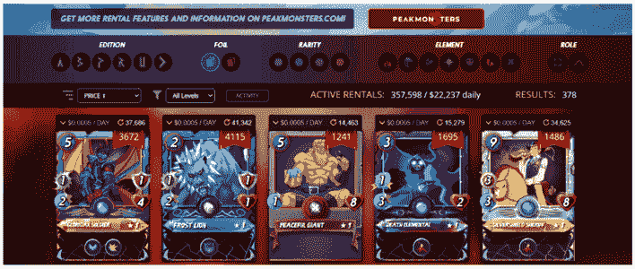
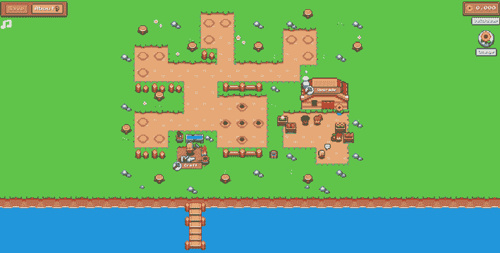

# 随着 GameFi 不断吸引玩家，Splinterlands 一马当先

> 原文：<https://web.archive.org/web/https://dappradar.com/blog/splinterlands-gamefi-leads-charge-games-of-the-week>

## 《向日葵之地》和《外星世界》占据了排行榜的首位

虽然代币价格一直在下降，但游戏 dapps 继续吸引玩家，其中交易卡游戏 Splinterlands 领先。该游戏吸引了超过 479，000 个独特的活动钱包，而 SPS 令牌价格下降了 6.5%。

[https://web.archive.org/web/20221004031710if_/https://www.youtube.com/embed/UeOts3s044g?feature=oembed](https://web.archive.org/web/20221004031710if_/https://www.youtube.com/embed/UeOts3s044g?feature=oembed)

Subscribe to [the DappRadar YouTube channel](https://web.archive.org/web/20221004031710/https://www.youtube.com/channel/UCxHZHLUTnV5zM34_33IP9Tg) for more videos, interviews and opportunities

总体而言，随着经济衰退的逼近和通货膨胀的加剧，投资者开始动摇，加密市场受到了冲击。尽管如此，区块链奥运会的需求依然强劲。4 月，[全区块链 52%的独立活跃钱包](https://web.archive.org/web/20221004031710/https://dappradar.com/blog/dapp-industry-report-april-2022)与游戏 dapp 互动。这大约相当于每天 120 万个钱包。

我们认为 Splinterlands 是最大的赢家之一，吸引了超过 479，000 个独特的活动钱包。随着代币价格下降，活跃钱包的数量成为确定这些排名的可靠指标。因此，看到《向日葵之地》和《外星世界》进入前三名并不奇怪。

为了创建这些每周游戏排名，我们将链上 dapp 数据与令牌估值和社区新闻相结合。浏览以下本月十大区块链游戏的完整列表。单击相应的图片，了解每个平台的更多信息。或者，看看下面的视频，它总结了排名，可以快速查看。

## 十大游戏–2022 年第 18 周

### 1.[夹板垫](https://web.archive.org/web/20221004031710/https://dappradar.com/multichain/games/splinterlands)

持续的游戏活动，因为 Splinterlands 吸引了超过 479，000 个独特的活动钱包，将交易卡游戏推上了排行榜的首位。一次社区市政厅活动重点介绍了围绕[SPS 令牌](https://web.archive.org/web/20221004031710/https://dappradar.com/hub/swap/bsc/BNB/SPS?to=0x1633b7157e7638c4d6593436111bf125ee74703f)的排放和使用案例的进展，其价值略有下降。

### 2.[向日葵地](https://web.archive.org/web/20221004031710/https://dappradar.com/polygon/games/sunflower-land)

凭借 113，000 个独特的活动钱包，农业游戏向日葵地设法排在第二位。从向日葵农民到向日葵地的迁徙期结束了。向日葵地已经成为多边形上最突出的项目之一[。](https://web.archive.org/web/20221004031710/https://dappradar.com/rankings/protocol/polygon)

### 3.[外星世界](https://web.archive.org/web/20221004031710/https://dappradar.com/multichain/games/alien-worlds)

凭借 20%的独特活跃钱包增长，《异形世界》上周表现强劲。它吸引了 363，000 个独特的活动钱包，而本地的 [TLM 令牌](https://web.archive.org/web/20221004031710/https://dappradar.com/hub/token/bsc/TLM/JADE?from=0x2222227e22102fe3322098e4cbfe18cfebd57c95)的价值下降了 18%。这使得《异形世界》成为[蜡像生态系统](https://web.archive.org/web/20221004031710/https://dappradar.com/rankings/protocol/wax)中排名最高的游戏。

### 4.[农民世界](https://web.archive.org/web/20221004031710/https://dappradar.com/wax/games/farmers-world)

另一个受欢迎的游戏是《农民世界》,已经连续几个月创造了不错的数字。农业游戏的观众在一周内增长了 6%，超过 160，000 个独特的活动钱包。这个项目一直在增长。

### 5.[万维网 b3](https://web.archive.org/web/20221004031710/https://dappradar.com/ethereum/collectibles/worldwide-webb-land)

就链上用户数量(228)而言，万维网并不那么引人注目，但该项目通过更多的集成和功能不断扩展其生态系统。开发商透露了本月的正式发布，同时取笑游戏世界的改进 V2 版本。

### 6.[余烬剑](https://web.archive.org/web/20221004031710/https://dappradar.com/polygon/games/ember-sword)

尽管《余烬之剑》没有任何现场游戏，但即将上映的《MMORPG 行动》却登上了排行榜。随着 NFT 土地底价约 0.12 ETH，余烬剑目前是元宇宙博彩最实惠的条目之一。

### 7\. [Chainmonsters](https://web.archive.org/web/20221004031710/https://dappradar.com/flow/games/chainmonsters)

即将到来的第二阶段测试将向所有人开放游戏。这给 MMORPG 和区块链带来了更多的关注。开放测试版将在 iOS、Android、PC 和 Mac 上推出。

### 8.aavegotchi

新推出的手工艺品和围绕收集 FUD、FOMO、阿尔法和 KEK 代币的活动增加，给了 Aavegotchi 一个推动。玩家现在可以借出或使用他们的 Gotchi 来寻找代币，然后在接下来的两周内制作 LE Golden Tile-Portal。这是[多边形生态系统](https://web.archive.org/web/20221004031710/https://dappradar.com/rankings/protocol/polygon)的明星！

### 9. [Mobox](https://web.archive.org/web/20221004031710/https://dappradar.com/binance-smart-chain/games/mobox-nft-farmer)

由 Mobox 制作的 GameFi 生态系统总是在他们的社区中产生兴奋感。NFT 滴剂做得很好。尽管代币价值下降，BNB 链上的游戏生态系统[仍然吸引了超过 159，000 个独特的活动钱包。](https://web.archive.org/web/20221004031710/https://dappradar.com/rankings/protocol/binance-smart-chain)

### 10.[高地](https://web.archive.org/web/20221004031710/https://dappradar.com/eos/games/upland)

在高地，我们发现一个来自 DappRadar 排名第十位的常客。区块链版的“大富翁”吸引了超过 159，000 个不同的活动钱包，在过去的七天里增加了 5%。标志性的 NFT 销售和即将到来的创世纪周在这一活动中发挥了作用。