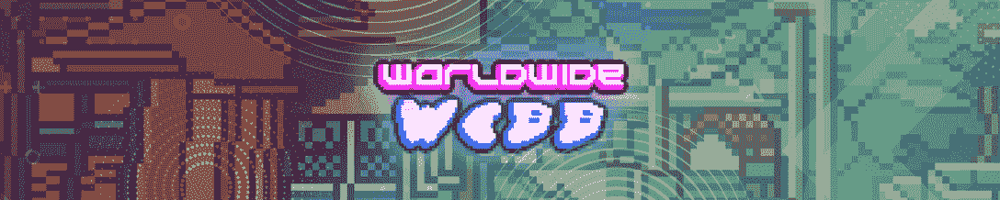

# 夹板岛将于今年五月夺回王位

> 原文：<https://web.archive.org/web/https://dappradar.com/blog/splinterlands-reclaims-the-throne-this-may>

## 本月，交易卡游戏见证了超过 50 万个独特的活动钱包

区块链游戏是 web3 中竞争最激烈的领域之一，每天吸引着成千上万的钱包，而 Splinterlands 将在今年 5 月脱颖而出。基于 Hive 的 dapp 对奖励积分系统进行了一些重大更新，引起了一波关注。在过去的 30 天里，Splinterlands 吸引了超过 50 万个独特的活动钱包。

主要竞争对手《异世界》在独立活动钱包方面做得更好，接近 100 万大关。不幸的是，这款游戏见证了其本土令牌 TLM 在 5 月份损失了超过 50%的估值，导致 dapp 在该排名中跌至第二位。

使用 [NFT 浏览器](https://web.archive.org/web/20230114095140/https://dappradar.com/hub/nft-explorer)发现您最喜爱的 NFT 系列，并获得可操作的准确数据。

根据[最新的 DappRadar 和 BGA Games 报告](https://web.archive.org/web/20230114095140/https://dappradar.com/blog/dappradar-x-bga-games-report-4-blockchain-games-continue-to-ascend-despite-collapsing-markets)，区块链博彩活动在 4 月份创下历史新高。游戏 dapps 吸引了超过 120 万个独特的活动钱包。这篇文章介绍了本月最热门的游戏。我们综合了链上活动、NFT 交易量、代币估值和围绕项目的新闻来编制排名。

浏览以下本月十大区块链游戏的完整列表。您还可以点击相应的图片，了解每个平台的更多信息。或者，看看下面的视频，向你展示排名中最重要的数据点。

[https://web.archive.org/web/20230114095140if_/https://www.youtube.com/embed/eHItk2dqopw?feature=oembed](https://web.archive.org/web/20230114095140if_/https://www.youtube.com/embed/eHItk2dqopw?feature=oembed)

## 十大游戏–2022 年 5 月

### 1.夹板岛

[<picture></picture>](https://web.archive.org/web/20230114095140/https://dappradar.com/multichain/games/splinterlands)

2022 年 5 月是分裂势力最成功的月份之一。该游戏见证了奖励积分系统的彻底修改，增加了玩家赢得箱子和卡片的机会。此外，Splinterlands 团队引入了第一波验证器节点，为社区带来了更多参与生态系统的机会。

### 2.外星世界

[<picture></picture>](https://web.archive.org/web/20230114095140/https://dappradar.com/multichain/games/alien-worlds)

《异形世界》本月排名第二，因为其本土标志 TLM 在过去 30 天内市值缩水 53%。尽管价格下跌，但这个基于蜡的采矿游戏本月吸引了近 100 万个独特的活动钱包，在 DappRadar 上跟踪的所有连锁店中保持着访问量最大的游戏 dapp 的地位。

### 3.被解放的神

[<picture></picture>](https://web.archive.org/web/20230114095140/https://dappradar.com/multichain/games/gods-unchained)

《被解放的众神》在上周的区块链周排行榜中独占鳌头，然而，这款游戏在月度排行榜中排名第三。《凡人审判卡包》扩展为《被解放的神》带来了大量关注，吸引了超过 12，000 个独特的活跃钱包，并将其原生令牌的估值提高了 2%。

### 4.向日葵地

[<picture></picture>](https://web.archive.org/web/20230114095140/https://dappradar.com/polygon/games/sunflower-land)

今年五月,我们见证了许多重要的发布。该团队正式推出了游戏的本地令牌 SFL，这对游戏的活动产生了相当大的影响。玩家蜂拥尝试新的退出机制。5 月，超过 140，000 个独特的活动钱包连接到基于多边形的平台。

### 5.Mobox

[<picture></picture>](https://web.archive.org/web/20230114095140/https://dappradar.com/binance-smart-chain/games/mobox-nft-farmer)

随着 MOMOverse 的推出，Mobox 在 2022 年经历了迄今为止最好的一年。这个月，这款游戏在 NFT 的交易额超过 780 万美元，排名第五。这款游戏的玩家数量也出现了激增，在过去 30 天里，有超过 170，000 个独特的活动钱包注册。

### 6.Aavegotchi

[<picture></picture>](https://web.archive.org/web/20230114095140/https://dappradar.com/polygon/games/aavegotchi)

尽管熊市趋势的威胁日益逼近，但 Aavegotchi 在 5 月份的表现也相当不错。该游戏将其用户群扩大到 29，000 多个独立活动钱包，并在 NFT 产生了 160 万美元的交易量。本月排名第六。

### 7.隐叶片

[<picture></picture>](https://web.archive.org/web/20230114095140/https://dappradar.com/multichain/games/cryptoblades)

[CryptoBlades](https://web.archive.org/web/20230114095140/https://dappradar.com/multichain/games/cryptoblades) 继续其上升轨迹。在过去的三十天里，该游戏吸引了超过 46，870 个独立活跃用户钱包。更重要的是，游戏上周庆祝了生日，众多生日活动和玩家奖励机会。这进一步推动了围绕加密刀片的活动和宣传。

### 8.山地

[<picture></picture>](https://web.archive.org/web/20230114095140/https://dappradar.com/eos/games/upland)

房地产交易游戏[高地](https://web.archive.org/web/20230114095140/https://dappradar.com/eos/games/upland)继续引领 EOS 区块链的收费。在过去的三十天里，Upland 吸引了超过 260，000 名独立活跃用户。此外，高地团队宣布了它的第一次黑客马拉松活动。凭借 50，000 美元的奖金池，该活动必将吸引更多玩家参与游戏。

### 9.无限轴

[<picture></picture>](https://web.archive.org/web/20230114095140/https://dappradar.com/multichain/games/axie-infinity)

尽管在 NFT 的交易量超过了 1150 万美元，但这个月还是排名倒数第二。虽然这不是一个首要位置，但 Axie 在不久的将来有着宏伟的计划。Sky Mavis 团队最近宣布了其 Builder 计划的第一批获奖者，这意味着带有 Axie 角色的衍生项目将很快得到开发。

### 10.环球韦布

[<picture></picture>](https://web.archive.org/web/20230114095140/https://dappradar.com/ethereum/collectibles/worldwide-webb-land)

最后但同样重要的是，这个月，我们有了万维网。虚拟世界在过去 30 天里创造了超过 150 万美元的土地 NFT 交易量。虽然熊市全面压制了许多活动，但 WorldWideWebb 宣布了期待已久的土地所有者福利，这有助于它产生兴奋和销售活动。

## 碎片领地奖励的改变重新激发了玩家的兴趣

新的 Splinterlads 奖励股份系统彻底改变了玩家从游戏中获利的方式。本质上，新的奖励系统更注重你的牌组实力和你的牌的稀有程度。例如，金箔卡将为奖励系统赢得更多份额，这些份额将转化为奖励基金。另一方面，普通首发卡不会获得任何股份。

此外，日常挑战已经转化为日常“焦点”。这意味着玩家将根据他们在 24 小时内使用焦点元素(碎片)从排名战中赢得的奖励份额总数获得一定数量的奖励。

Splinterlands 社区已经批准了新的奖励系统，并在社交媒体上分享了他们的成功。根据一些玩家的说法，这是一个更加公平的奖励玩家技能的系统。此外，一些玩家推测，随着时间的推移，个别卡的价值也会增加，因为越稀有的卡将在新的奖励系统中获得越大的份额。

DappRadar 将继续关注区块链的游戏市场，因为各个项目都在逆熊市趋势而动。您可以在此查看完成[顶级区块链游戏排名](https://web.archive.org/web/20230114095140/https://dappradar.com/rankings/category/games)。它为您提供了 DappRadar 上跟踪的所有链中游戏 dapps 的详细信息。此外，你可以在 [Twitter](https://web.archive.org/web/20230114095140/https://twitter.com/dappradar) 上关注 DappRadar，抢先获得最新的游戏新闻。

 NewsletterUnsubscribe at any time. [T&Cs](https://web.archive.org/web/20230114095140/https://dappradar.com/terms) and [Privacy Policy](https://web.archive.org/web/20230114095140/https://dappradar.com/privacy-policy)