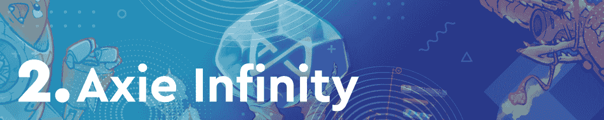
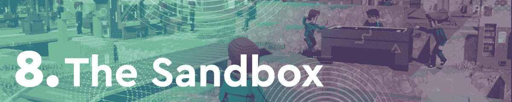
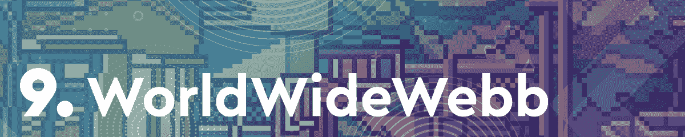

# 夹板地领先，NFT 世界退出

> 原文：<https://web.archive.org/web/https://dappradar.com/blog/splinterlands-takes-the-lead-nft-worlds-drops-out>

## 本周只有两个虚拟世界晋级

虽然二月份我们看到虚拟世界主宰了区块链的游戏领域，但三月份似乎又迎来了一个回归的领导者，Splinterlands。在过去的七天里，这款基于蜂巢的纸牌游戏凭借令人印象深刻的 526，470 个独特的活动钱包再次荣登排行榜榜首。

令人惊讶的是，连续三周位居榜首的 NFT 世锦赛本周却没有入围。虚拟世界完成了第二次 WRLD 空投。然而，native token 在过去七天内损失了超过 33%的估值。

几个月来，区块链游戏一直处于加密活动的前沿。通过这篇文章，DappRadar 看了本周最热门的游戏 dapps。为了编制这个排名，我们考虑了链上活动，NFT 交易量，令牌估值，以及围绕每个 dapp 的新闻和事件。

在下面浏览本周十大区块链游戏的完整列表。单击相应的图片，了解每个平台的更多信息。或者，看看下面的视频，它总结了排名，可以快速查看。

[https://web.archive.org/web/20220929045731if_/https://www.youtube.com/embed/UB_e-1n1m-g?feature=oembed](https://web.archive.org/web/20220929045731if_/https://www.youtube.com/embed/UB_e-1n1m-g?feature=oembed)

## 区块链十大运动会–2022 年第 9 周

多亏了令人印象深刻的用户群，Splinterlands 本周重新登上了宝座。在过去的七天里，该纸牌交易游戏吸引了 526，470 个独特的活动钱包。它也成为在 DappRadar 上追踪的[所有连锁店中访问量最大的游戏 dapp。再加上本地治理令牌](https://web.archive.org/web/20220929045731/https://dappradar.com/rankings/category/games) [SPS](https://web.archive.org/web/20220929045731/https://dappradar.com/hub/token/bsc/SPS/BNB?from=0x1633b7157e7638c4d6593436111bf125ee74703f) 相对稳定的价格，这个基于 Hive 的平台本周稳坐榜单首位。

游戏赚取巨头 Axie Infinity 在 NFT 创造了 1375 万美元的交易量，本周排名第二。这个令人印象深刻的交易量可能是由于最近[宣布从 3 月 7 日开始，Axie 市场的交易费用将会增加。](https://web.archive.org/web/20220929045731/https://dappradar.com/blog/axie-infinity-launches-new-fee-structure-players-disagree/)

基于多边形的移动塔防游戏[疯狂防御英雄](https://web.archive.org/web/20220929045731/https://dappradar.com/multichain/games/crazy-defense-heroes)正在游戏社区中稳步获得牵引力，本周排名第三。这款游戏是 Animoca Brands 产品组合的一部分，已经[宣布对游戏赚取结构](https://web.archive.org/web/20220929045731/https://dappradar.com/blog/earn-more-tower-rewards-with-crazy-defense-heroes/)进行重大改进。这也包括未来几个月更高的[塔](https://web.archive.org/web/20220929045731/https://dappradar.com/hub/token/eth/TOWER/ETH?from=0x1c9922314ed1415c95b9fd453c3818fd41867d0b)奖励池。此外，在过去的七天里，该移动平台连接了近 150，000 个不同的活动钱包。

基于蜡的采矿游戏[外星世界](https://web.archive.org/web/20220929045731/https://dappradar.com/wax/games/alien-worlds)本周排名第四，此前它是二月份排名的亚军。尽管推动其本土令牌 TLM 的估值超过 3%，但《异形世界》的玩家数量却有所下降。该游戏本周吸引了 293，560 个独特的活动钱包。尽管如此，采矿平台仍然是最受欢迎的区块链游戏之一，也是[蜡像协议](https://web.archive.org/web/20220929045731/https://dappradar.com/rankings/protocol/wax/category/games)的顶级玩家。

在缺席数周后，总部位于多边形的 REVV Racing 重返区块链十佳游戏榜单。这项比赛本周吸引了 3500 多名参赛者。然而，在排名中推动其得分的是本地令牌 [REVV](https://web.archive.org/web/20220929045731/https://dappradar.com/rankings/protocol/wax/category/games) 。除了超过 8%的大幅提价，REVV 还在[区块链](https://web.archive.org/web/20220929045731/https://dappradar.com/rankings/protocol/flow)上正式推出。它现在在 BloctoSwap 上有自己的 REVV/Flow 交易对。

基于 BSC 的农业游戏 [Mobox](https://web.archive.org/web/20220929045731/https://dappradar.com/binance-smart-chain/games/mobox-nft-farmer) 在 3 月 2 日的大规模 NFT 赠品之后，本周排名第六。赠品发布后，该平台记录了令人印象深刻的每周 400 万美元的 NFT 交易量。此外，Mobox 吸引了 176，960 个独特的活动钱包到其平台，在本周 DappRadar 上位居 [BSC 游戏排名](https://web.archive.org/web/20220929045731/https://dappradar.com/rankings/protocol/binance-smart-chain/category/games)榜首。

基于 EOS 的房地产游戏[高地](https://web.archive.org/web/20220929045731/https://dappradar.com/eos/games/upland)本周排名第七。该平台宣布将很快在地图上展示一个全新的区域，这促进了活动。高地将在未来几周内欢迎玩家来到底特律汽车城。此外，该游戏在过去七天内吸引了 158，140 个独特的活动钱包。

虚拟世界[沙盒](https://web.archive.org/web/20220929045731/https://dappradar.com/ethereum/games/the-sandbox)在过去 7 天里以超过 720 万美元的 NFT 交易量首次进入本周的排名。此外，该平台于 3 月 3 日举行了[大型 NFT 土地拍卖会，进一步增加了活跃度，有助于提高交易量。尽管如此，虚拟世界本周还是后退了一步，只有最大的平台才能晋级。](https://web.archive.org/web/20220929045731/https://dappradar.com/blog/news-from-the-sandbox-land-sale-going-live-on-march-3rd/)

第二个进入本周十大区块链游戏的虚拟世界是 WorldWideWebb。该平台[推出了一项名为公寓建造者](https://web.archive.org/web/20220929045731/https://dappradar.com/blog/digital-homeowners-get-to-design-their-apartment-today-in-worldwidewebb/)的重要新功能。该工具允许 Webb 土地所有者定制他们的虚拟公寓，并根据他们的喜好进行个性化设置。这是该平台上最受期待的功能之一，它的推出帮助 Webb land 在过去七天里在 NFT 产生了超过 430 万美元的交易量。

基于多边形的手机游戏平台 Arc8 本周完成了排名。自本月早些时候正式推出第一季以来，Arc8 一直有稳定的玩家流入。在过去的七天里，该游戏吸引了超过 27，000 个独特的活动钱包，而游戏的原生令牌 [GMEE](https://web.archive.org/web/20220929045731/https://dappradar.com/hub/token/polygon/GMEE/MATIC?from=0xcf32822ff397ef82425153a9dcb726e5ff61dca7) 升值超过 3%。

## Splinterlands 重新取得领先，多边形游戏蒸蒸日上

Splinterlands 逐渐建立了该领域最大的游戏社区之一，这有助于它获得大量活动。此外，游戏仍在进行其混乱军团战役，定期掉落新的扑克牌。

虽然 Splinterlands 处于领先地位，但基于多边形的平台，如 Crazy Defense Heroes、REVV Racing 和 Arc8，正在稳步吸引更多的观众。由于交易成本低和处理速度快，多边形区块链已经成为一些最受认可的即玩即赚游戏的所在地。

根据最近的一份 DappRadar 行业报告，替代连锁店正变得越来越受欢迎，尤其是在 NFT 和区块链的游戏领域。像[多边形](https://web.archive.org/web/20220929045731/https://dappradar.com/rankings/protocol/polygon)、[蜂巢](https://web.archive.org/web/20220929045731/https://dappradar.com/rankings/protocol/hive)、[雪崩](https://web.archive.org/web/20220929045731/https://dappradar.com/rankings/protocol/avalanche)和[和谐](https://web.archive.org/web/20220929045731/https://dappradar.com/rankings/protocol/harmony)这样的协议包含了这个领域中一些表现最好的游戏。此外，亚军 Axie Infinity 也运行在定制的 Ronin 侧链上，这进一步说明了报告中详细描述的趋势。

随着每周都有新项目声名鹊起，达普拉达尔将继续关注区块链博彩领域。如果你想了解更多关于区块链游戏的信息，请查看完整的 [DappRadar 顶级游戏排名](https://web.archive.org/web/20220929045731/https://dappradar.com/rankings/category/games)。你也可以在[的推特](https://web.archive.org/web/20220929045731/https://twitter.com/dappradar)上关注 DappRadar，首先了解最新的区块链博彩新闻。

 NewsletterUnsubscribe at any time. [T&Cs](https://web.archive.org/web/20220929045731/https://dappradar.com/terms) and [Privacy Policy](https://web.archive.org/web/20220929045731/https://dappradar.com/privacy-policy)