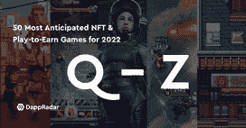

# Splinterlands 和华纳音乐将游戏和艺术家结合在一起

> 原文：<https://web.archive.org/web/https://dappradar.com/blog/splinterlands-warner-music-artists-games>

## 艺术家创造和开发独特的玩赚和 NFT 游戏

趋势区块链游戏 Splinterlands 宣布与华纳音乐集团合作，允许艺术家设计和开发独特的游戏赚取街机风格的区块链游戏。这种伙伴关系将有利于 WMG 艺术家和 Splinterlands 球员精选组的球迷。

凭借每周超过 50 万的独立活跃用户钱包，[splitterlands](https://web.archive.org/web/20230103160210/https://dappradar.com/multichain/games/splinterlands)在所有游戏中创造了最多的区块链活动。这些用户选择卡片并在战术卡片游戏中相互战斗，每周进行超过 1850 万次交易。本周，500 张以音乐艺术家瓦卡·弗洛卡为原型的独家游戏卡上市了，现在市场上的售价很高。

Splinterlands 和华纳音乐之间的新伙伴关系将为艺术家开创新的收入来源。这家音乐公司专注于定制 NFT 游戏，以吸引和吸引粉丝。Splinterlands 在一份新闻稿中表示，每款游戏都将是手机友好型的，易于使用。他们还强调，新的开发不会从游戏的路线图中拿走任何东西，包括陆地游戏，验证器节点，当然，还有新的卡包。

音乐和游戏似乎可以在区块链找到彼此。早在一月份，WMG 已经宣布通过收购沙盒中的虚拟地块进入元宇宙。 [Gala Games 推出了 Gala Music](https://web.archive.org/web/20230103160210/https://dappradar.com/blog/music-flows-through-the-crypto-world) 并吸引了史努比狗狗、史蒂夫·青木和英国电信。与此同时，RAC 与他的第一个分散式应用 racOS 和 RAC token 一起在分散式土地上推出了一个虚拟家园。

## 一个金融解决方案，现在有趣的来了

对于发展中国家的许多人来说，区块链游戏和游戏赚钱一直是副业，甚至是急需的收入。一些人宣扬这些好处，另一些人则批评新运动。以至于现有的游戏公司因为来自他们社区的仇恨而放弃了他们的 NFT 计划。最重要的是，区块链游戏通常缺乏传统视频游戏的深度。

尽管如此，人们对 NFTs 和游戏赚钱的商业模式越来越感兴趣。最近几个月，像育碧、Square Enix、微软、索尼和电子艺界这样的公司已经表达了他们对游戏赚钱的兴趣。这助长了一种观点，即区块链驱动的商业模式将会持续下去。育碧[在《幽灵侦察》断点](https://web.archive.org/web/20230103160210/https://dappradar.com/blog/ubisoft-bringing-ghost-recon-game-nfts-to-tezos/)中引入了 NFTs，并将[将其 Rabbids 特许经营权移入沙盒](https://web.archive.org/web/20230103160210/https://dappradar.com/blog/game-company-ubisoft-brings-raving-rabbids-into-the-sandbox/)。

目前，大多数区块链游戏的特点是简单的赚钱机制，比如在 [DeFi 王国](https://web.archive.org/web/20230103160210/https://dappradar.com/blog/play-to-earn-defi-kingdoms-rise-to-success/)中耕作或者在 Axie Infinity 中赢得战斗。更复杂的游戏和更广泛的机制正在开发中。在 2022 年及以后，游戏玩家可以期待第一人称射击游戏和 MMORPGs 以玩赚机制为特色。

一段时间后，当游戏质量达到 PlayStation 5 热门游戏的体验时，消费者会选择哪一款？你花 60 美元玩的那种，还是你玩就能赚到钱的那种？

看看下面的文章中列出的一些最令人期待的区块链奥运会。

[<picture></picture>](https://web.archive.org/web/20230103160210/https://www.dappradar.com/blog/best-nft-play-to-earn-games-for-2022-from-a-to-f)[<picture></picture>](https://web.archive.org/web/20230103160210/https://www.dappradar.com/blog/best-nft-play-to-earn-games-for-2022-from-g-to-p)[<picture></picture>](https://web.archive.org/web/20230103160210/https://www.dappradar.com/blog/best-nft-play-to-earn-games-for-2022-from-q-to-z)