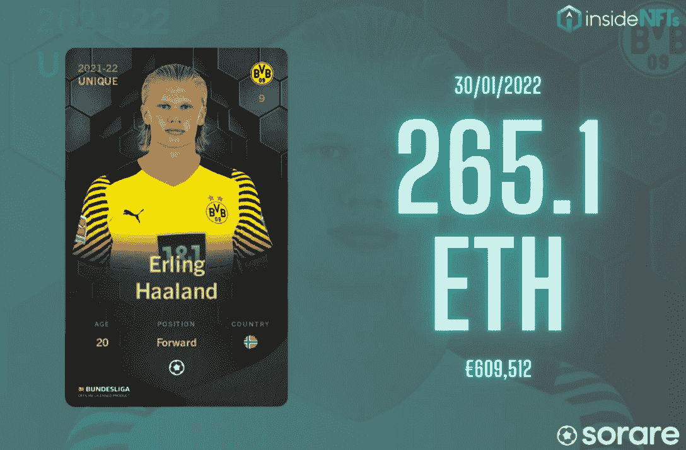
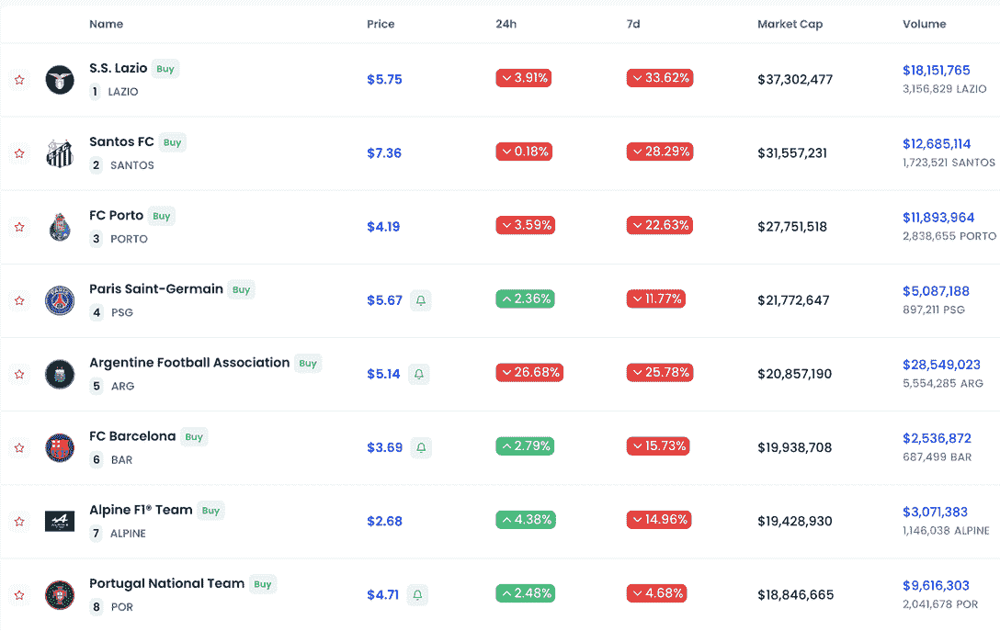
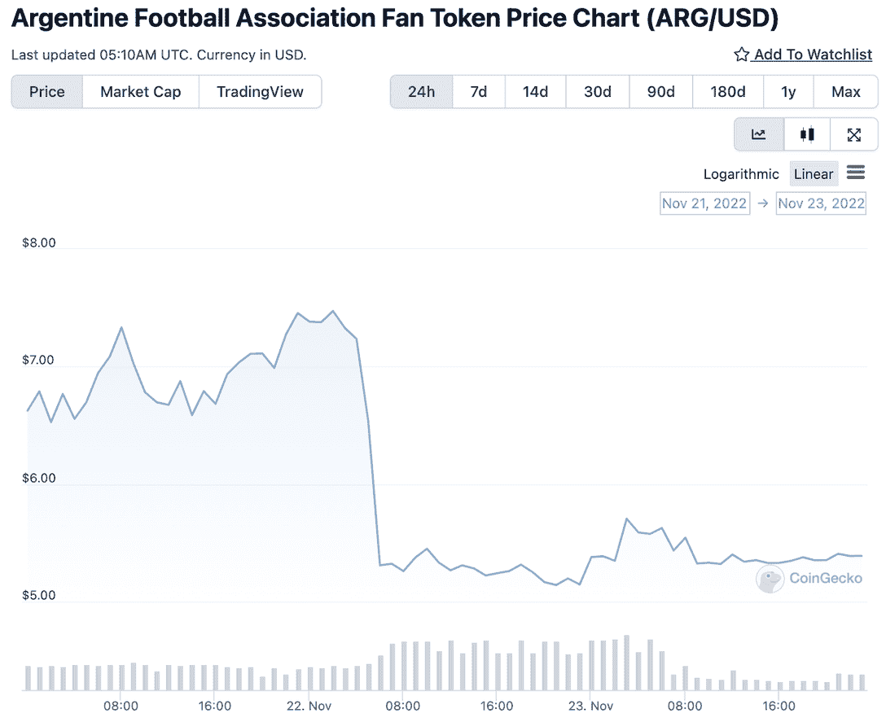
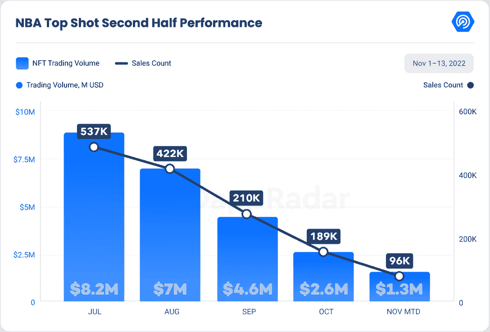
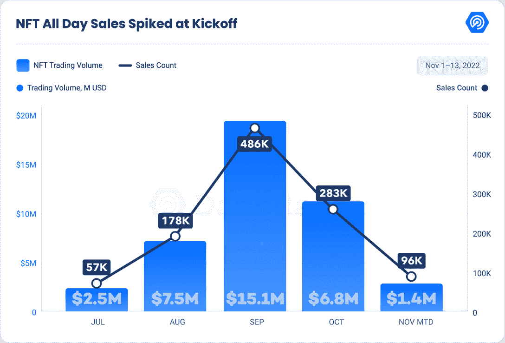
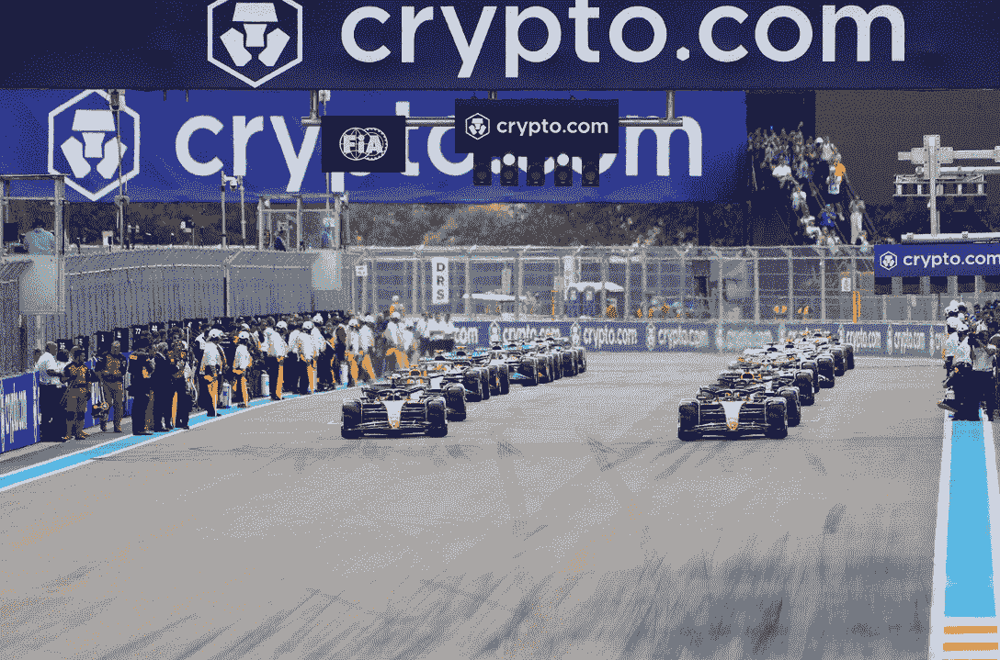
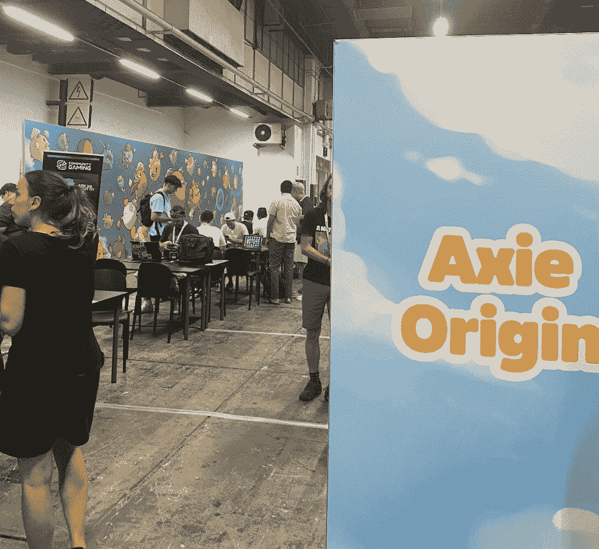

# 体育报道——国际足联世界杯让 30 亿至 50 亿人接触网络

> 原文：<https://web.archive.org/web/https://dappradar.com/blog/sports-report-fifa-world-cup-introduces-web3-to-5-billion-people>

## 区块链在体育界的潜力是巨大的。Web3 电子竞技的目标是成为大众采用的工具。

在接下来的六周里，全世界的目光都将聚焦在一个地方:卡塔尔 2022 年奥运会。世界杯是少数几个所有民族、种族、意识形态或宗教都能走到一起的全球现象之一。这是世界上最受关注的体育赛事，在 2018 年的比赛中吸引了全球 35 亿观众。这一数字预计将在未来六周内超过 50 亿。然而，今年在卡塔尔，Web3 将通过赞助、广告和互动体验与世界上一半以上的人口建立联系。

在国际足联球迷节期间，VISA 将为足球迷提供一种新的混合体验，包括 NFT 拍卖和沉浸式体验，允许世界杯参与者在克罗诺斯区块链上创建自己的 NFT。

今年早些时候，[algrand](https://web.archive.org/web/20221223101253/https://dappradar.com/rankings/protocol/algorand)成为国际足联的区块链官方合作伙伴。上个月，国际足球联合会(FIFA)在阿尔格兰德推出了首个 NFT 市场，名为 FIFA+ Collect。该市场将允许足球迷拥有国际足联世界杯和国际足联女足世界杯历史上标志性时刻的数字收藏品。

第一层的区块链不会是卡塔尔唯一的 Web3 网站。Crypto.com 和百威啤酒为世界杯签署了重要的赞助协议。对于百威啤酒这个在 Web3 上曝光率很高的品牌来说，这是一个通过 Budverse 展示其 NFT 战略的机会。

卡塔尔 2022 确实有机会将 crypto 和 Web3 带给主流观众。然而，公众在今年的世界杯上接触到区块链技术只是一长串网络 3-体育合作中的最新一例。从 NBA Top Shot 和 Sorare 的早期成功，到 Chiliz 基于 Web3 的体育生态系统，再到装饰 80% F1 赛车的品牌，区块链和体育营销显然是一对伟大的搭档。

为了庆祝世界杯，DappRadar 撰写了独家体育报道。

## 内容

*   [足球&区块链——一场梦幻般的比赛](https://web.archive.org/web/20221223101253/https://dappradar.com/blog/sports-report-fifa-world-cup-introduces-web3-to-5-billion-people/#Football-&-blockchain---a-fantasy-match)
*   [分散体育和娱乐活动](https://web.archive.org/web/20221223101253/https://dappradar.com/blog/sports-report-fifa-world-cup-introduces-web3-to-5-billion-people/#Decentralizing-sports-and-entertainment)
*   [流量引领数字体育收藏品](https://web.archive.org/web/20221223101253/https://dappradar.com/blog/sports-report-fifa-world-cup-introduces-web3-to-5-billion-people/#Flow-leading-on-digital-sports-collectibles)
*   [Web3 品牌在过去 18 个月里投入了 24 亿美元](https://web.archive.org/web/20221223101253/https://dappradar.com/blog/sports-report-fifa-world-cup-introduces-web3-to-5-billion-people/#Web3-brands-commit-$2.4-billion-over-the-last-18-months)
*   [电子竞技的未来可能会经历 Web3](https://web.archive.org/web/20221223101253/https://dappradar.com/blog/sports-report-fifa-world-cup-introduces-web3-to-5-billion-people/#The-future-of-esports-might-go-through-Web3)
*   [关闭](https://web.archive.org/web/20221223101253/https://dappradar.com/blog/sports-report-fifa-world-cup-introduces-web3-to-5-billion-people/#Closing)

## 足球和区块链——一场梦幻般的比赛

足球是世界上最受欢迎的运动，世界杯将为区块链提供前所未有的曝光率和知名度。克里斯蒂亚诺罗纳尔多是 Instagram 上最受关注的人，而梅西和内马尔的社交网络覆盖数百万人。但是 Web3 和足球之间的故事很久以前就开始了。

Sorare 是一款流行于区块链的梦幻足球游戏。在 Sorare，人们收集 Starkware 上的 NFT 玩家卡，stark ware 是以太坊的第二层解决方案。从以太坊到 Starkware 的转变帮助 Sorare 变得更快、更便宜、更容易获得。

每周，玩家会选出他们的顶级玩家，根据每次的表现来收集分数。Sorare 为游戏玩家提供了管理现实生活中的运动队的亲密体验，这不同于流行的幻想体育平台。

在过去的 30 天里，Sorare 是交易量第二大的 NFT 收藏，仅次于无聊猿游艇俱乐部。梦幻运动卡的表现超过了顶级系列，如[涂鸦](https://web.archive.org/web/20221223101253/https://dappradar.com/ethereum/collectibles/doodles)、[志那都红豆](https://web.archive.org/web/20221223101253/https://dappradar.com/ethereum/collectibles/azuki)和[月鸟](https://web.archive.org/web/20221223101253/https://dappradar.com/ethereum/collectibles/moonbirds)。

Source: [InsideNFTs](https://web.archive.org/web/20221223101253/https://inside-nfts.com/en-gb/sorare-most-expensive-cards/)

据 InsideNFTs 报道，迄今为止最高的 Sorare 销售额是 Erling Haaland Unique 卡，去年 1 月以 265 ETH 或 609，000 欧元售出。Mbappé以 41.6 万欧元的价格紧随其后，而梅西和罗纳尔多的卡片售价均超过 23 万欧元。

8 月，Sorare 增加了 NBA 球员的官方许可证，以推出他们的梦幻篮球游戏，从而扩大了其产品范围。幻想玩家可以交换印有他们最喜欢的球员的卡片，如斯蒂芬·库里、勒布朗·詹姆斯、杰森·塔图姆和卢卡·多尼契奇。而美国职业棒球大联盟(MLB)紧随其后。

[3 Cool Soccer Games to Play During the FIFA World Cup](https://web.archive.org/web/20221223101253/https://dappradar.com/blog/cool-soccer-games-to-play)

## 分散体育和娱乐

奇利兹·区块链为体育界最有趣的概念之一提供了动力:球迷代币。球迷代币是在 Chiliz 上铸造的可替换的公用代币，允许体育迷与他们最喜爱的体育俱乐部、球队或品牌联系。

粉丝令牌持有者可以参与投票，选择球衣设计、球衣号码、庆祝歌曲或激励信息。此外，投票者还可以参加抽奖，赢取官方商品、VIP 通道、门票、独家优惠等。

这些治理活动发生在 Socios.com，一个由 Chiliz 支持的平台。2022 年，Socios.com 计划发起 500 多项民意调查。该团队估计，到今年年底，将有 17，000 名 Socios.com 用户收到与其团队相关的奖励和礼物。

Source: [fanmarketcap](https://web.archive.org/web/20221223101253/https://www.fanmarketcap.com/)

在写的时候有 82 个粉丝代币，总市值 3.268 亿美元。巴萨、马德里竞技、巴黎圣日耳曼、阿森纳、曼城、尤文图斯、AC 米兰、弗拉门戈和河床等足球巨头都推出了球迷代币。此外，阿根廷、意大利和葡萄牙的足球俱乐部也紧随其后。

有趣的是，俱乐部的成绩会影响球迷代币的价值。一个例子是，在 2022 年卡塔尔世界杯的首场比赛中，阿根廷以 1 比 2 输给沙特后，AFA 币的价格下跌了 25%。

Source: [CoinGecko](https://web.archive.org/web/20221223101253/https://www.coingecko.com/en/coins/argentine-football-association-fan-token)

除了足球俱乐部，网球戴维斯杯，电子竞技队和 F1 赛车队也推出了粉丝代币。

CHZ 是为 Socios.com 平台提供动力的数字货币，新推出的 CC2-奇利兹测试网旨在成为第一个专门从事体育运动的区块链。他们正在创建定制的基础设施，在此基础上构建体育专用的 Web3 体验。在阿纳海姆，测试网第一阶段，CC2 将允许创建 NFT 和范令牌智能合同。

## 数字体育收藏品的流量领先

虽然 Sorare 是 fantasy sports 的领先 dapp，而 Chiliz 正在围绕粉丝代币建立一个去中心化的生态系统，但 [Flow](https://web.archive.org/web/20221223101253/https://dappradar.com/rankings/protocol/flow) 已经成为体育收藏品的标准。这是最大的体育相关市场之一:福布斯估计，仅去年一年就有 120 亿至 240 亿美元用于体育纪念品。

Top Shot 可能不仅启动了基于体育的 NFT 市场，还在去年的 NFT 牛市中发挥了重要作用。在 Q1 2021 年， [NBA Top Shot](https://web.archive.org/web/20221223101253/https://dappradar.com/flow/collectibles/nba-topshot) 产生了 4.5 亿美元的交易额，占整个 NFT 市场的 36%。Dapper Labs 创建的平台允许篮球迷收集名为 Moments 的短视频，捕捉 NBA 比赛的精彩片段。

和 Sorare 一样，Top Shot 的收藏品也经常出现在交易量最大的 NFT 收藏品中。Flow 的篮球时刻今年已经从 810 万笔交易中产生了超过 2 亿美元的销售额。Top Shot 是有史以来交易量第七大的收藏，成交额为 9.75 亿美元。

为了补充他们在 NBA 的提议，Dapper Labs 于 2021 年 9 月宣布了 [NFL 全天](https://web.archive.org/web/20221223101253/https://dappradar.com/flow/collectibles/nfl-all-day)。美式足球生态系统对该平台来说是成功的。到目前为止，在 2022 年，NFL 全天已经通过超过一百万次交易积累了超过 3500 万美元。除了 NBA 和 NFL，Dapper Labs 还与 UFC 和西甲进行了合作。

Dapper Labs 成功的一个关键因素是减少摩擦。当时刻存储在区块链上时，当创建链接到它的账户时，流钱包同时在后端创建。此外，任何人都可以使用银行卡购买一包或一个时刻，将 NFTs 带给更广泛的受众。

[Discover Top 10 NFT Collections for Sports Fans](https://web.archive.org/web/20221223101253/https://dappradar.com/blog/top-10-nft-collectibles-for-sports-fans)

## 在过去的 18 个月中，Web3 品牌承诺投入 24 亿美元

虽然本报告旨在涵盖最相关的体育 dapp，但有必要评估外部经济条件，以了解体育在 dapp 生态系统中的潜力。

据彭博称，在过去的 18 个月里，与密码相关的品牌已经承诺在体育营销上投入超过 24 亿美元。2021 年夏天，F1 与 Crypto.com 签署了一份价值 1 亿美元的大单[。更令人印象深刻的是，大约 80%的赛车队至少与 Tezos、OKX、ByBit 以及三周前的 FTX 等公司有一个加密合作关系。](https://web.archive.org/web/20221223101253/https://www.cnbc.com/2021/06/29/formula-1-strikes-100-million-cryptocurrency-sponsorship.html)

​​

Source: [Bloomberg](https://web.archive.org/web/20221223101253/https://www.bloomberg.com/news/articles/2022-10-01/crypto-s-hold-on-formula-1-sponsoring-gets-tested-in-singapore?leadSource=uverify%20wall)

此外，Crypto.com 在 2021 年 11 月签署了一项为期 20 年、价值 7 亿美元的大规模协议，获得斯台普斯中心的冠名权。Crypto.com 还与法国足球强队巴黎圣日耳曼(PSG)和 NHL 的蒙特利尔加拿大人队建立了合作关系。同样，特佐斯已经和曼联签订了一份重要的协议，而币安成为了拉齐奥的主要球衣赞助商。币安最近还宣布与克里斯蒂亚诺罗纳尔多签署协议，推出球员的第一个官方 NFT 系列。

比特币基地也成为美国体育迷们熟悉的名字。比特币基地承诺在四年内为 NBA 花费近 2 亿美元。去年二月，比特币基地发起了一场超级碗广告战。尽管结果并没有带来预期的结果，但是他们仍然实现了为 Web3 sphere 提供可见性的关键目标。

不管是好是坏，FTX 是体育界最引人注目的标志之一。2021 年 1 月，FTX 与迈阿密戴德郡签署了一份为期 19 年、价值 1.35 亿美元的协议，获得迈阿密热火队主场的冠名权。当年晚些时候，FTX 与电子竞技俱乐部团队 SoloMid 签署了一份为期 10 年、价值 2.1 亿美元的合同。在最近的事件之后，两份合同都被立即取消了。

## 电子竞技的未来可能会通过 Web3

在过去的十年里，电子竞技行业经历了巨大的增长。2019 年，[全球有 1 亿人观看了英雄联盟锦标赛](https://web.archive.org/web/20221223101253/https://www.statista.com/chart/16875/super-bowl-viewership-vs-world-cup-final/#:~:text=The%202020%20Super%20Bowl%20pales,million%20viewers%20around%20the%20world.)。它通过包括 ESPN 在内的 30 个平台以 19 种不同语言播出。从这个角度来看，全球有 1.3 亿人观看了 LV 超级碗。

Axie Origins Tournament Finals

在这个拥有 24 亿游戏玩家的星球上，区块链的游戏有潜力在未来几年推动电子竞技行业的发展。9 月，在巴塞罗那 AxieCon 期间，Sky Mavis 举办了三场电子竞技锦标赛，总奖金为 100 万美元。多亏了游戏公会，以及下一代区块链游戏，包括《分裂之地》、《被解放的上帝》、多人在线游戏和《皇室战争》, Web3 游戏进入电子竞技主流舞台可能只是时间问题。

看看这些区块链竞技游戏:

*   [Axie Infinity](https://web.archive.org/web/20221223101253/https://dappradar.com/multichain/games/axie-infinity) (战术战斗游戏)
*   [夹板地](https://web.archive.org/web/20221223101253/https://dappradar.com/multichain/games/splinterlands)(交易卡牌游戏)
*   [被解放的神](https://web.archive.org/web/20221223101253/https://dappradar.com/multichain/games/gods-unchained)(交易卡牌游戏)
*   [REVV 赛车](https://web.archive.org/web/20221223101253/https://dappradar.com/polygon/games/revv-racing)(赛车游戏)
*   [Skyweaver](https://web.archive.org/web/20221223101253/https://dappradar.com/polygon/games/skyweaver) (交易卡牌游戏)

## 关闭

体育产业一直融合了高端技术。在 F1 中，车队在他们的汽车中采用尖端技术。Moneyball 的故事展示了运动家队如何利用先进的分析技术成为一支低于平均水平的有竞争力的球队。然而，区块链将改变传统的体育模式，引入一种新的方式将粉丝群与他们喜爱的球队和球员联系起来。

区块链在体育界的潜力是巨大的。Web3 电子竞技的目标是成为大众采用的工具。球迷代币扰乱了人们与他们喜爱的俱乐部的互动方式，提供了真正的归属感，同时以现实生活中的效用奖励代币持有者。

体育 dapps 也将收藏品和幻想游戏推向了一个新的高度。五年前，对于任何人来说，拥有世界杯、NFL、NBA、MLB 等标志性时刻的授权镜头都是不可想象的。体育 NFT 为个人以自由和安全的方式交易收藏品提供了一个自由市场。与此同时，区块链的奇幻游戏促进了新玩家的经济发展。

最后，通过 web3 生态系统，如 Bored Ape 游艇俱乐部、CryptoPunks 或其他 NFT 社区，粉丝可以随时与库里、汤姆·布拉迪和小威廉姆斯等知名运动员共享相同的社交层。社会精英的壁垒可以通过一个不和谐的服务器或独家活动稍微模糊。

web3 以其他形式出现，如 WAGMI 团队或 VaynerSports，表明这可能只是体育分权模式的开始。