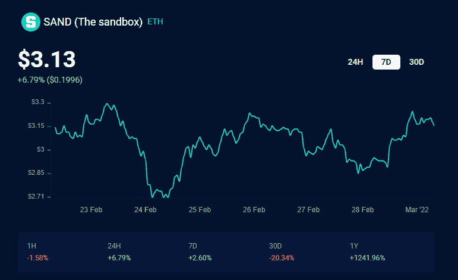
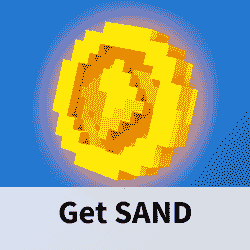

# 广场埃尼克斯将地牢围攻转变为元宇宙内容

> 原文：<https://web.archive.org/web/https://dappradar.com/blog/square-enix-dungeon-siege-the-sandbox-metaverse>

## 游戏特许经营权进入沙盒

**Square Enix** [**将把其**](https://web.archive.org/web/20220929104945/https://sandboxgame.medium.com/the-sandbox-and-square-enix-team-up-to-bring-dungeon-siege-rpg-experiences-to-the-metaverse-c5029bb13bd4) **地牢围攻特许经营权带入沙盒，允许用户使用特许内容在元宇宙构建自己的地牢围攻冒险。一个特殊的地牢围攻地块将成为玩家发现用户生成内容的起点。**

Square Enix 不仅将在虚拟领域[沙盒](https://web.archive.org/web/20220929104945/https://dappradar.com/ethereum/games/the-sandbox)中推出自己的地牢围攻游戏中心。他们还将向玩家和内容创作者提供地牢围攻体素角色和物品，以将其融入他们自己的元宇宙体验。

[https://web.archive.org/web/20220929104945if_/https://www.youtube.com/embed/-QEOTkxyQ-o?feature=oembed](https://web.archive.org/web/20220929104945if_/https://www.youtube.com/embed/-QEOTkxyQ-o?feature=oembed)

在 Square Enix 的产品组合中，我们发现了《最终幻想》和《古墓丽影》等品牌。可以肯定地说，地牢围攻是他们较小的品牌之一。地牢围攻 III，该系列的最后一款游戏，发布于 2011 年。该特许经营已经售出 170 万份，同时还利用了强大的修改者社区。

## Square Enix 早期投资沙盒

自 2019 年底以来，Square Enix 一直是沙盒的投资者，但尚未宣布任何针对元宇宙或游戏赚取游戏的内部开发。通过将他们的地牢围攻游戏带入沙盒，他们将成为两者的先锋。虚拟世界让内容创作者和玩家都能从他们的努力中获利。其他活跃在沙盒中的游戏公司有育碧和雅达利。

总体而言，沙盒已经与来自不同市场的 200 多个品牌和公司合作。最近，他们宣布与华纳音乐集团和阿迪达斯合作。此外，还有项目来与古驰，行尸走肉，史努比狗狗，但也有蓝精灵和关怀熊。

毫无疑问，这些合作关系对于沙盒中的虚拟土地的估价很有帮助。在撰写本文时，voxel 虚拟世界中的土地价格为 3.25 ETH，即 9500 美元。该平台目前正在经历一次迁移，期间陆地从[以太坊](https://web.archive.org/web/20220929104945/https://dappradar.com/rankings/protocol/ethereum)移动到[多边形区块链](https://web.archive.org/web/20220929104945/https://dappradar.com/rankings/protocol/polygon)。

## 沙子从 0.03 美元到 3.00 美元

在 2020 年 10 月[本地沙子代币](https://web.archive.org/web/20220929104945/https://dappradar.com/hub/token/eth/SAND?from=0x3845badade8e6dff049820680d1f14bd3903a5d0)的价值为 0.03 美元。快进到现在，沙子的价值是 3.19 美元，在过去的 24 小时内上涨了 7.9%。该公司将允许玩家在即将到来的第二次阿尔法测试中赚取沙子。

[<picture></picture>](https://web.archive.org/web/20220929104945/https://dappradar.com/hub/token/eth/SAND?from=0x3845badade8e6dff049820680d1f14bd3903a5d0)

[Discover SAND on DappRadar](https://web.archive.org/web/20220929104945/https://dappradar.com/hub/token/eth/SAND?from=0x3845badade8e6dff049820680d1f14bd3903a5d0)

[<picture></picture>](https://web.archive.org/web/20220929104945/https://dappradar.com/ethereum/games/the-sandbox)[<picture></picture>](https://web.archive.org/web/20220929104945/https://dappradar.com/hub/token/eth?to=0x3845badade8e6dff049820680d1f14bd3903a5d0)