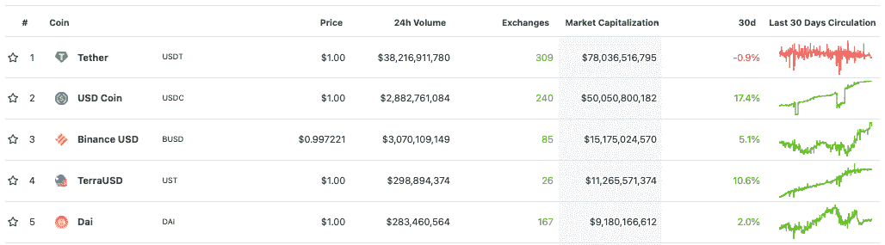

# USDC 追赶 USDT，赛马进入白热化

> 原文：<https://web.archive.org/web/https://dappradar.com/blog/stablecoin-race-heats-as-usdc-chases-usdt>

## USDC 市值突破 500 亿美元大关

与美元挂钩的稳定货币 USDC 紧随领先的稳定货币 USDT 之后。而高盛支持的 USDC 的市值增长了 17%以上，达到了具有里程碑意义的 500 亿美元。USDT 在过去 30 天下跌了近 1%。

稳定点数[代表各种机会](/web/20221007195207/https://dappradar.com/blog/what-is-staking-and-how-to-earn-passive-income/)，但被投资者广泛用于进出交易头寸。最近，它们被用来赚取被动收入，一些平台提供高达 10%的稳定币储蓄。在新的 stablecoin 项目上市的背景下，统治之战仍在继续，世界两大 stable coin 正在一决雌雄。

就在一年前，前五大稳定币名单还不包括 TerraUSD，Terra 网络的原生稳定币。TVL 目前的资产超过 130 亿美元，比一年前的 1 亿美元有所增长。此外，BUSD 的出现证明了币安智能链自不到 18 个月前推出以来，作为一个交易平台取得了令人印象深刻的增长。然而，很明显，在不久的将来，只有两个稳定的竞争对手会占据榜首。

## USDC 占据市场份额

stablecoin 的总供应量目前为 1760 亿美元，相当于整个加密货币市值的 10%左右。系绳占据了 45%的份额，而随着差距的缩小，USDC 现在占据了 29%的份额。凭借超过 780 亿美元的市值，Tether 仍然是 stablecoin 生态系统中的主导力量，但高盛支持的 USDC 正在发起严重的指控。

拥有本地稳定币背后的一个关键动机是，它可以刺激 dapps 及其运营的网络急需的交易量。[随着多链模式在 2021 年继续发展](/web/20221007195207/https://dappradar.com/blog/2021-dapp-industry-report/)，一系列新区块链、dapps 和分散式交易所出现了。这些平台中的一些已经推出了他们的 stablecoins 来帮助他们特定网络上的交易者。Magic Internet Money 推出了它的 MIM 令牌，而 Celo dollar 也正在获得牵引力，并帮助[显著增长网络的 TVL](https://web.archive.org/web/20221007195207/https://defillama.com/chain/Celo)。

此外，stablecoin 项目目前正在寻找与美元挂钩之外的货币，以便为交易商提供本国货币，例如欧元 Tether (EURT)。这可以让那些希望用欧元进行交易的供应商和零售商轻松很多，而且不会受到汇率波动的影响。极大地帮助了更多真实世界的用例以他们的本地货币进行支付。

在 2022 年 1 月的第三周，USDC 的供应已经在以太坊网络上翻转了 USDT。根据其透明[报告](https://web.archive.org/web/20221007195207/https://tether.to/en/transparency/)，系绳供应目前主要在以太坊和创之间分配，每个网络上分别有大约 390 亿美元和 360 亿美元 USDT，其余的在少数其他网络上，如 Solana 和 Algorand。

 NewsletterUnsubscribe at any time. [T&Cs](https://web.archive.org/web/20221007195207/https://dappradar.com/terms) and [Privacy Policy](https://web.archive.org/web/20221007195207/https://dappradar.com/privacy-policy)

***以上不构成投资建议。此处给出的信息仅供参考。请行使尽职调查，做你的研究。作者持有 ETH、BTC、AGIX、HEX、LINK、GRT、CRO、OMI、不可变 X、GALA、AVASTR、GMEE、CUBE、RADAR、FLOW、FTM、BNB、SPS、WRLD、ATOM 和 ADA。***