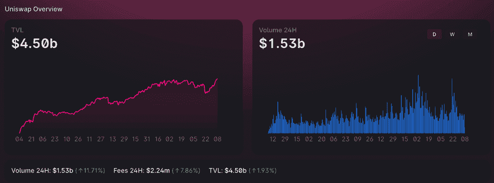
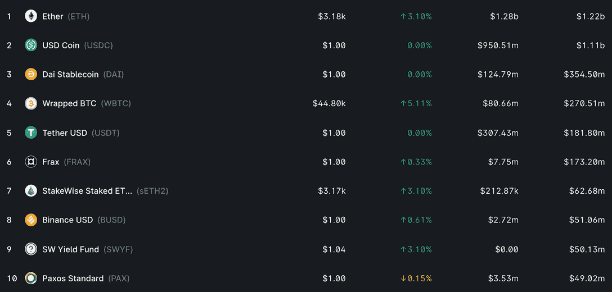
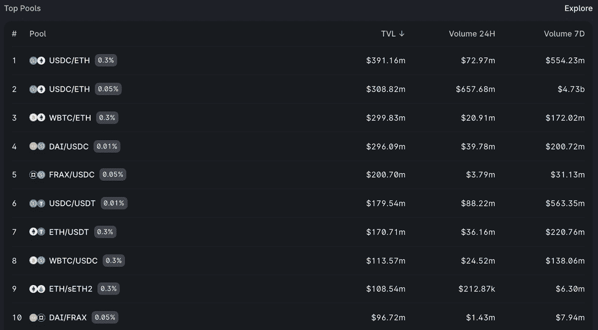

# 当 Uniswap TVL 公司在 ATH 上市时，Stablecoins 显示出 45 亿美元的价值

> 原文：<https://web.archive.org/web/https://dappradar.com/blog/stablecoins-show-worth-as-uniswap-tvl-hits-ath-4-5b>

## 以太坊的价格比 2021 年 11 月的 ATH 低 34%

**尽管 ETH 的象征性价格比 2021 年 11 月的历史高点低 34%,但 Uniswap V3 的总价值锁定(TVL)达到了 45 亿美元的历史高点。** [**Uniswap 创历史新高**](https://web.archive.org/web/20221208162228/https://dappradar.com/ethereum/exchanges/uniswap-v3) **在目前市场不景气的情况下，显示了金融平台的多样性和稳定收入在定义中的重要性。**

Uniswap V3 在区块链本地 ETH 令牌的价格没有飙升的情况下，成功达到了锁定总价值的记录。通常情况下，TVL 与不断上涨的代币价格密切相关，但这里显然不是这样。

看看构成 Uniswap 今天锁定的总价值的大部分的[十大代币资产](https://web.archive.org/web/20221208162228/https://info.uniswap.org/#/)，我们看到列表中有七个美元支持的代币。在 45 亿美元的总价值中，这些约占 19 亿美元。USDC 是明显的主导力量，持有超过 11 亿美元。锁定的另一半价值大多由 ETH 和 wBTC 组成，是比特币的包装版。

如上所述，当代币价格下降时，Uniswap 持有的代币总额的美元数字将会下降。Uniswap 的高水平 [stablecoin 投资是该平台在象征性价格下跌中进入新 ATH 的原因。由于这些稳定的货币与美元挂钩，它们不会波动。](https://web.archive.org/web/20221208162228/https://dappradar.com/ethereum/exchanges/uniswap-v3)

## 投资者是如何使用 stablecoins 的？

Uniswaps 的核心功能依赖于用户向池中提供流动性以实现代币互换。在一个去中心化的平台上，流动性必须来自其社区，不像传统银行可以从中央储备中借款，并向用户收取费用。[在 Uniswap](https://web.archive.org/web/20221208162228/https://dappradar.com/ethereum/exchanges/uniswap-v3) 上，用户可以向资金池中添加等量的 ETH 和 USDC，以获得奖励并获得资产利息。然后，希望在瑞士联邦交易所或 USDC 进行代币掉期交易的交易商可以利用这个资金池。

查看 Uniswap 上的前十个池可以了解该平台上正在发生的事情的更多细节。此外，池显示了 Uniswap 上目前锁定的大部分价值以及在哪些令牌中。很快，我们看到两个最大的资产池是 USDC 和瑞士联邦理工学院，这仅仅反映了 Uniswap 中最重要的资产，所以这并不奇怪。

有趣的是，十大池中有四个只涉及稳定资本，四个涉及流动性对一侧的稳定资本。

2022 年去中心化金融越来越受欢迎，这意味着交易者越来越多地寻找在尽可能少的价格影响下进出交易头寸的方法。Stablecoins 可以提供这一点，让交易者留在特定的 dapp 生态系统中开展业务。更不用说那些愿意提供流动性的人所获得的回报和 APY 了。

## 稳定是关键

stablecoin 的总供应量目前为 1770 亿美元，相当于整个加密货币市值的 10%左右。系绳控制了其中的 45%,而 USDC 现在占了 29%。

随着多链模式在 2021 年继续发展，一系列新区块链、dapps 和分散式交易所[出现](https://web.archive.org/web/20221208162228/https://dappradar.com/rankings/category/defi)。这些平台中的一些已经推出了他们的 stablecoins 来帮助他们特定网络上的交易者。神奇的互联网货币推出了它的 MIM 令牌，而 Celo dollar 也正在获得牵引力，并帮助[显著增长网络的 TVL](https://web.archive.org/web/20221208162228/https://defillama.com/chain/Celo)。此外，stablecoin 项目目前正在寻找美元挂钩之外的货币，以向交易商提供本国货币，例如欧元泰铢(EURT)。

 NewsletterUnsubscribe at any time. [T&Cs](https://web.archive.org/web/20221208162228/https://dappradar.com/terms) and [Privacy Policy](https://web.archive.org/web/20221208162228/https://dappradar.com/privacy-policy)

***以上不构成投资建议。此处给出的信息仅供参考。请行使尽职调查，做你的研究。作者持有 ETH、BTC、AGIX、HEX、LINK、GRT、CRO、OMI、不可变 X、GALA、AVASTR、GMEE、CUBE、RADAR、FLOW、FTM、BNB、SPS、WRLD、ATOM 和 ADA。***