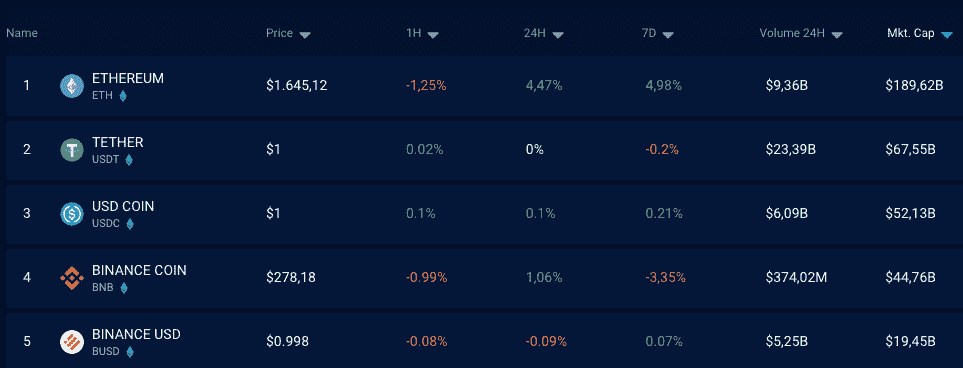
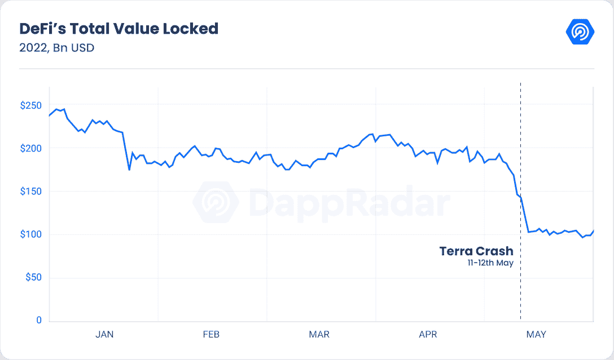

# Stablecoins:简单指南

> 原文：<https://web.archive.org/web/https://dappradar.com/blog/stablecoins-the-simple-guide>

## 大量采用稳定的硬币需要消费者保护和合理的监管。

最新更新 2022 年 9 月 6 日

Stablecoins 是一种加密货币，是现实世界和加密领域之间的桥梁。常规稳定货币应该是一对一挂钩的，并通过美元等基础法定资产来保持其价值。

总市值超过 1500 亿美元的稳定公司吸引了消费者和监管者的注意也就不足为奇了。

根据其基础资产的支持，有许多不同类型的稳定债券。最受欢迎和最容易掌握的是那些基于美元等真实货币和黄金或白银等硬实物资产的货币。

然而，也有加密抵押和算法稳定的帐户，如[制造商戴](https://web.archive.org/web/20220907092806/https://dappradar.com/hub/token/eth/DAI?from=0x6b175474e89094c44da98b954eedeac495271d0f)。我们将在这本简单的指南中讨论 stablecoin 的用例以及后面的方面。

[https://web.archive.org/web/20220907092806if_/https://www.youtube.com/embed/pGzfexGmuVw?feature=oembed](https://web.archive.org/web/20220907092806if_/https://www.youtube.com/embed/pGzfexGmuVw?feature=oembed)

Source: [Whiteboard Crypto](https://web.archive.org/web/20220907092806/https://www.youtube.com/c/WhiteboardCrypto)

在此了解[你可以信赖的最佳稳定伙伴](https://web.archive.org/web/20220907092806/https://dappradar.com/blog/these-are-the-best-stablecoins-you-can-trust)。

首先，我们必须了解使用 stablecoins 的目的以及它们的用途。

## 为什么是 Stablecoins？

当前的金融系统非常缓慢，尽管全球数字化，我们的钱仍然以模拟方式工作。缓慢的交易增加了高成本和一系列影响消费者和企业的其他摩擦。

想象一下，如果您可以拥有加密的速度和灵活性，并将其与现实世界的资产相结合，而不具有加密的高波动性。这是 stablecoins 的主要价值主张。

让我们来研究一下 stablecoins 的用例

### 赤字贷款

在 DeFi 平台贷款的情况下，stablecoins 的效用非常明显。它们作为开关斜坡，在法定货币(真实货币)和加密货币之间提供无摩擦的流动。6 月份稳定债券的交易总额超过了 5900 亿美元。

在发展中国家，稳定的货币是抵御恶性通货膨胀的一种手段。在熊市中，投资者将资金存放在稳定的货币中，因为它们比其他加密货币波动性小。

### 汇款

在委内瑞拉或阿根廷等通货膨胀率极高的国家，稳定的货币是保存你寄给朋友和家人的钱的实际价值的绝佳工具。拥有一个支持 stablecoins 的加密钱包可以降低交易成本。而且，可以瞬间安全放心的汇款。

### 工资单和发票

Stablecoins 可以显著降低企业的费用和交易成本。这对于没有足够资源的夫妻店、大型企业和最终消费者来说尤其有利。

## 有哪些不同类型的稳定圈？

并非所有的稳定曲线都是相同的，因此了解它们是如何工作的至关重要。理论上，稳定硬币发行者在一对一的基础上持有实际抵押品——要么是金融机构，要么是传统银行。

[<picture></picture>](https://web.archive.org/web/20220907092806/https://dappradar.com/hub/tokens/ethereum/all/1)

以下是最常见类型的分类

### 菲亚特支持的

这种类型的稳定币是完全支持的，并且可以以一对一的比率与其相应的固定资产进行兑换。[系绳 USDT](https://web.archive.org/web/20220907092806/https://dappradar.com/hub/token/eth/USDT?from=0xdac17f958d2ee523a2206206994597c13d831ec7) 和[圈 USDC](https://web.archive.org/web/20220907092806/https://dappradar.com/hub/token/eth/USDC?from=0xa0b86991c6218b36c1d19d4a2e9eb0ce3606eb48) 就属于这一类。

要使这种模式正常运行，稳定的账户必须由可信的第三方进行彻底的支持和透明的审计。市值最大的公司是泰瑟 USDT 公司，超过 660 亿美元，其次是 USDC 圈公司，超过 550 亿美元。

[Check out stablecoins with our Token Explorer](https://web.archive.org/web/20220907092806/https://dappradar.com/hub/tokens/ethereum/all/1)

由帕克斯和币安创立的 [BUSD 稳定币](https://web.archive.org/web/20220907092806/https://www.binance.com/en/busd)也属于这一类，由美元一对一支持。使用 BUSD 这样的稳定货币可以大大有助于对冲市场波动时期的风险，现在 BUSD 可能会加大势头，宣布不再支持 USDC，并将把用户的 USDC 兑换成自己的稳定货币 BUSD。

按交易量计算，币安是最大的加密交易所，这一举措肯定会影响市值第二大的稳定币发行商 USDC 的格局，并加剧不同类型稳定币发行商之间的竞争。

### 商品支持/集中式稳定帐户

这些稳定的货币使用硬资产，如贵金属，如经认证的实物黄金储备。像 [Tether Gold (XAUT)](https://web.archive.org/web/20220907092806/https://dappradar.com/hub/token/eth/XAUT?from=0x4922a015c4407f87432b179bb209e125432e4a2a) 和 [DigixGlobal (DGX)](https://web.archive.org/web/20220907092806/https://coinmarketcap.com/currencies/digix-gold-token/) 这样的发行人是排名靠前的。

### 分散/算法稳定

许多高级加密用户认为这些类型的稳定密码是最值得信赖的。如果稳定币背后的智能合约是可自我审计的，精明的消费者就能发现潜在的缺陷。

它们受到其他加密货币的支持，以太坊区块链的智能合约会自动稳定它们的价值。

智能合约有控制供给和需求以稳定价值的算法公式。

[戴](https://web.archive.org/web/20220907092806/https://dappradar.com/hub/token/eth/DAI?from=0x6b175474e89094c44da98b954eedeac495271d0f)可以说是最值得信赖的去中心化稳定币。它在[以太坊](https://web.archive.org/web/20220907092806/https://dappradar.com/rankings/protocol/ethereum)上运行，并试图维持 1.00 美元的价值。与中央银行不同，戴的银行账户中没有美元作为支持。

相反，它是由绿洲 DeFi 平台上的抵押品支持的，该平台是由创客和戴项目背后的同一批人构思的。

最近，Aave 提出了一种分散的产生收益的稳定币，这种币将与美元挂钩，由产生利息收益的用户铸造。

该提议获得了 Aave DAO 的批准，预示着对整个生态系统的巨大影响。根据 DeFi Lama 在撰写本文时的说法，Aave 是 DeFi 的巨头，TVL 为 66 亿美元。GHO 的合同开发处于高级阶段，我们可能会看到 GHO 很快上市。

此外，以太坊上的 V2 将成为 GHO 的第一个推动者

### stablecoins 的问题

稳定货币的作用是维持其固定价值，减少波动。理想情况下，这些数字资产必须得到 100%的支持，就像我们银行账户中的钱应该得到政府资产一对一的完全支持一样。

不幸的是，在有些情况下，稳定的债券无法保持其价值，导致高系统性风险和流动性问题。根据 DappRadar 的 2022 年 5 月行业报告，在特拉区块链崩溃期间，DeFi 损失了 45%的价值。

[<picture></picture>](https://web.archive.org/web/20220907092806/https://dappradar.com/defi)

Source: DappRadar

### 稳定的法规

Terra 的崩溃抹去了 600 亿美元，这是现代史上最大的财富损失，造成了所有加密资产的恐慌，并恶化了熊市。

虽然各国的方法不同，技术总是领先一步，但似乎有一个共识，即对稳定的硬币实行更严格的监管。

最终，稳定的硬币发行者可能会面临银行必须遵守的同样严格的监管框架。

这里是你需要知道的关于全球加密法规的所有信息。

 NewsletterUnsubscribe at any time. [T&Cs](https://web.archive.org/web/20220907092806/https://dappradar.com/terms) and [Privacy Policy](https://web.archive.org/web/20220907092806/https://dappradar.com/privacy-policy)