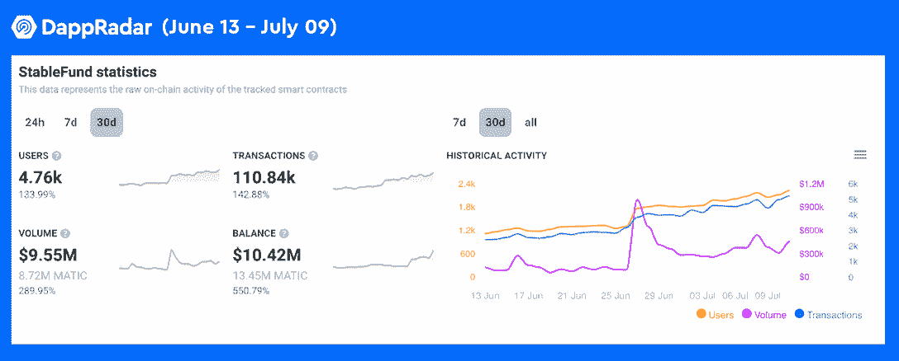

# StableFund 的人工智能应用程序使加密交易变得极其简单

> 原文：<https://web.archive.org/web/https://dappradar.com/blog/stablefunds-ai-powered-app-makes-crypto-trading-extremely-easy>

## StableFund 允许用户赚取每日赌注奖励

StableFund 是一款人工智能支持的加密交易应用，为用户带来极致体验。这是 StableOne 的最新创新，stab Leone 是一家总部位于英国的专门从事区块链的技术公司。

**概要:**

*   StableFund 允许用户在[多边形](https://web.archive.org/web/20220813151400/https://dappradar.com/rankings/protocol/polygon) 和 [BNB 智能链](https://web.archive.org/web/20220813151400/https://dappradar.com/rankings/protocol/binance-smart-chain)上交易、互换、下注和存储加密货币。
*   密码投资者可以使用 Al-powered 平台交换 200 种不同的密码，包括 [MATIC](https://web.archive.org/web/20220813151400/https://dappradar.com/hub/token/eth/MATIC?from=0x7d1afa7b718fb893db30a3abc0cfc608aacfebb0) 、 [ETH](https://web.archive.org/web/20220813151400/https://dappradar.com/hub/token/eth/ETH) 、 [BNB](https://web.archive.org/web/20220813151400/https://dappradar.com/hub/token/eth/BNB?from=0xb8c77482e45f1f44de1745f52c74426c631bdd52) 、 [FTM](https://web.archive.org/web/20220813151400/https://dappradar.com/hub/token/eth/FTM?from=0x4e15361fd6b4bb609fa63c81a2be19d873717870) 等等。
*   过去 30 天，StableFund 的用户增长了 133%，交易量增长了 143%，交易量增长了 290%。

## 什么是稳定基金

StableFund 是 Polygon 和 BNB 智能链上的一体化加密交易平台。StableFund 采用尖端技术，为用户提供了一个交易、互换、下注和存储替代硬币的平台。目前，用户可以用 StableFund 兑换 200 枚硬币，包括 MATIC、ETH、BNB、FTM 等。

毫无疑问，市场上已经有很多交易平台。然而，StableFund 先进的人工智能工具使其在竞争中脱颖而出。这些人工智能工具可以帮助用户自动交易密码，并通过 Apple Pay、信用卡和借记卡等多种方法促进支付。

另外值得一提的是，StableFund 在 iOS 和 Android 智能手机上都可以使用，为用户提供直观的界面和简化的体验。

## 实现利润最大化并获得日常回报

除了为用户提供一个方便有效的加密交易应用程序，StableFund 还允许赚取被动收入。StableFund 的赌注功能允许用户每天收取 1.5%的奖励。

为了实现这一目标，该团队设计了利润驱动的算法，以最大化用户在密码交易中的收入。值得注意的是，它不仅利用数据分析，还采用经验丰富的交易者的成熟交易策略，以实现最佳交易结果，帮助投资者实现利润。

## 稳定基金的活动有所增长

易于使用的应用程序、稳定的收益和强大的人工智能，这三大支柱有助于 StableFund 的普及。根据 DappRadar dapp 跟踪页面，StableFund 在过去 30 天里见证了所有指标的显著增长。具体来说，dapp 的 30 天独立用户增长了 134%，而交易增长了 142%。

StableFund 的 30 天交易量也飙升了近 290%，产生了 955 万 MATIC。

要开始使用 StableFund，用户只需从 AppStore 或 GooglePlay 下载应用程序，并创建一个钱包。StableFund 的社区和团队随时准备在用户遇到问题时给予支持。

了解有关 StableFund 的更多信息:

[网站](https://web.archive.org/web/20220813151400/https://stablefund.app/)

[推特](https://web.archive.org/web/20220813151400/https://twitter.com/stableonegroup)

[电报](https://web.archive.org/web/20220813151400/https://t.me/Stablefundofficial)

[脸书](https://web.archive.org/web/20220813151400/https://www.facebook.com/StableOne-Group-108855348518713)

[Instagram](https://web.archive.org/web/20220813151400/https://www.instagram.com/stableonegroup/)

**免责声明** —这是一篇赞助文章。DappRadar 不认可本页面上的任何内容或产品。DappRadar 旨在提供准确的信息，但读者应该在采取行动之前总是自己做研究。DappRadar 的文章不能被认为是投资建议。