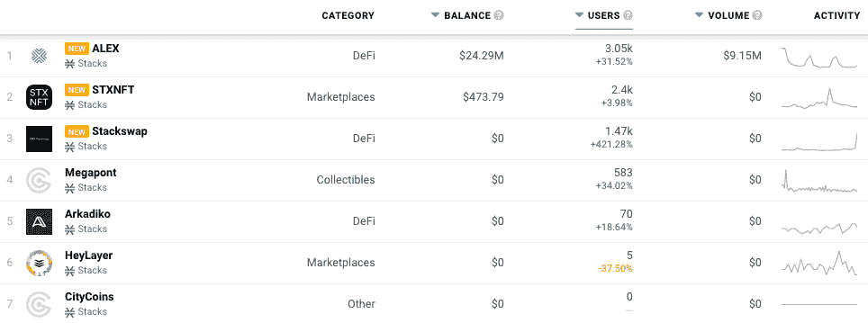

# 现在在 DappRadar 上堆叠区块链 Dapps

> 原文：<https://web.archive.org/web/https://dappradar.com/blog/stacks-blockchain-dapps-now-on-dappradar>

## Stacks 支持比特币的 dapps 和智能合约

DappRadar 很高兴地宣布整合了区块链 T2 的 Stacks 和它的 dapps 生态系统。DappRadar 每月 100 万的网站访问者现在可以通过 Stacks dapp 排名来分析哪些 dapp 吸引了最多的交易量，独特的用户钱包，或者处理了最多的交易。通过这种方式，每个人都可以了解哪些 dapps 和令牌构建了稳固的社区，并在堆栈上产生了价值。

[Stacks 2.0 是一个第一层区块链](https://web.archive.org/web/20221128042518/https://dappradar.com/rankings/protocol/stacks)，它连接到比特币，并带来智能合约和去中心化应用。在 Stacks 平台上开发的智能合约和 dapps 与比特币的安全性、稳定性和经济实力天然集成在一起。

堆栈区块链实现了一种叫做转移证明(PoX)的挖掘机制。PoX 是两个区块链之间的一致算法。它使用已有的区块链(在这里是比特币)来确保新区块链的安全。PoX 以 1:1 的块比率连接到比特币，这意味着在 Stacks 区块链上发生的任何事情都可以在比特币区块链上得到验证。PoX 没有在工作证明上烧电，而是重新使用已经铸造的比特币作为“计算证明”，矿工直接用比特币表示他们的采矿成本。

## 在 DappRadar 上堆叠 Dapp 排名

在发布时， [DappRadar 将在 Stacks Network](https://web.archive.org/web/20221128042518/https://dappradar.com/rankings/protocol/stacks) 上跟踪多个类别的七个 dapp，包括 DeFi 和交易所、NFT 收藏和市场，未来还会有更多 dapp。 [ALEX(自动流动性交易所)](https://web.archive.org/web/20221128042518/https://dappradar.com/stacks/defi/alex-1)是一个使用 Stacks 智能合约为比特币构建的完整 DeFi 平台。亚历克斯让投资者启动新项目，赚取利息，并交换代币。用户还可以通过 launchpad 发现和参与新兴堆栈项目的 IDO 轮，并通过提供流动性获得回报。

STXNFT 是一个领先的数字收藏品市场和比特币 NFT 的社交平台。marketplace 由三个核心产品组成，允许用户探索和收集 NFT，而其 creator-first launchpad 允许艺术家在几分钟内部署经过全面测试的无代码智能合同。最后，社交平台以一种 Web3 原生的方式将创作者和收藏者聚集在一起。

Explore Stacks [Dapps](https://web.archive.org/web/20221128042518/https://dappradar.com/rankings/protocol/stacks)

[Megapont 是 NFT 独家会员俱乐部](https://web.archive.org/web/20221128042518/https://dappradar.com/stacks/collectibles/megapont)，为用户提供 NFT 系列和更广泛的路线图，包括 MEGACOIN、Mega Kongs、Megapont Ape Club 和 [more](https://web.archive.org/web/20221128042518/https://dappradar.com/stacks/collectibles/megapont) 。我们鼓励社区参与并探索 DappRadar now 上的[全系列 Stacks dapps。](https://web.archive.org/web/20221128042518/https://dappradar.com/rankings/protocol/stacks)

## 面向 dapp 开发者的堆栈

Clarity 是 Stacks 2.0 区块链智能合约的新语言，优化了可预测性和安全性。Stacks 2.0 将 Clarity 智能合约锚定在比特币上，使智能合约能够基于比特币区块链上看到的动作进行操作。

dappRadar 邀请 Dapp 开发者[向 DappRadar](https://web.archive.org/web/20221128042518/https://dappradar.com/submit-dapp) 提交他们的 Dapp，为 Stacks 生态系统在世界 Dapp 商店上创造更多的可见性。那些有兴趣了解更多关于栈和可用可能性的人可以从[栈开发者文档](https://web.archive.org/web/20221128042518/https://docs.stacks.co/understand-stacks/overview)开始。

[<picture></picture>](https://web.archive.org/web/20221128042518/https://dappradar.com/rankings/protocol/stacks)[<picture></picture>](https://web.archive.org/web/20221128042518/https://dappradar.com/stacks/defi/alex-1)[<picture></picture>](https://web.archive.org/web/20221128042518/https://dappradar.com/stacks/collectibles/megapont) NewsletterUnsubscribe at any time. [T&Cs](https://web.archive.org/web/20221128042518/https://dappradar.com/terms) and [Privacy Policy](https://web.archive.org/web/20221128042518/https://dappradar.com/privacy-policy)