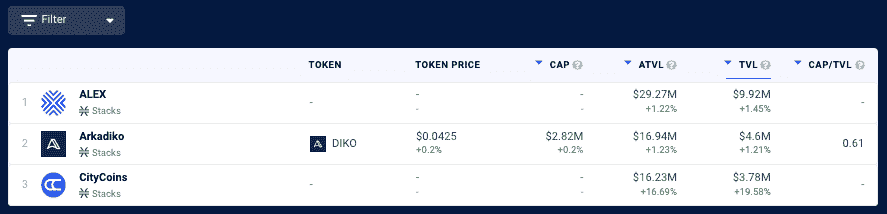
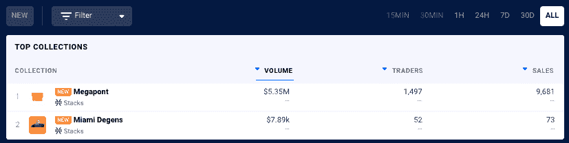
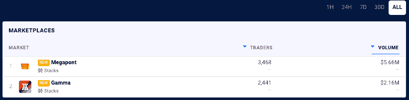

# 书库网络 NFT 收藏和 DeFi TVL 现在在达普拉达

> 原文：<https://web.archive.org/web/https://dappradar.com/blog/stacks-network-nft-collections-defi-tvl-now-on-dappradar>

## 通过扩展我们的能力为用户带来更多价值

**DappRadar 在我们的 NFT 排名页面中增加了对栈上 [DeFi dapps 的总价值锁定(TVL)](https://web.archive.org/web/20220705011826/https://dappradar.com/defi/protocol/stacks)和 [NFT 收藏](https://web.archive.org/web/20220705011826/https://dappradar.com/nft/protocol/stacks)的跟踪功能。这有助于用户更好地了解区块链[书库](/web/20220705011826/https://dappradar.com/blog/stacks-blockchain-dapps-now-on-dappradar/)的 DeFi 景观，并让他们深入了解最热门的 NFT 系列的表现。**

[Stacks 2.0 是一个第一层区块链](https://web.archive.org/web/20220705011826/https://dappradar.com/rankings/protocol/stacks)，它连接到比特币，并带来智能合约和去中心化应用。在 Stacks 平台上开发的智能合约和 dapps 与比特币的安全性、稳定性和经济实力天然集成在一起。

Stacks 区块链 dapps 在更广泛的 DappRadar 生态系统中的更深入整合将 [DeFi dapps](https://web.archive.org/web/20220705011826/https://dappradar.com/defi) 和 [NFT 系列](https://web.archive.org/web/20220705011826/https://dappradar.com/nft)置于聚光灯下。现在用户可以通过十三个区块链[分析 TVL，包括](https://web.archive.org/web/20220705011826/https://dappradar.com/defi)[栈](https://web.archive.org/web/20220705011826/https://dappradar.com/defi/protocol/stacks)，以太坊，多边形，BNB 链。与此同时，NFT 的崇拜者可以使用达普拉达 NFT 排行榜来追踪书架上最受欢迎的 NFT 系列的表现。

## 达普拉达尔的斯塔克斯·迪菲·TVL

锁定总价值或 TVL 指的是锁定在网络上 DeFi dapps 智能合同中的资产的美元价值。这是一个广泛使用的指标，用来表示 DeFi 空间随时间的增长。

DappRadar 目前[跟踪为客户](https://web.archive.org/web/20220705011826/https://dappradar.com/defi/protocol/moonriver)[提供分散金融](https://web.archive.org/web/20220705011826/https://dappradar.com/blog/what-is-defi-or-decentralized-finance/) (DeFi)服务的栈中的三个 dapps。TVL 反映了有多少价值被注入 DeFi dapps，也可以表明他们的受欢迎程度和整体吸引力。在 DeFi 排名中，用户现在可以分析 TVL 和本地令牌，并更详细地探索和分析堆栈 DeFi dapps。

*Source:* [*DappRadar*](https://web.archive.org/web/20220705011826/https://dappradar.com/defi/protocol/stacks)

## 在达普拉达上堆放 NFT 收藏品

尽管 NFT 收藏刚刚在区块链书展上预热，但作为世界上的 dapp 商店，DappRadar 向用户传达最热门资产类别的最新趋势是至关重要的。DappRadar 目前在区块链书库上追踪两个 NFT 收藏和两个 NFT 市场。用户现在可以更详细地分析 NFT 收藏，并使用过滤器来查看网络上的顶级 NFT 销售以及他们可以交易的市场。

## 扩展 DappRadar 功能

DappRadar 在过去的 24 个月中极大地扩展了它的跟踪能力，从一个跟踪少数网络及其 Dapp 的网站到[世界的 Dapp 商店](https://web.archive.org/web/20220705011826/https://dappradar.com/rankings)。我们向世界介绍了我们的雷达令牌，[一个具有扩展功能的投资组合管理器](https://web.archive.org/web/20220705011826/https://dappradar.com/hub/wallet/)，NFT 探索者和价值评估者，令牌交换和探索者，以及深入的 NFT、DeFi 和 TVL 跟踪。

此外，DappRadar 还提供行业领先的评估工具和报告，帮助[进一步指导社区](https://web.archive.org/web/20220705011826/https://dappradar.com/token/governance)。随着我们继续建设未来的 dapp 商店，我们邀请社区参与、贡献并与我们一起建设[it](https://web.archive.org/web/20220705011826/https://dappradar.com/token/governance)。

[<picture></picture>](https://web.archive.org/web/20220705011826/https://dappradar.com/rankings/protocol/stacks)[<picture></picture>](https://web.archive.org/web/20220705011826/https://dappradar.com/stacks/defi/alex-1)[<picture></picture>](https://web.archive.org/web/20220705011826/https://dappradar.com/stacks/collectibles/megapont)

## 面向 dapp 开发人员的堆栈网络

Clarity 是 Stacks 2.0 区块链智能合约的新语言，优化了可预测性和安全性。Stacks 2.0 将 Clarity 智能合约锚定在比特币上，使智能合约能够基于比特币区块链上看到的动作进行操作。

dappRadar 邀请 Dapp 开发者[向 DappRadar](https://web.archive.org/web/20220705011826/https://dappradar.com/submit-dapp) 提交他们的 Dapp，为 Stacks 生态系统在世界 Dapp 商店上创造更多的可见性。那些有兴趣了解更多关于栈和可能性的人可以从[栈开发者文档](https://web.archive.org/web/20220705011826/https://docs.stacks.co/understand-stacks/overview)开始。

 NewsletterUnsubscribe at any time. [T&Cs](https://web.archive.org/web/20220705011826/https://dappradar.com/terms) and [Privacy Policy](https://web.archive.org/web/20220705011826/https://dappradar.com/privacy-policy)