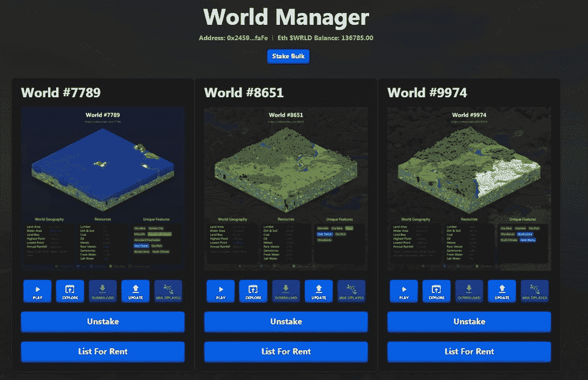

# 在 NFT 世界中下注并赚钱

> 原文：<https://web.archive.org/web/https://dappradar.com/blog/stake-and-earn-money-in-nft-worlds>

## 成千上万的用户已经利用了赌注的机会

本周，NFT 世界引入了赌注制度，允许 NFT 持有者锁定他们的 NFT，赚取用 WRLD 代币支付的利息。赌注已经成为 DeFi 领域的一项主要活动，并且也在游戏领域有所发展。

NFT 世界现在允许用户通过下注他们的世界 NFT 来生成平台的本地令牌 WRLD。有幸拥有 10，000 个 NFT 世界之一的用户可以获得以下好处:

*   每隔一段时间赚取 WRLD 代币。世界所有者可以在任何时候要求他们的 WRLD 奖金。
*   一个标桩的世界也可以出租。业主可以设定每月租金价格，就像现实世界中的房东一样。该团队通过[世界经理 dapp](https://web.archive.org/web/20220925071400/https://nftworlds.com/manager) 提供租赁管理。

持有人从赌注中赚取的 WRLD 数量取决于他们持有的 NFT 的稀有程度。一块土地的稀有属性越多，它产生的 WRLD 就越多。查看[这个链接](https://web.archive.org/web/20220925071400/https://docs.nftworlds.com/nft-worlds-usdwrld-token/staking-and-rent-for-nft-world-holders)显示了整个公式。

总共有 17.5 亿 WRLD 代币被锁定，准备在计划的五年时间内作为赌注奖励进行分配。按照目前的票面价格，这相当于 3.325 亿美元。在赌注功能推出几个小时后，土地所有者已经下注了所有 NFT 世界的 34.53%。

## 如何支撑 NFT 世界

这是一个相当简单的过程来赌注你的 NFT 世界:

*   进入[世界管理器](https://web.archive.org/web/20220925071400/https://www.nftworlds.com/manager)，连接你使用的钱包。
*   在世界管理器中，你将会看到所有的土地。
*   你可以按下“赌注”按钮一个接一个地下注。
*   或者您可以使用页面顶部的“批量下注”按钮。
*   请记住，赌注需要在以太坊区块链进行交易。所以你需要一些以太网来支付煤气费，以太坊的煤气费相对较高。

World Manager page

## 关于 NFT 世界

NFT 世界是一个由 10，000 个虚拟世界组成的集合，这些虚拟世界以 NFT 的形式存在于区块链以太坊。每个世界都是“一个可探索的、无限的世界，你可以把它建成你能想象的任何东西。”

与《我的世界》兼容，地块铸造于 2022 年 10 月 5 日。每一个都是一个迷你元宇宙，用户可以按照他们认为合适的方式来制作、塑造和设计。每一个都有独特的特点，游客可以自由探索。爱好者，以及交易者和投机者，对这个项目产生了真正的兴趣，因为它展示了真正有趣的用例。

可能性似乎是无穷无尽的，因为世界的主人可以以他们想要的任何方式塑造他们的环境。玩家和开发者社区创造了角色扮演游戏、塔战游戏和第一人称射击游戏。每个游戏都有从玩到赚的机制来赢得 WRLD 或其他奖励，由 NFT 世界提供支持。是的，您也可以通过在“玩即赚”服务器上玩游戏来赢取 WRLD。

[https://web.archive.org/web/20220925071400if_/https://www.youtube.com/embed/8qgpU3jpGwc?feature=oembed](https://web.archive.org/web/20220925071400if_/https://www.youtube.com/embed/8qgpU3jpGwc?feature=oembed)

NFT Worlds multiplayer demo

有关区块链游戏和分散应用世界的更多新闻，请继续关注 [DappRadar](https://web.archive.org/web/20220925071400/https://dappradar.com/blog/) 并在 [Twitter](https://web.archive.org/web/20220925071400/https://twitter.com/DappRadar) 上关注我们。你也可以参加我们每周四下午 4 点的[不和谐](https://web.archive.org/web/20220925071400/https://discord.com/invite/QMnwjGzrkG)节目。