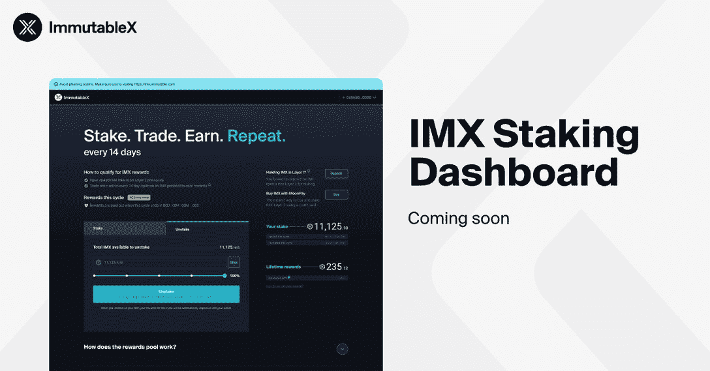

# 用不可变的 X 锁定

> 原文：<https://web.archive.org/web/https://dappradar.com/blog/staking-with-immutable-x>

## 自我保管赌注确保社区保持控制

从 7 月 1 日到 7 月 30 日，不可变 X 将举行第一个赌注周期。随后将转向自我保管，用户将保留对其资产的完全控制权。最近的行业事件可能削弱了人们对 web3 的信心，但那些将客户放在第一位的公司会继续繁荣发展。

**总结**

*   ***第一个不可变 X 赌注周期将于 7 月 1 日开始，运行至 7 月 30 日。***
*   ***赌注的第一阶段将在每个周期结束时开始自动奖励活跃的*******用户。随着时间的推移，不可变的 X 将切换到一个具有交互式仪表板的自我保管的赌注过程。****
*   ****[DappRadar 新的跨链锁定协议](https://web.archive.org/web/20220813154642/https://dappradar.com/token/staking)将同时推出，也将给予用户对其区块链资产的完全自我保管控制。****

 *继最近的危机之后，如 Terra stablecoin 内爆和 T2 冻结顾客钱包，人们重新关注 web3 的所有权问题。

自我保管赌注已经成为一个热门话题，因为人们越来越担心，如果符合公司利益，他们的资产可能会被拿走。去中心化和所有权是 web3 的基石；组织暂停你的资金是不应该发生的。

正是考虑到这些对话和问题，Immutable X 推出了新的 staking 特性。这场运动的核心理念是“你的资产应该永远是你的。”

## 不可变 X 定位是如何工作的？

为了获得第一阶段赌注的资格，用户需要在整个周期内在不可变的 X 层 2 钱包中持有至少 10 个 [IMX](https://web.archive.org/web/20220813154642/https://dappradar.com/hub/token/eth/IMX?from=0xf57e7e7c23978c3caec3c3548e3d615c346e79ff) 令牌。他们还需要用他们的钱包交易至少一个 T2 NFT。

在第一个赌注周期于 7 月 30 日结束后，Immutable X 将向每个符合标准的钱包发放奖励。奖励将基于每个用户对整个赌注池的 [IMX](https://web.archive.org/web/20220813154642/https://dappradar.com/hub/token/eth/IMX?from=0xf57e7e7c23978c3caec3c3548e3d615c346e79ff) 贡献的比例。因此，如果总共有 100 个代币，您投入其中的 30 个，您将获得所有奖励的 30%。

第二阶段的赌注从 9 月份开始，用 Immutable X 的话说，是受到“最近的行业事件”的刺激。这是一个自我保管的赌注系统，永远不会暂停提款。

Work-in-progress dashboard

实现一个用户可以随时将他们的资产移入和移出的协议，将需要开发人员几个月的时间来配置。这就是为什么 Immutable X 决定采用分阶段的方法，这样人们就可以尽快开始获得奖励。

在同一个地方查看您在不同区块链的代币、NFT 和 DeFi 头寸。连接您的 Web3 钱包并[查看您的投资组合](https://web.archive.org/web/20220813154642/https://dappradar.com/hub/wallet)！

[<picture></picture>](https://web.archive.org/web/20220813154642/https://dappradar.com/hub/wallet)

## 什么是 staking 和 DappRadar 的新跨链 staking？

赌注是赌注凭证(PoS)令牌持有者锁定其令牌的地方。为此，他们通过大宗奖励和交易费得到补偿。有没有想过那些[以太币气费](https://web.archive.org/web/20220813154642/https://dappradar.com/blog/when-are-ethereum-gas-fees-lowest)去哪了？很多钱都给了股东，作为认可区块链交易的奖励。

PoS 协议自 2012 年以来一直存在，但在过去几年中变得更加突出，特别是在 DeFi 中，因为平台和组织正在寻找创造性的方法来使用 PoS 赚钱。DappRadar 写的曲线战争是一个很好的例子，说明了押注加密货币可以带来巨大的利润

DappRadar 通过我们的跨链标桩协议引领了标桩领域的新创新。简而言之，用户可以用另一种加密货币，如 T2 的 ETH T3 或 T4 的 BNB T5，来换取雷达 T1 代币。

我们这样做是因为 DappRadar 是一个多链平台。我们的目标从一开始就是组织和展示来自每个区块链的数据。因此，我们不希望只与一两个区块链合作，而是希望我们的用户能够从他们使用的任何一个中获得奖励。

有关如何跨链下注并以您选择的加密货币赢取奖励的完整指南，请访问 DappRadar 的跨链下注指南。

## 为什么自我保管的赌注很重要

首先，我们应该界定什么是自我保管赌注。这是赌注，委托人仍然完全控制他们的令牌。这意味着赌注者只委托每个 PoS 令牌的投票权，而不会失去将资产移动到所需位置的能力。

自我监管跟踪很重要，因为控制区块链的资产是这种技术的一个关键特征。一家公司告诉你你的资金是你自己的，只是为了在他们需要保持流动性时阻止你提取资金，这是没有好处的，就像 Celsius 的情况一样。

真正的 web3 平台，如 Immutable X，已经看到一些平台如何违背了他们的承诺，并希望向他们的社区保证他们不会做同样的事情。这是他们战略的一部分，目的是让尽可能多的人加入区块链科技。

可持续发展是 web3 长远未来的关键。坚持其既定理想的组织将帮助整个空间向前发展，并确保不断有新人加入进来。更多像不可变 X 这样的平台将有助于培养确定性和信任。*