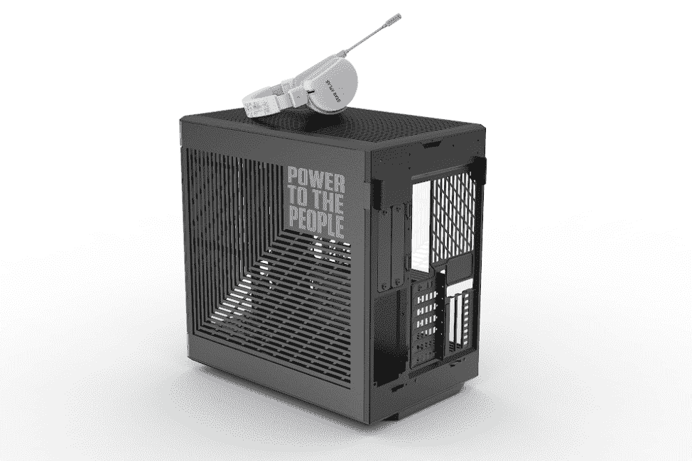
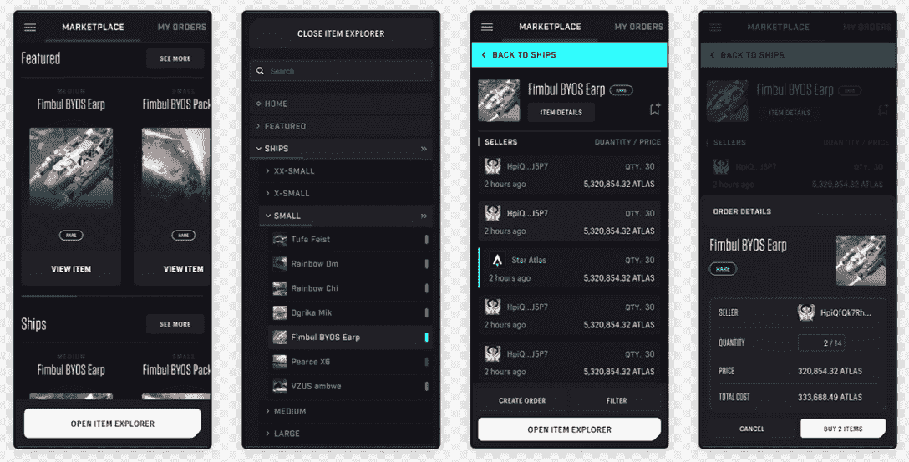

# Star Atlas 首席执行官谈“人类劳动协调的下一步”

> 原文：<https://web.archive.org/web/https://dappradar.com/blog/star-atlas-ceo-on-the-next-step-in-the-coordination-of-human-labor>

## 迈克尔·瓦格纳讨论了“无边界的数字国家”和权力下放的演变

7 月 21 日，DappRadar 参加了 Star Atlas 426LIVE 活动，亲自了解备受期待的平台更新。几天来，谣言在粉丝论坛上满天飞，而《星际争霸》团队仍然守口如瓶。每个人都在猜测迈克尔和团队会透露什么。

幸运的是，没有人失望而归。活动进行得天衣无缝，有现场 DJ 和大量聊天。自动控制公司 Star Atlas 背后的团队——的高层人物出席发布了最新消息、启示和大量 alpha。

### 演讲的主要收获:

*   对于 Star Atlas 而言，运营安全至关重要。为此，他们正在与 Kudelski Security 合作，以确保用户的钱包尽可能安全。
*   **[Star Atlas](https://web.archive.org/web/20220811235216/https://dappradar.com/solana/games/star-atlas) 正与游戏制造商 iBUYPOWER 合作，发布一系列定制产品。这些将是一个品牌的 PC 外壳，定制耳机和一个光滑的游戏鼠标垫，带有 Star Atlas 艺术作品。**
*   产品负责人 Luciano Castello 在介绍 Star Atlas 自己的银河市场时给了我们一份全球独家报道。这是现在已经推出，并准备交易。
*   StarPath 是全新的星图推荐计划。它采用 web3 技术来奖励招募新玩家的用户和游戏部落。
*   首席执行官迈克尔·瓦格纳(Michael Wagner)在最后的陈述中发布了最令人期待和激动的最新消息:Star Atlas 正在推出其去中心化自治组织的第一个版本。稍后将详细介绍。

在音乐和演示之后，我有机会和 Star Atlas 的首席执行官迈克尔·瓦格纳坐在一起，旁边还有一些 web3 的新闻成员。

我们讨论了道力学对星图未来的重要性。我们谈到了在区块链奥运会期间创造一个可持续发展的经济有多么困难。以下是迈克尔·瓦格纳对我们提出的一些问题的回答。

[https://web.archive.org/web/20220811235216if_/https://www.youtube.com/embed/obc68pU3Or8?feature=oembed](https://web.archive.org/web/20220811235216if_/https://www.youtube.com/embed/obc68pU3Or8?feature=oembed)

Exclusive Showroom gameplay

## 为什么 Dao 对 web3 如此重要？

Michael Wagner:分散的自治组织是区块链本地的治理系统，使用自动化来协调参与者的指令。

在全球范围内，Dao 是一个相对较新的概念，与传统的公司结构不同，它们优先考虑成员所有权。

这些结构是人力资本和劳动力协调的下一步，这一步和公司本身的发明一样具有重要的历史意义。

## 《星图》中的刀将如何操作？

马:DAO 生态系统被设计成一个多层次的平台，在最高层，我们今天推出的 universal DAO 的任务是管理货币政策、财政部和游戏范围的决策，以规范 Star Atlas 的整体福祉。

这是一个总体结构，它指导着整个生态系统，在接下来的迭代中，我们将引入派系、区域和地方 Dao 来用于游戏中。

除此之外，公会将会有一个独立的基础设施。这些次级 Dao 将决定行星和派系税率等因素。他们将被用来协调派系斗争，所以未来会有更多的事情发生。

通用 DAO 的主要任务是通过 ATLAS 货币政策管理 Star Atlas 经济，并将对未来的 Atlas 排放进行监管，以获得游戏奖励。它还将监督替代激励结构。

此外，DAO 还嵌入了来自游戏性 taxationalongisee 产品实现(如新市场)的收入流。这些经济考虑之外的其他影响领域包括特性和资产发布时间表。

以及合并玩家创建的内容。此外，批准现实世界的公司之间具有法律约束力的外链合同。

该基金会将由一个独立的董事会管理。我在这里很想强调一点，自动机并不控制基础。

董事会的唯一职能是充当 DOA 的代理人。他们负责处理过去的提案，并在必要时代表 DAO 签订法律合同。

iBUYPOWER bespoke Star Atlas PC case

## 区块链游戏成功的关键是什么？真正的去中心化，易用性，三 A 玩法，还是别的？

马:就主流游戏玩家而言，他们将依赖我们开发一款对他们非常有吸引力的产品。这显然是我们追求的目标。

这就是在索拉诺上运行的基于三 A 虚幻引擎的体验。你知道，对我们来说，提供非常有趣、吸引人、娱乐性强的游戏体验是至关重要的。

这需要成为我们的首要任务，一个有趣的游戏体验。然而，其次才是基础，这是我们通过引入加密和非功能性传输允许的潜在经济和不同的价值主张。对于游戏玩家来说，就像玩到赚一样。

对我来说，这是一种价值提升。这不是该用户群的核心价值提案。如果你可以花几个小时玩 MMO，在结束时，你也可以得到一些具有真实世界货币价值的加密货币。嗯，这对于那个特定的用户来说都是有利的。

他们无论如何都要去玩。但现在他们实际上拥有了自己的资产。他们可以自由地进行点对点交易。而且他们在游戏中花费时间也有潜在的收益。

## 区块链游戏如何实现大众化？

马:我们把用户的安全放在第一位。我们坚持网络安全协议和实施的最高标准。

因此，这从我们开始，确保我们的应用程序是安全的，并且那些与个人交互的程序也是安全的。

现在，我们在这方面有很多复杂的东西。我们碰巧在这方面很有能力。这并不是说某些未知的漏洞或零日攻击不可能被发现。

但是我们在这个过程中采取了许多措施来确保我们的程序是安全的。这从我们的设计方式开始。它始于我们对每一个被部署的链上程序的内部审查。

当谈到用户本身时，显然这里真正重要的事情之一是能够向这些新用户提供一些教育。

在这之后，我会再谈一件事，但是，嗯，从哲学上来说，也许不是团队中的每个人都同意这一点，但对我来说，教会人们在这些抵制审查和没有许可的系统中运作的内在好处是非常重要的。

我的偏好是拥有资产的自我保管，让人们建立他们自己的钱包和他们自己的密钥管理。但是，在这样做的时候，这确实意味着我们需要减轻负担，减少摩擦，让他们使用起来更简单。

然后还提供了如何访问我们正在构建的每个组件的指导步骤。

[https://web.archive.org/web/20220811235216if_/https://www.youtube.com/embed/ciFSSd39pAY?feature=oembed](https://web.archive.org/web/20220811235216if_/https://www.youtube.com/embed/ciFSSd39pAY?feature=oembed)

Star Atlas trailer looks like a film

## 《星际地图》采取了什么措施来确保游戏经济的长期可持续性？

马:老实说，这是现有大众化游戏的一个弱点。

也许我会从描述我们内部的经济部门开始。目前有五个人，他们是世界上在经济学方面最聪明的人。

团队里有几个硕士和一个博士。我们将经济部门细分为游戏经济、代币经济和元宇宙经济。

现在，自动机实际上是星图宇宙背后的控制货币体。随着时间的推移，我认为这种情况会随着治理的分散而改变。

从第一天起，我们就一直在考虑确保不存在恶性通货膨胀或供应过度膨胀。我们也非常广泛地思考奖励结构是什么样的。

因为我们不想做的是创造一个短期的炒作引擎来吸引大量的玩家。我们在寻找能经受时间考验的东西。

因此，如果这意味着我们必须在短期内牺牲一些增长，因为我们没有与 DeFi 平台或其他游戏竞争的收益，那么，我们对此感到满意。

因为我们知道这意味着我们的游戏会持续下去。其他项目失败了，因为人们不再对与之相关的财务激励感兴趣。

我们的将继续存在，因为我们的玩家会留下来，因为我们创造了一个他们想要参与的伟大产品。

Star Atlas 每季度发布一次自己的经济报告。

## 区块链博彩业未来会有什么发展？

马:很难将我们正在做的事情以外的事情概念化，因为我们已经在理论上可行的基础上运作了。

链上互操作性是一个巨大的机会，因为我们在谈论区块链。现在在这方面已经做了很多工作。看起来经济机会确实存在。人们正在建立跨链平台来转移资产，转移资金，所以我认为我们会看到这个问题得到解决。

然后，它真的进入下一部分，几乎是双重的，但这是经济上的考虑。为什么有人想要复制我们的资产来生活在沙盒里？他们为此得到报酬了吗？

经济学的第二部分是从公司或实体的角度。这两种环境之间的公平价值交换非常重要。

星际地图很乐意允许其他游戏资产进入星际地图。但是我们的国内经济还太年轻。

如果我们开始让其他游戏的船只进入星际地图，那么我们现有用户群中的每一项资产的价值会有什么结果？

Screenshots from the new Galactic marketplace

## 现在的 n00bs 怎么能和《星图》扯上关系？

马:我会告诉他们我们的分歧，因为我们的团队非常有能力回答关于如何参与游戏和平台的问题。

此外，社区中的其他人非常乐于帮助引入新人，并为他们提供他们需要的信息。

显然，对他们来说，查看世界各地制作的任何内容也是有益的。YouTube 是一个很好的平台。

## 现在就开始玩星际地图

*   进入[星图单 dapp 页面](https://web.archive.org/web/20220811235216/https://dappradar.com/solana/games/star-atlas)。
*   点击橙色框中的[打开 Dapp](https://web.archive.org/web/20220811235216/https://dappradar.com/deeplink/12972) 。这将确保你去正确的网站，而不是一个骗局。
*   当您到达 Star Atlas 时，选择右上角的立即播放。
*   点击连接钱包。要做到这一点，你需要一个 Solana 钱包。
*   一旦你通读并接受了服务条款，你就进入了游戏。
*   开始探索和享受吧！

 NewsletterUnsubscribe at any time. [T&Cs](https://web.archive.org/web/20220811235216/https://dappradar.com/terms) and [Privacy Policy](https://web.archive.org/web/20220811235216/https://dappradar.com/privacy-policy)