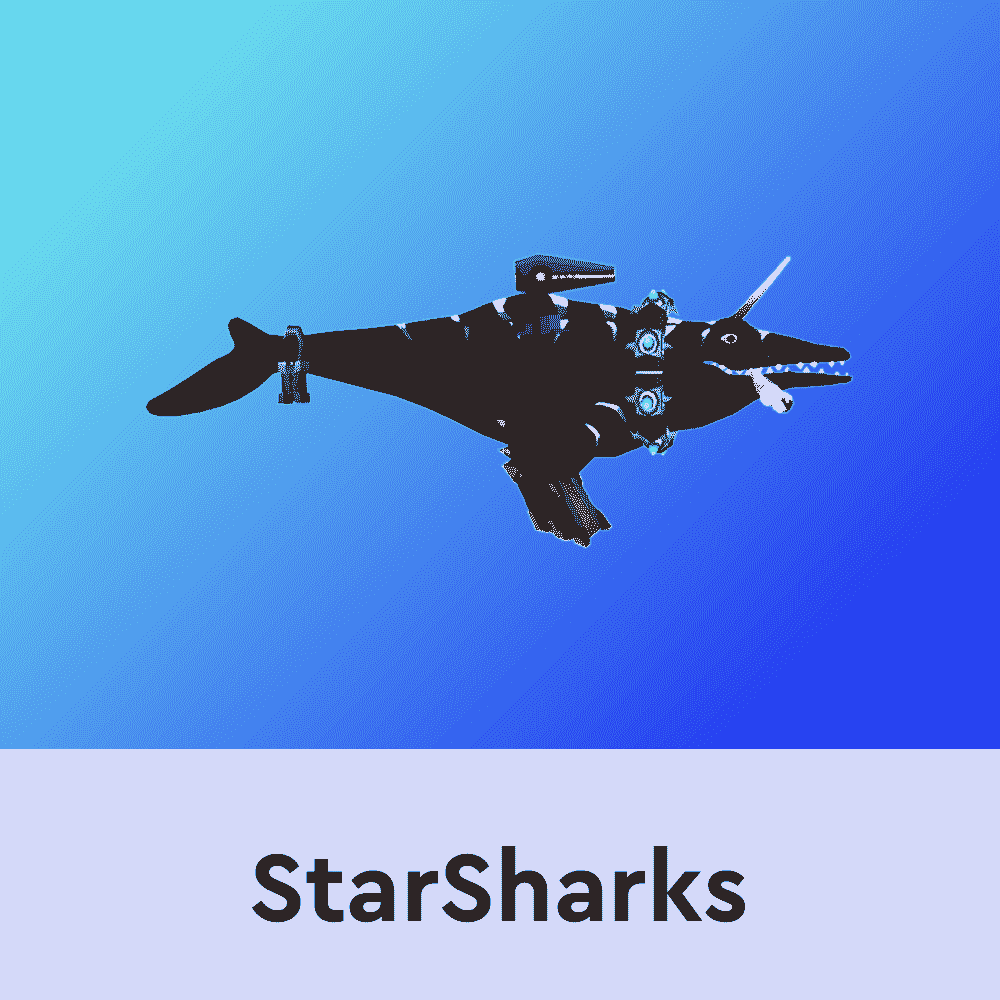
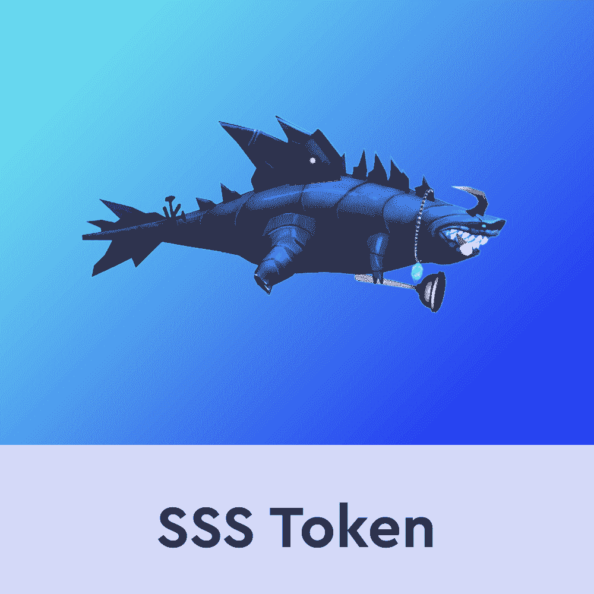
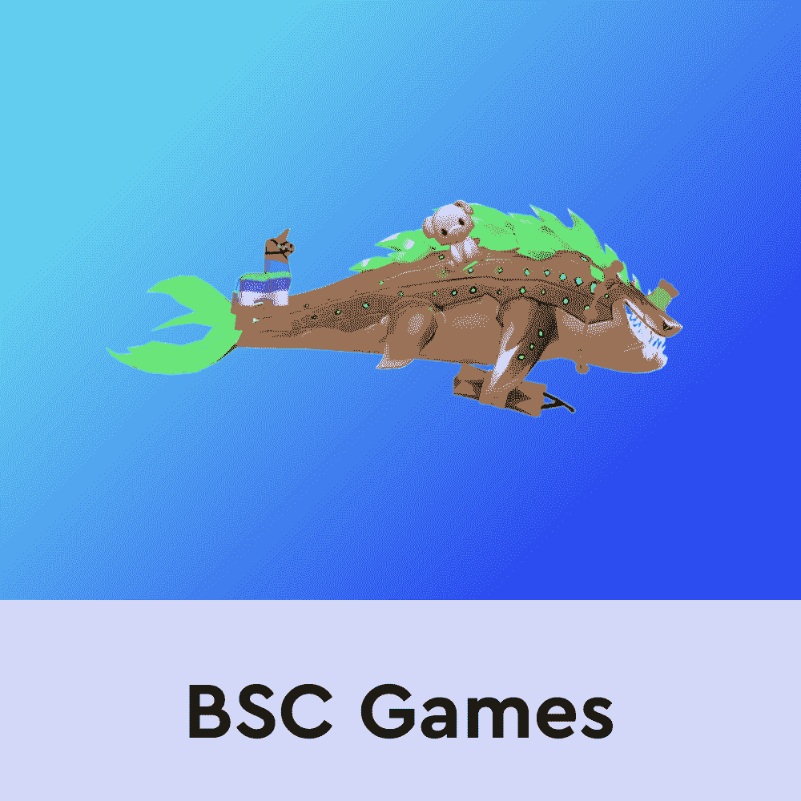

# 星鲨和原生 SSS 令牌

> 原文：<https://web.archive.org/web/https://dappradar.com/blog/starsharks-and-the-native-sss-token>

## 关于星鲨和 SSS 你需要知道的一切

BNB 链上的 StarSharks 游戏平台允许玩家以相同的 NFT 角色参与众多迷你游戏。GameFi 平台整合了一整套游戏风格的生态系统，最重要的是，玩家可以通过内部市场租借 NFT 角色。

*总结*

*   *什么是* [*星鲨*](https://web.archive.org/web/20221127164358/https://dappradar.com/binance-smart-chain/games/starsharks) *？*
*   *如何使用 SSS 令牌*

凭借严格构建的游戏内经济， [StarSharks](https://web.archive.org/web/20221127164358/https://dappradar.com/binance-smart-chain/games/starsharks) 依靠其[本地令牌 SSS](https://web.archive.org/web/20221127164358/https://dappradar.com/hub/token/bsc/SSS?from=0xc3028fbc1742a16a5d69de1b334cbce28f5d7eb3) 作为游戏生态系统中的货币。拥有 StarSharks NFTs 的玩家可以出租它们来换取 SSS 代币，反之亦然。

StarSharks 项目的主要目标之一是让尽可能多的玩家开始享受 web3 世界和 GameFi 的赚钱机会。为了降低进入门槛，该团队建立了 StarSharks 的内部 NFT 市场。由于坚实的租赁结构，即使玩家不能购买自己的星鲨 NFT 人物也能享受游戏。

## 什么是星鲨？

StarSharks 是一个基于 NFT 的迷你游戏平台，允许玩家相互竞争。然后他们可以赢得战斗和排名的奖励。StarSharks Warriors 是主要的迷你游戏模式，使玩家能够在 PvP 战斗模式中面对其他玩家。随着一个雄心勃勃的路线图的到来，StarSharks 计划增加一个丰富的迷你游戏组合，允许玩家参与各种比赛，如鲨鱼赛跑或鲨鱼交易卡战斗。

作为一个以 NFT 为中心的平台，游戏中所有可玩的角色都是不可替换的令牌。每个角色都有不同的属性，这给了他们在其他游戏中的优势。内部 StarSharks NFT 市场是研究所有最佳游戏角色和建立强大团队的绝佳场所。

重要的是，StarSharks 非常关注元宇宙。该团队计划完全拥抱 web3 空间，并很快推出土地 NFT 力学。拥有星鲨 NFT 乐园的玩家将能够在生态系统中创建一个定制的空间。此外，土地所有者将能够创造经验，并邀请其他玩家参观他们的土地。

## 如何使用 SSS 令牌

SSS 令牌是 StarSharks 生态系统的经济和治理支柱。除了市场购买和租赁，SSS 还结合了几个功能。重要的是，该代币承担多种用途的任务，部分充当玩家的“玩即赚”奖励代币、治理代币和赌注代币。

作为一个 GameFi 平台，在 StarSharks 排行榜中排名靠前会授予玩家 SSS 代币奖励。这种从玩到赚的结构允许玩家在娱乐游戏的同时赚钱。值得一提的是，该平台的主要奖励令牌是 SEA。但是，排行榜冠军将获得全球 SSS 奖励池的一定比例。

SSS 赌注允许游戏玩家锁定他们的代币，并通过绑定游戏赚取奖励来获得被动收入。堆叠 SSS 代币可以通过可变的 APR 百分比轻松增加收入。

最后，SSS 令牌还允许社区参与游戏的管理。根据 DAO 原则，该团队就游戏的重要更新和未来计划进行治理投票。重要的是，要参与这些投票，玩家需要下注 SSS 代币。

如果你想了解更多关于 StarSharks 和 SSS 令牌的信息，请点击下面的链接。随着更多令人兴奋的项目加入竞赛，DappRadar 将继续监测区块链游戏空间。首先，在 Twitter 上关注 DappRadar，加入我们的 T2 不和谐社区，了解最新消息。

[<picture></picture>](https://web.archive.org/web/20221127164358/https://dappradar.com/binance-smart-chain/games/starsharks)[<picture></picture>](https://web.archive.org/web/20221127164358/https://dappradar.com/hub/token/bsc/SSS?from=0xc3028fbc1742a16a5d69de1b334cbce28f5d7eb3)[<picture></picture>](https://web.archive.org/web/20221127164358/https://dappradar.com/rankings/protocol/binance-smart-chain/category/games) NewsletterUnsubscribe at any time. [T&Cs](https://web.archive.org/web/20221127164358/https://dappradar.com/terms) and [Privacy Policy](https://web.archive.org/web/20221127164358/https://dappradar.com/privacy-policy)