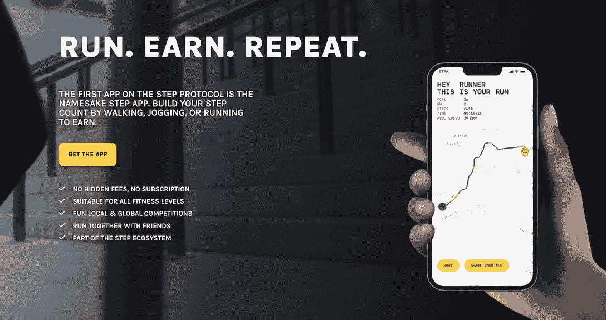

# Step App 用区块链技术革新健身行业

> 原文：<https://web.archive.org/web/https://dappradar.com/blog/step-app-revolutionizes-the-fitness-industry-with-blockchain-technology>

## 使用 Step App 进行竞争、社交和移动以获得收入

Step App 是一家开创性的 Web3 公司，致力于鼓励全球人民过上更健康、更富裕、更幸福的生活。2022 年初，Step App 进入了开发的第一阶段，在 8 个月内，Step App 从一个想法发展成为一款拥有超过 2000 万支持者、爱好者和用户的应用。

12 月 1 日在日本东京举行的 [Step App 发布会](https://web.archive.org/web/20221227024052/https://step.app/event?utm_source=dappradar&utm_medium=article&utm_campaign=app_introduction)上庆祝了这一巨大成就，Step App 在此正式发布。行业领导者，包括他们的全球大使 Usain Bolt 和日本职业棒球运动员 Kazuto Taguchi，在大会的主题演讲中分享了他们对移动赚钱行业、使用 Step App 健身的未来等的见解。

## **什么是 Step App？**

这是一个移动赚钱应用程序，将 Web3 和健身结合在一起；动的越多，赚的越多。Step App 激励你运动，并通过应用内的步行、慢跑和跑步奖励，激励你过上更健康、更富裕、更快乐的生活。

为了配合奖励，Step App 加入了游戏化，让应用变得更加有趣。例如，你和你的朋友会有友好的比赛，比如“一周最多步数”，这样你们可以互相激励，获得额外的奖励。

你不一定要成为跑步者或专业运动员才能用 Step App 赚取；你所要做的就是下载应用程序，并根据你是喜欢散步、慢跑还是跑步来选择最适合你的潜行方式。潜行者是一种独特的 NFT 运动鞋。

**如果这听起来正是你所需要的，以下是如何通过 5 个简单的步骤开始使用 Step App:**

1.  [下载 Step App](https://web.archive.org/web/20221227024052/https://step.app/app?utm_source=dappradar&utm_medium=article&utm_campaign=app_introduction) 并创建个人资料。
2.  [将加密钱包连接到应用程序](https://web.archive.org/web/20221227024052/http://web.step.app/?utm_source=dappradar&utm_medium=article&utm_campaign=app_introduction)。
3.  将 FITFI 加入您的钱包。 FITFI 是 Step App 的治理令牌。你会需要它来买一个潜行者。
4.  在应用市场上买一个。
5.  开始跑步吧！

在区块链上，你的脚步会转化为金钱奖励，因为用户移动时会获得 KCAL 代币奖励。KCAL 的许多应用程序内使用帮助用户通过交易、铸造运动鞋等建立有趣的新收入来源。你甚至可以在交易所交易你的大卡来获得稳定的积分！

## **连接现实世界和数字世界的一体化网关**

Step App 正在打造一款“一体化”应用，这在移动挣钱行业是独一无二的。使用 Step App 开始健身之旅所需的一切都将驻留在该应用程序中。你不必浏览不同的网站、应用和钱包。这降低了新用户的准入门槛，并推动了大规模采用。

但是创新不止于此。Step App 正在建立一个强大的生态系统，让全球都能使用 Web3 和区块链技术。该应用程序是 Step 生态系统的门户，该生态系统包括一系列产品。

Step App 是第一款正在[步网](https://web.archive.org/web/20221227024052/https://step.app/vision?utm_source=dappradar&utm_medium=article&utm_campaign=app_introduction)上打造的 App，由 FITFI 提供支持。Step Network 是一款面向大众的区块链。它以低成本和闪电般的速度提供地理位置技术、NFT 造币、交易功能等。

在 Step Network 上开发的开发人员、团队或全球品牌可以立即部署这些功能。项目将通过其发射台[分步发射](https://web.archive.org/web/20221227024052/https://steplaunch.org/?utm_source=dappradar&utm_medium=article&utm_campaign=app_introduction)登上区块链。Step Launch 上推出的第一个项目 PRIMAL 在不到 30 分钟的时间里达到了 50 万美元的筹集上限。Step App 还发布了他们的分散式交换平台 Step Ex，在那里你可以购买他们的代币和其他代币，这些代币可以在 Step 网络上通过他们的 launchpad 下载。

他们的完整产品套件在 Step 应用网站上。

[Download the Step App](https://web.archive.org/web/20221227024052/https://step.app/app?utm_source=dappradar&utm_medium=article&utm_campaign=app_introduction)

#### 了解有关 Step App 的更多信息

*   [网站](https://web.archive.org/web/20221227024052/https://step.app/)
*   [推特](https://web.archive.org/web/20221227024052/http://twitter.com/stepapp_)
*   [不和](https://web.archive.org/web/20221227024052/https://discord.gg/stepappdc)
*   [电报](https://web.archive.org/web/20221227024052/https://t.me/stepappchat)

**免责声明** —这是一篇赞助文章。DappRadar 不认可本页面上的任何内容或产品。DappRadar 旨在提供准确的信息，但读者应该在采取行动之前总是自己做研究。DappRadar 的文章不能被认为是投资建议。