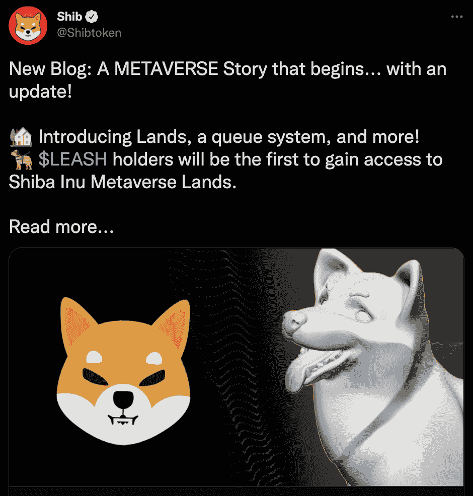
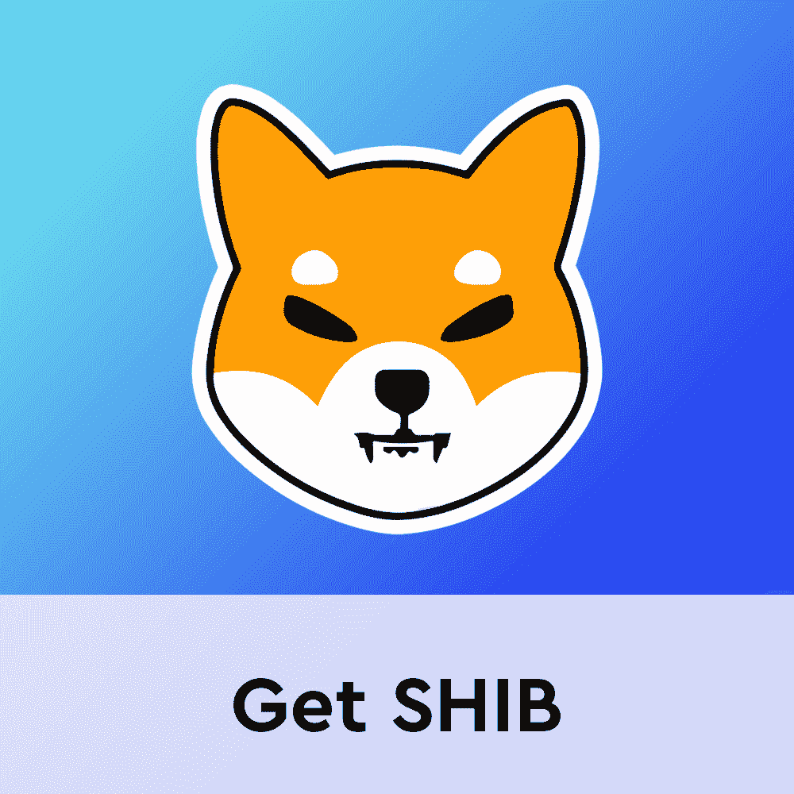
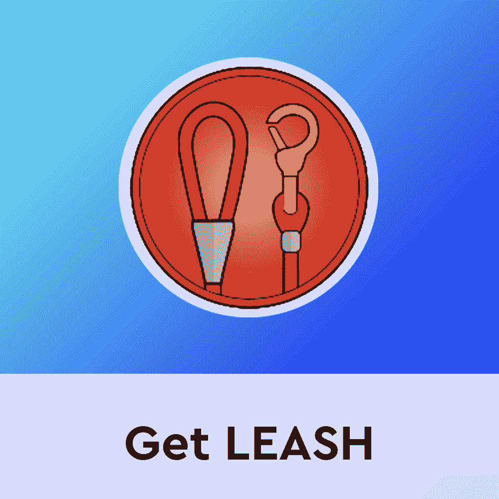

# 步入柴犬虚拟世界，加入土地买卖

> 原文：<https://web.archive.org/web/https://dappradar.com/blog/step-into-the-shiba-inu-virtual-world-and-join-the-land-sale>

## 柴犬迷将有机会拥有一个柴犬虚拟世界

柴犬团队正致力于扩大其区块链产品的生态系统，他们宣布了即将到来的虚拟世界和 NFT 土地销售。元宇宙的这个新角落将允许柴犬球迷拥有一块土地来进行他们的 ShibaSwap 活动。

关于即将到来的柴犬虚拟世界的细节仍然很少。然而，为了变得更有意义并迎合更多的观众，该团队将重点放在了元宇宙上。在这个时候，甚至即将到来的虚拟世界平台的名称还没有透露，然而，[最近的公告](https://web.archive.org/web/20221002011644/https://blog.shibaswap.com/a-metaverse-story-that-begins/)暗示这一信息将很快可用。

重要的是，柴犬粉丝可以得到的主要信息是，土地拍卖即将发生。关于时间和日期的细节仍然不可用，但是，该团队已经揭示了一个重要的排队机制。

## 如何排队购买土地

排队系统将允许排他性，要求有兴趣的各方持有皮带令牌。这给予了在即将到来的虚拟世界中土地的第一销售阶段的优先权和独家使用权。除了排队之外，该团队还开发了一个防倾倒系统，以保护牵绳持有者。

一旦皮带持有者有机会造币，剩余的土地将解锁。这些地块将向公众开放。拥有一块柴犬房产会带来一系列好处。然而，这些额外津贴的细节仍有待公布。

## 柴犬加入元宇宙赛跑

过去的几个月对虚拟世界的爱好者来说是一段快乐的旅程。元宇宙占据了加密领域每个人的心灵和思想。重要的是，兴奋和关注的浪潮始于脸书更名为 Meta。

从那以后，像沙盒、T2、分散的土地和 T4 这样的虚拟世界见证了大量新用户的涌入。此外，像 [NFT 世界](https://web.archive.org/web/20221002011644/https://dappradar.com/ethereum/games/nft-worlds)和[环球网 3](https://web.archive.org/web/20221002011644/https://dappradar.com/ethereum/collectibles/worldwide-webb-land) 这样的项目推出后，在密码爱好者中引起了轰动。

柴犬想要在他们自己即将到来的虚拟环境中实现的，是寄希望于所有这些激动人心的事情。虽然该团队尚未宣布细节和最重要的是他们在元宇宙一角的用例，但这绝对是一个大消息。更何况柴犬和 ShibaSwap 已经有了很大的受众群去迎合了。考虑到这一点，即将推出的柴犬虚拟空间可能会成为元宇宙的热门景点。

随着关于他们即将到来的虚拟世界首次亮相的更多细节的发布，DappRadar 将继续监视柴犬。如果你想在他们的官方 dapp 页面上了解更多关于柴犬系列产品的信息。此外，你可以通过下面的链接购买 SHIB 和皮带代币，准备在柴犬虚拟世界中购买你的新土地。

[<picture></picture>](https://web.archive.org/web/20221002011644/https://dappradar.com/hub/token/eth/SHIB)[<picture></picture>](https://web.archive.org/web/20221002011644/https://dappradar.com/hub/token/eth/LEASH)[<picture></picture>](https://web.archive.org/web/20221002011644/https://dappradar.com/hub/token/eth/BONE) NewsletterUnsubscribe at any time. [T&Cs](https://web.archive.org/web/20221002011644/https://dappradar.com/terms) and [Privacy Policy](https://web.archive.org/web/20221002011644/https://dappradar.com/privacy-policy)