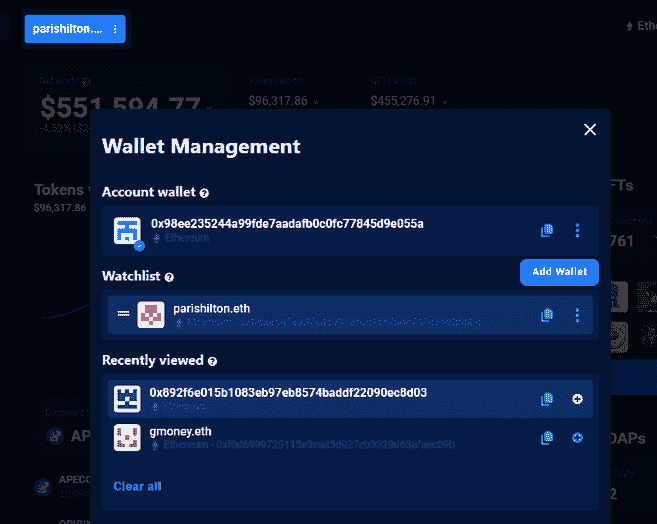

# 史蒂夫·青木成为第一名人 NFT 收藏家

> 原文：<https://web.archive.org/web/https://dappradar.com/blog/steve-aoki-became-the-number-1-celebrity-nft-collector>

## 比利·穆雷和扎克·海曼在排行榜上取得了最大的进步

音乐艺术家史蒂夫·青木已经取代史努比·多格成为 NFT 最有价值作品的收藏家。尽管在过去的两个月里损失了大约 120 万美元，但青木的 510 万美元的钱包在 Snoop 和 Gary Vee 之前占据了榜首。

DappRadar 定期更新名人钱包富豪榜，最近的更新显示了图表中的一些变化。除了史蒂夫·青木成为镇上新的 NFT 国王，我们还看到冰球运动员扎克·海曼上升了七位，排名第四。

海曼将其投资组合的价值从 836，000 美元增加到 1，460，000 美元。这使得加拿大曲棍球运动员成为增加投资组合价值图表中的最大赢家。他在自己的收藏中增加了两只无聊的猿猴和另外两只动物，这严重影响了估价。

[See Zach Hyman’s NFT collection](https://web.archive.org/web/20221130135141/https://dappradar.com/hub/wallet/eth/0x991091D5596484f3153aC8707c76Ec79f6D353ED)

## 比利·穆雷现在是一个认真的 NFT 收藏家

不断下降的加密价格对名人投资组合的估值产生了很大影响。他们中的大多数人已经看到自己的价值下降，但海曼一直忙于增加价值。拳击界的传奇人物迈克·泰森也是如此，他的投资组合价值在过去的两个月里翻了一番，从 16，000 美元增加到 33，000 美元。但与比利·穆雷的举动相比，这算不了什么。

传奇的捉鬼敢死队员比利·穆雷在进入这个领域时买了一个密码朋克，但不久后就放弃了他自己的 NFT 系列。他最初的钱包现在只有 200 美元的价值，但默里没有离开。他把所有的收藏品都放到了一个新钱包里，并继续疯狂收购，将他的钱包估价提高到了 601，000 美元以上。

穆雷的新钱包里有两张 LinksDAO 的会员通行证，显示了他对高尔夫和创新的热情。然而，这位美国演员还拥有一个 Hashmask，一只时尚弄潮儿，矮胖的企鹅，两只 Deadfellaz，两只老板美人，一只[达明安·赫斯特](https://web.archive.org/web/20221130135141/https://dappradar.com/hub/assets/eth/0xaadc2d4261199ce24a4b0a57370c4fcf43bb60aa/7161)的货币艺术品，当然还有[朋克#5530](https://web.archive.org/web/20221130135141/https://dappradar.com/hub/assets/eth/0xb47e3cd837ddf8e4c57f05d70ab865de6e193bbb/5530) 。

[See Bill Murray’s NFT collection](https://web.archive.org/web/20221130135141/https://dappradar.com/hub/wallet/eth/0x892f6e015b1083eb97eb8574baddf22090ec8d03/nfts)

## 关注你最喜欢的名人

每个人都可以在 DappRadar 上创建一个帐户，然后连接他们的钱包。使用投资组合追踪器，你可以得到你的 NFT 收藏、代币持有和 DeFi 头寸的综合估价。

但是，您也可以跟踪其他钱包。这将允许你跟随像比利·穆雷、史蒂夫·青木和史努比·道格这样的名人的收藏。

1.  当您在投资组合钱包中时，单击左上角的蓝色钱包按钮。
2.  钱包管理会弹出
3.  按“添加钱包”并提供 ENS 域或钱包地址。
4.  确认后，钱包将出现在您的监视列表中。
5.  您也可以通过按(+)按钮将最近查看的钱包添加到您的监视列表中

[Check out the Portfolio Tracker](https://web.archive.org/web/20221130135141/https://dappradar.com/hub/wallet) NewsletterUnsubscribe at any time. [T&Cs](https://web.archive.org/web/20221130135141/https://dappradar.com/terms) and [Privacy Policy](https://web.archive.org/web/20221130135141/https://dappradar.com/privacy-policy)