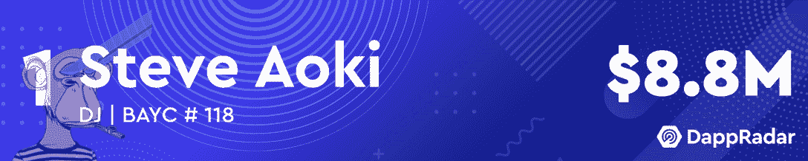
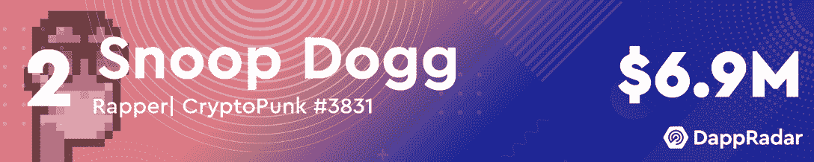
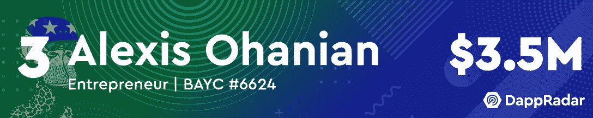
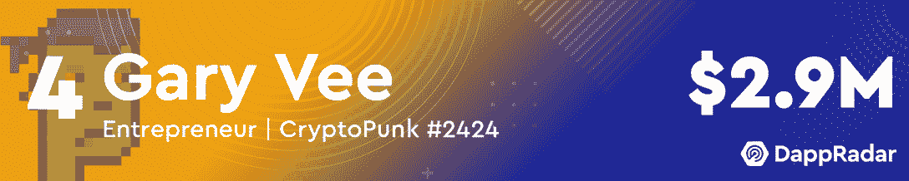
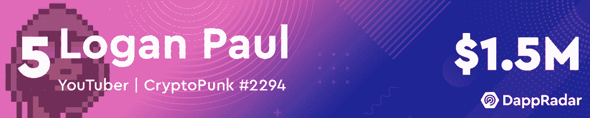
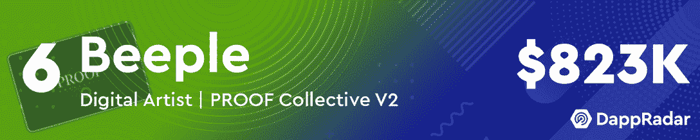
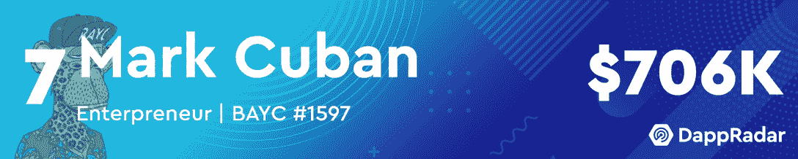
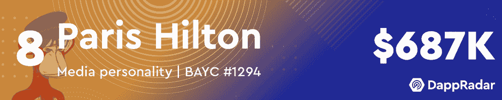
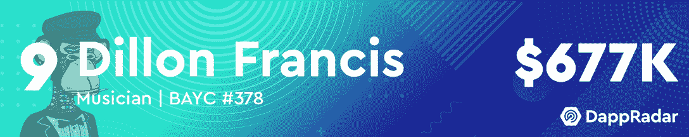
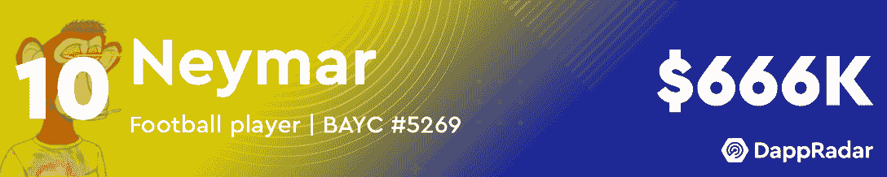

# 史蒂夫·青木拥有五月份最有价值的名人作品集

> 原文：<https://web.archive.org/web/https://dappradar.com/blog/steve-aoki-has-the-most-valuable-celebrity-portfolio-in-may>

## 看看哪些名人增加了他们的投资组合的价值，哪些名人退出了排名

五月的最有价值名人作品集清单非常令人兴奋。史蒂夫·青木击败了长期领先的史努比·道格，而亚历克西斯·奥哈尼安击败了加里·维，获得了前三名。

DJ 史蒂夫·青木在过去几个月里一直在疯狂购物，尽管加密世界正在经历令人担忧的熊市趋势。在上个月的名人钱包评论中，他成功攀升了两位。这个月他更加努力，第一次登上冠军宝座。

Gary Vee 和 Snoop Dogg 直到最近才被怀疑，他们的投资组合价值都下降了。虽然亚历克西斯·奥哈尼安的投资组合价值也有所下降，但他设法以超过 50 万美元的优势超过加里·维，在排行榜上名列第三。

请继续阅读，找出 2022 年 5 月最有价值的名人 NFT 作品集的完整列表，或者查看下面的视频快速浏览。

***这里需要注意的一点是，名人会吸引大量注意力到他们的钱包，并收到数千份 NFT 作为礼物。我们已经手动筛选了所有这些名人钱包，给读者带来了一个更加过滤的视角。为了实现这一点，我们已经排除了赠送给这些钱包的 NFT。如果您看到此列表与 DappRadar 投资组合跟踪器上显示的值之间存在差异，请考虑这一点。***

[https://web.archive.org/web/20220705002437if_/https://www.youtube.com/embed/hE0885wjHAQ?feature=oembed](https://web.archive.org/web/20220705002437if_/https://www.youtube.com/embed/hE0885wjHAQ?feature=oembed)

## 五月份十大最有价值的名人 NFT 作品集

[<picture></picture>](https://web.archive.org/web/20220705002437/https://dappradar.com/hub/wallet/eth/0xe4bbcbff51e61d0d95fcc5016609ac8354b177c4/nfts)[<picture></picture>](https://web.archive.org/web/20220705002437/https://dappradar.com/hub/wallet/eth/0xce90a7949bb78892f159f428d0dc23a8e3584d75/nfts/1)[<picture></picture>](https://web.archive.org/web/20220705002437/https://dappradar.com/hub/wallet/eth/0x0ed1e02164a2a9fad7a9f9b5b9e71694c3fad7f2/nfts)[<picture></picture>](https://web.archive.org/web/20220705002437/https://dappradar.com/hub/wallet/eth/0xd6a984153acb6c9e2d788f08c2465a1358bb89a7/nfts/1)[<picture></picture>](https://web.archive.org/web/20220705002437/https://dappradar.com/hub/wallet/eth/0xff0bd4aa3496739d5667adc10e2b843dfab5712b/nfts/1)[<picture></picture>](https://web.archive.org/web/20220705002437/https://dappradar.com/hub/wallet/eth/0xc6b0562605d35ee710138402b878ffe6f2e23807/nfts)[<picture></picture>](https://web.archive.org/web/20220705002437/https://dappradar.com/hub/wallet/eth/0xa679c6154b8d4619af9f83f0bf9a13a680e01ecf/nfts)[<picture></picture>](https://web.archive.org/web/20220705002437/https://dappradar.com/hub/wallet/eth/0xb6aa5a1aa37a4195725cdf1576dc741d359b56bd/nfts)[<picture></picture>](https://web.archive.org/web/20220705002437/https://dappradar.com/hub/wallet/eth/0x58473e9ac681c4424ca74619281ff71801d002d6)[<picture></picture>](https://web.archive.org/web/20220705002437/https://dappradar.com/hub/wallet/eth/0xc4505db8cc490767fa6f4b6f0f2bdd668b357a5d)

## 史蒂夫·青木挑战熊市

虽然加密市场正在经历自 2020 年以来最艰难的几个月，但[史蒂夫·青木](https://web.archive.org/web/20220705002437/https://dappradar.com/hub/wallet/eth/0xe4bbcbff51e61d0d95fcc5016609ac8354b177c4/nfts)似乎没有停滞。在整个三月和四月，他一直在稳步攀升，五月给他颁发了一枚第一名奖牌。

这位 DJ 已经在 NFT 活跃了一段时间，他的作品不仅价格昂贵，而且相当广泛。在撰写本文时，他拥有超过 11，000 件独特的收藏品，总价值为 881 万美元。

随着史蒂夫·青木升至榜首，竞争者[史努比·道格](https://web.archive.org/web/20220705002437/https://dappradar.com/hub/wallet/eth/0xce90a7949bb78892f159f428d0dc23a8e3584d75/nfts/1)和[加里·维](https://web.archive.org/web/20220705002437/https://dappradar.com/hub/wallet/eth/0xd6a984153acb6c9e2d788f08c2465a1358bb89a7/nfts/1)看到他们各自投资组合的估值急剧下降。在过去的 30 天里，这位说唱歌手的资产缩水了 450 多万美元。Gary Vee 也损失了一大笔钱，因为他的 NFT 投资组合现在只值 290 万美元，而 4 月份的记录超过了 860 万美元。

另一件有趣的事情是帕丽斯·希尔顿重返每月名人富豪榜。她拥有最有价值的名人作品集之一，价值超过 68 万美元。似乎整体熊市状况并没有影响这位媒体明星的 NFT 收藏。

DappRadar 将继续关注名人的钱包，以及大牌明星的收藏如何随着时间的推移而发展。如果你想浏览名人钱包的完整列表，请查看官方 DappRadar 页面。此外，你可以在[的 Twitter](https://web.archive.org/web/20220705002437/https://twitter.com/dappradar) 上关注 DappRadar，首先获得最新的名人和 NFT 动态。

 NewsletterUnsubscribe at any time. [T&Cs](https://web.archive.org/web/20220705002437/https://dappradar.com/terms) and [Privacy Policy](https://web.archive.org/web/20220705002437/https://dappradar.com/privacy-policy)