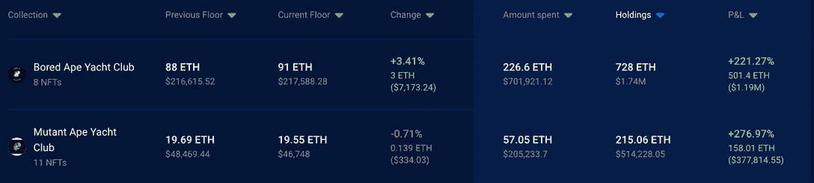

# 尽管市场趋势看跌，史蒂夫·青木仍继续疯狂购物

> 原文：<https://web.archive.org/web/https://dappradar.com/blog/steve-aoki-went-on-a-shopping-spree-despite-bearish-market-trends>

## 这位 DJ 和音乐家在过去的一周买了 2 台志那都红豆 NFT 和许多 Tripsters NFTs

史蒂夫·青木是最活跃的名人 NFT 收藏家之一，市场的熊市趋势似乎并没有阻止他。在过去的七天里，DJ 以总计约 40 ETH 的价格收购了两家志那都红豆 NFT。

## 总结:

*   [史蒂夫·青木最近将目光投向了两个系列，志那都红豆和特里普斯特，从两个品牌](https://web.archive.org/web/20221209070251/https://dappradar.com/blog/steve-aoki-went-on-a-shopping-spree-despite-bearish-market-trends/#radar)
    收购了几个 NFT
*   [史蒂夫·青木也在他自己的 web3 项目 Aokiverse 上下了重注，在过去的一周购买了许多 A0K1VERSE 信用点数](https://web.archive.org/web/20221209070251/https://dappradar.com/blog/steve-aoki-went-on-a-shopping-spree-despite-bearish-market-trends/#Credits)

*   [这位 DJ 的投资组合数量在增加，尽管价值在下降，他持有的 BAYC 和 MAYC 股票目前是青木公司最赚钱的](https://web.archive.org/web/20221209070251/https://dappradar.com/blog/steve-aoki-went-on-a-shopping-spree-despite-bearish-market-trends/#value-in)

## 阿祖基和史蒂夫·青木雷达上的情报人员

从他的 OpenSea 个人资料来看，史蒂夫·青木成为 NFT 收藏家已经一年多了。在此期间，他积极参与了许多 NFT 社区，成为加密领域的知名实体。

在过去的七天里，这位 DJ 一直在疯狂采购，尽管加密市场正经历着整体的负面情绪。在 ETH 价格下跌的同时，史蒂夫·青木总共购买了 [45 个 Aokiverse 信用点](https://web.archive.org/web/20221209070251/https://dappradar.com/hub/wallet/eth/0xe4bbcbff51e61d0d95fcc5016609ac8354b177c4/nfts/1/a0k1verse-credits)、 [2 个志那都红豆 NFT](https://web.archive.org/web/20221209070251/https://dappradar.com/hub/wallet/eth/0xe4bbcbff51e61d0d95fcc5016609ac8354b177c4/nfts/1/azuki)、 [18 个 trip sters NFT](https://web.archive.org/web/20221209070251/https://dappradar.com/hub/wallet/eth/0xe4bbcbff51e61d0d95fcc5016609ac8354b177c4/nfts/1/tripsters-official-collection)和 [8 个东西代币](https://web.archive.org/web/20221209070251/https://dappradar.com/hub/wallet/eth/0xe4bbcbff51e61d0d95fcc5016609ac8354b177c4/nfts/1/something-token)。

他投资组合中的这 73 个新成员总共花费了 DJ 大约 66.8 ETH，目前价值 160，288 美元。在仅仅 7 天的时间里，这是一笔可观的支出，尤其是在市场经历波动的时候。

这次购物狂欢中最昂贵的购买是两个志那都红豆 NFT。志那都红豆 8245 号花了 DJ 23.9 ETH，而志那都红豆 7645 号花了他 16.9 ETH。值得注意的是，这些购买发生在最近关于这位志那都红豆创始人的令人震惊的消息泄露之前。史蒂夫·青木还在 Tripsters 非功能性食品上花费了大约 4.6 ETH，在 Token 非功能性食品上花费了大约 3.2 ETH。令人印象深刻的是，这位音乐制作人并不回避投资自己的企业，在 A0K1VERSE 信用点上花费了超过 19 ETH。

## 什么是 A0K1VERSE 学分？

A0K1VERSE 积分是史蒂夫·青木 web3 体验的入口点。根据官方网站，这些信用将允许持有人获得护照 NFT，给他们带来广泛的利益和效用。

A0K1VERSE 仍在开发中，然而，信用 NFTs 在今年 2 月下降。重要的是，为了升级他们的护照并获得更多的额外津贴，持有者需要购买更多的积分。顶级护照升级需要 1024 积分，按底价换算约为 91 ETH。那是 216，986 美元，或者一只底价的无聊猿。虽然 Prizm 级别的护照可能很贵，但它让持有者有权与史蒂夫·青木一起录制歌曲，并通过 DJ 的音乐流媒体文件分发。

虽然 Aokiverse 项目已经有一段时间没有任何官方更新了，但史蒂夫·青木继续疯狂购物可能会被解释为创始人发出的信号。他目前一共持有 [26 个 A0K1VERSE 积分](https://web.archive.org/web/20221209070251/https://dappradar.com/hub/wallet/eth/0xe4bbcbff51e61d0d95fcc5016609ac8354b177c4/nfts/1/a0k1verse-credits)。如果你想了解更多关于 Aokiverse 和不同层次的护照，请查看官方网站。

## 史蒂夫·青木在 BAYC NFTs 中存储价值

虽然加密和 NFT 市场都经历了更好的日子，但看起来史蒂夫·青木并没有受到我们正在经历的熊市的影响。用方便的 NFT 金融观点快速检查一下他的投资组合，可以提供一个可能的解释。

史蒂夫·青木在一周内花费了超过 66 ETH，在价格下跌和该领域普遍焦虑的背景下，从众多收藏中购买非功能性纺织品。这背后的原因之一可能是他的 BAYC 和 MAYC 控股公司是 DJ 的重要利润来源。这给他带来了一定程度的投资安全，让他可以不顾当前的市场状况继续疯狂购物。

在撰写本文时，史蒂夫·青木拥有 8 个无聊猿游艇俱乐部和 11 个变异猿游艇俱乐部。他购买这些东西的总价格是 283.65 埃特，或购买时的 907，154 美元。目前，按底价计算，这些非关税壁垒的总价值为 659.41 ETH。这相当于超过 150 万美元，或者如果他现在卖掉所有东西，大约有 60 万美元的利润。

尽管趋势看跌，但青木的投资组合有稳定的盈利机会，他看起来很有信心。另一个需要注意的重要事情是，如果持有者没有相应地更新他们的要价，熊市是廉价购买 ETH 和折价购买 NFTs 的绝佳机会。

达普拉达将继续关注史蒂夫·青木的 NFT 之旅，因为他巩固了自己作为最活跃的名人收藏家的地位。如果你想深入了解他的投资组合，你可以通过 DappRadar 投资组合跟踪器在这里查看。此外，你可以在 Twitter 上关注 DappRadar，获取 NFT 空间的最新独家新闻。

 NewsletterUnsubscribe at any time. [T&Cs](https://web.archive.org/web/20221209070251/https://dappradar.com/terms) and [Privacy Policy](https://web.archive.org/web/20221209070251/https://dappradar.com/privacy-policy)