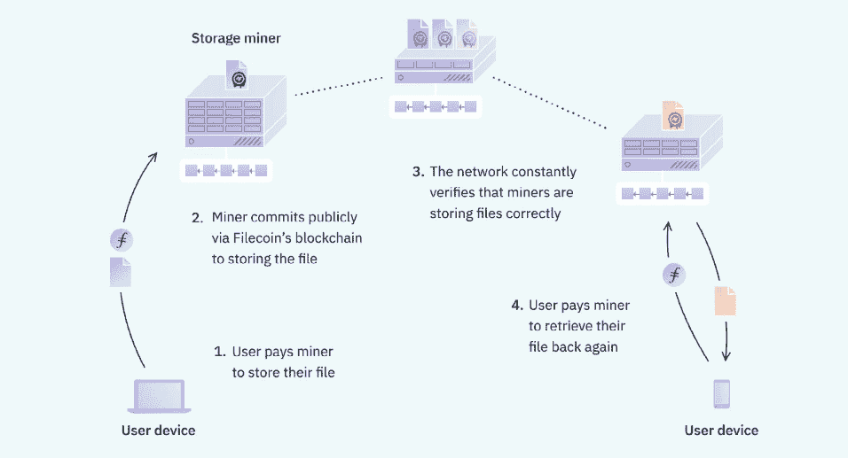
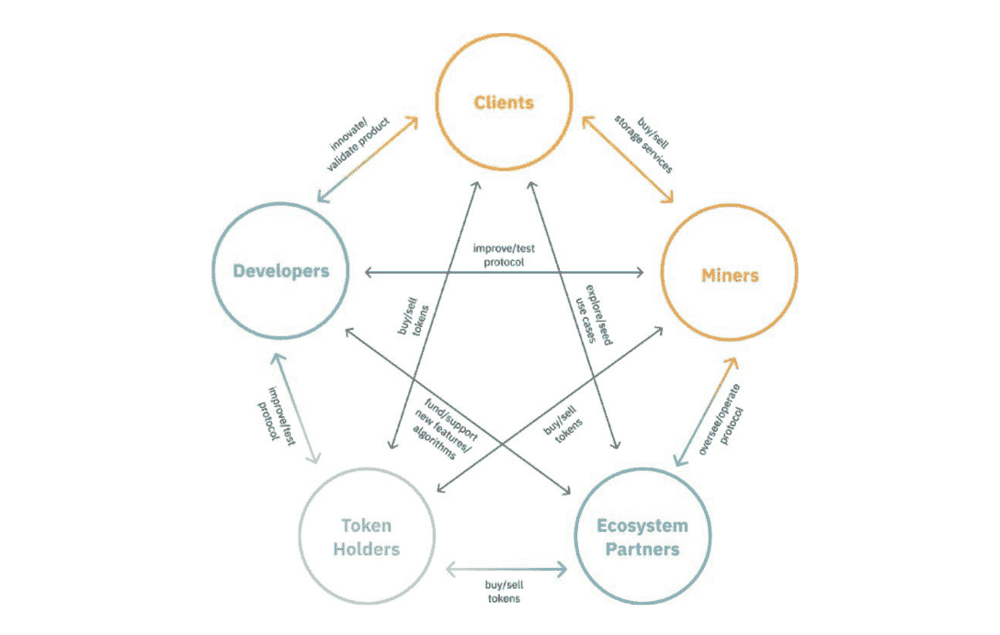

# 使用 Filecoin 安全、经济、分散地存储您的信息

> 原文：<https://web.archive.org/web/https://dappradar.com/blog/store-your-information-safely-affordably-and-decentralized-with-filecoin>

## 一个分散的、经济高效的、抗审查的、强大的存储网络

Filecoin 是一种创新的基础设施，以安全、经济、分散的方式存储您最重要的信息。随着对集中式云存储服务的现有问题(包括数据泄露)的担忧不断增加，Filecoin 应运而生，为用户带来了一个潜在的更安全、更分散、更具成本效益的解决方案。

**概要:**

*   Filecoin 是一个分散式存储网络，将云存储转变为算法存储市场。
*   Filecoin 的去中心化生态系统是抗审查、经济高效、开源和社区驱动的。
*   FIL 代币促进并刺激了 Filecoin 经济。

2018 年 10 月，[脸书因在剑桥分析公司丑闻](https://web.archive.org/web/20220906042945/https://www.bbc.com/news/technology-54722362)中的角色被罚款 50 万英镑，该丑闻涉及 8700 万用户的数据泄露，并在政治竞选中被滥用。当数据存储依赖于一个集中的实体时，数据泄露等事件似乎几乎是不可避免的。更不用说集中式服务会遇到中断，从而使其客户端和最终用户无法访问

Filecoin 引入了一个开源的、抗审查的、基于市场的、去中心化的网络，可以潜在地修复当前集中式云基础设施的缺陷。想象一下，一个分散的网络总是在线的，当消费者使用服务时，所有参与者都受益。

## Filecoin 是什么？

Filecoin 是一个分散的存储网络，任何人都可以在上面出租或购买存储空间。用户可以使用 Filecoin 将数据存储在分布在世界各地的计算机上，而不是将重要数据交给一家公司管理。此外，该基础架构允许用户决定存储空间购买的价格和合同。让我们仔细看看 Filecoin 网络中的不同角色以及它们是如何运作的。

在 Filecoin 的去中心化存储网络中，有两个服务提供商:存储提供商和检索提供商。客户向存储提供商付费以保存他们的数据。然后，存储提供商使用数学证明来存储这些数据，以验证完整性、准确性和隐私性。检索提供商负责在客户需要时检索和交付数据。因此，Filecoin 网络创造了一个市场，提供商可以在这里销售他们的服务，客户可以对满足他们需求的解决方案进行投标。

## 是什么让 Filecoin 成为 Web3 的理想数据存储解决方案？

Filecoin 革新了文件存储，承诺带来各种优于集中式解决方案的优势。

*   **分散**。Filecoin 网络由全球一千多家存储提供商组成。它的目标是成为一个健壮的文件存储协议，不依赖于集中式服务提供商。
*   抵制审查。Filecoin 利用其分散式网络，提供防审查存储，这是为用户提供完整的网络体验而不会失去对关键个人数据的控制的基础。
*   **性价比高。** Filecoin 消除了中介，创建了一个更加经济高效的点对点存储市场。虽然存储价格因交易而异，但 Filecoin 一直将成本保持在亚马逊服务收费的 3%以下。
*   **健壮。** Filecoin 拥有超过 3，987 家存储提供商，总共为网络贡献了近 16.2 EiB 的存储容量。相比之下，脸书上的 100 亿张图片累积起来需要大约 1.5 的存储空间。因此，Filecoin 的存储容量是脸书的 1 万多倍。
*   **可证实的。** Filecoin 为用户推出了两种新颖的证明来验证客户端数据的完整性和位置，即复制证明(PoRep)和时空证明(PoSt)。PoRep 验证在专用的物理存储空间中复制了一段数据。PoSt 验证数据是否随着时间的推移而正确存储。
*   **自由竞争**。Filecoin 上的开放参与创造了一个自由市场，有可能实现高效定价和自发创新。
*   **开源。** Filecoin 倡导开放协作的网络。Filecoin 的代码是可查看的，任何人都可以免费访问和贡献。目前，Filecoin 在网络中有近 10，000 名开源贡献者。
*   **离线-数据传输。** Filecoin 允许用户将大规模数据集离线转移到存储提供商，同时仍然在线验证交易。这一关键特性从根本上优化了大量数据集的传输，为用户节省了大量的金钱和时间。
*   **社区驱动。**任何人都可以提交关于 Filecoin 升级的提案。

## Filecoin 的动态经济解释

Filecoin 的网络为其经济繁荣奠定了坚实的基础。在 Filecoin 经济中，网络中有三个不同的市场和参与者。除了前面提到的存储和检索市场，第三个是令牌交易市场，参与者与客户、存储提供商和其他令牌持有者交易生态系统货币。下图显示了主要利益相关者群体之间的互动。

Filecoin 创建了 [FIL](https://web.archive.org/web/20220906042945/https://dappradar.com/hub/token/eth/RENFIL?from=0xd5147bc8e386d91cc5dbe72099dac6c9b99276f5) 作为其本地生态系统令牌，以促进和刺激经济。它被用作交换媒介和 Filecoin 网络上的抵押品。例如，FIL 作为用户向存储提供商支付服务费用的货币。此外，存储提供商锁定 FIL 以增加存储容量，并确保 Filecoin 网络中的数据安全。如果存储提供商无法证明数据是通过 PoST 存储的，抵押的 FIL 令牌可能会被用于处罚。

## 最后的话

[根据云存储市场报告](https://web.archive.org/web/20220906042945/https://www.marketsandmarkets.com/PressReleases/cloud-storage.asp)，云存储的全球市场规模预计将从 2020 年的 501 亿美元增长到 2025 年的 1373 亿美元。随着人们的数字生活进入 Web3 和元宇宙时代，高度互动、沉浸式的互联网生活无疑需要一个更加庞大的在线数据存储基础设施。

以去中心化和无许可协作为核心，Filecoin 构建了一个无限可扩展的数据存储网络。更重要的是，网络中的自由市场可以显著降低服务价格。最后但同样重要的是，分散式网络意味着没有单点故障，这使得遇到中断或允许黑客劫持网络变得更加困难。

要了解激励驱动和自我维持的 Filecoin 数据存储网络的更多信息，请查看以下渠道:

[网站](https://web.archive.org/web/20220906042945/https://filecoin.io/)

[经济论文](https://web.archive.org/web/20220906042945/https://filecoin.io/2020-engineering-filecoins-economy-en.pdf)

[推特](https://web.archive.org/web/20220906042945/https://twitter.com/Filecoin)

[博客](https://web.archive.org/web/20220906042945/https://filecoin.io/blog/)

**免责声明** —这是一篇赞助文章。DappRadar 不认可本页面上的任何内容或产品。DappRadar 旨在提供准确的信息，但读者应该在采取行动之前总是自己做研究。DappRadar 的文章不能被认为是投资建议。