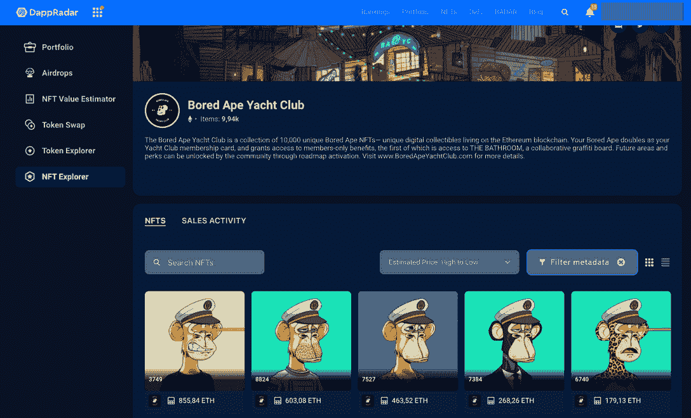

# 强大的 NFT 收藏为加密混乱提供了对冲

> 原文：<https://web.archive.org/web/https://dappradar.com/blog/strong-nft-collections-provide-hedge-among-crypto-turmoil>

## 发现如何识别好的对冲价格下跌

在一系列悲观的加密市场趋势中，一些 NFT 藏品脱颖而出，成为投资组合价值下跌的真正对冲工具。由于 DappRadar 上的可用数据，我们注意到一些 NFT 的底价和均价显著增加。但是你如何找到这些 grails 呢？这就是本文将要讨论的内容。让我们开始吧！

## NFTs 作为对经济下滑的对冲

特别是在最近几周，NFTs 的底价和均价在处于收缩阶段的行业中保持了最好的结果。

尽管 NFT 备受争议，但一些最著名的收藏似乎正在扭曲分散市场的规则。

正如你在 2022 年 7 月的 [DappRadar 区块链行业报告](https://web.archive.org/web/20220926000206/https://dappradar.com/blog/dappradar-blockchain-industry-report-july-2022/#bubble-burst)中看到的:

> “我们可以观察到活动的高度集中化，蓝筹股 NFT 收藏品保留了它们的大部分价值。”

2021 年 NFT 市场的繁荣为许多新的创作者和收藏腾出了空间，拥有大量的空间和观众。然而，并不是所有的项目都取得了成果或获得了稳定的地位。

有大量不可替代的代币，你需要知道如何找到真正有价值的代币。这就是蓝筹 NFT 的用武之地。

## 今年夏天 NFT 最强的系列是什么？

过去几周 NFT 市场交易量的增加甚至集中在蓝筹藏品上，主要是属于[宇迦实验室](https://web.archive.org/web/20220926000206/https://www.yuga.com/)的项目——Bored Ape 游艇俱乐部、Otherside 元宇宙的 Otherdeed、变种人 Ape 游艇俱乐部、CryptoPunks 等等。

请看下面 2022 年 7 月 NFT 顶级收藏的 DappRadar 排名。

The strongest NFT collections summer 2022 at DappRadar

此外，我们可以期待一个日益互联的未来，其中 [Magic Eden](https://web.archive.org/web/20220926000206/https://dappradar.com/blog/magic-eden-leads-the-market-after-ethereum-bombshell) 和 [OpenSea](https://web.archive.org/web/20220926000206/https://dappradar.com/blog/trading-solana-nfts-magic-eden-vs-opensea) 市场引领 NFT dapp——并且都宣布在 2022 年支持以太坊和索拉纳网络。

## 在特定的 NFT 系列中，哪些非功能性翻译做得特别好？

虽然通过[达普拉达 NFT 概览](https://web.archive.org/web/20220926000206/https://dappradar.com/nft)发现有潜力的 NFT 收藏可能很容易，但这并不是寻找 NFT 的全部。在一个集合中，有各种具有不同稀有性和价值的单个不可替换的令牌。

就拿[无聊猿游艇俱乐部](https://web.archive.org/web/20220926000206/https://dappradar.com/hub/nft-explorer/collection/bored-ape-yacht-club)来说吧。尽管整个收藏已经有了一个相当可观的底价，但一些非艺术珍品具有特殊的属性，这使得它们非常稀有，因此价格也很高。

2021 年 9 月，沙盒游戏宣布以 740 ETH(当时价值 242 万美元)的价格正式购买 [Bored Ape #3749](https://web.archive.org/web/20220926000206/https://dappradar.com/hub/assets/eth/0xbc4ca0eda7647a8ab7c2061c2e118a18a936f13d/3749) 。

你可以在我们的 [NFT 价值评估器](https://web.archive.org/web/20220926000206/https://dappradar.com/hub/nft-value-estimator)中看到这种代币的高价值，这不仅来自它的稀有性——得益于它的独特特征，如金色皮毛和激光眼——还来自于这个项目作为 NFT 空间权威的成功。

*   **进一步阅读:** [如何估值百无聊赖的猿类游艇俱乐部 NFTs](https://web.archive.org/web/20220926000206/https://dappradar.com/blog/how-to-value-bored-apes-yacht-club-nfts)

## 如何用 DappRadar 在一个收藏中找到最好的 NFT？

我们的 [NFT 收藏浏览器](https://web.archive.org/web/20220926000206/https://dappradar.com/hub/nft-explorer)让您获得准确和最新的数据，帮助您在竞争中领先。

使用这个工具，您可以根据元数据过滤特定集合中的 NFT，根据价格对它们进行排序，或者直接使用 NFT ID 进行搜索。因此，这是发现收藏中最有价值的代币的最好方法之一。

You can filter and sort NFTs in various collections with DappRadar

我们还制作了一个[视频，解释一步一步的过程](https://web.archive.org/web/20220926000206/https://www.youtube.com/watch?v=fkEaXYLOW-s)以及在我们的 Youtube 频道上使用它的主要好处，你一定要看看。

## 用 DappRadar 继续跟踪 NFT

众所周知，知识就是力量，DappRadar 是 NFT 领域高质量数据和内容的最佳来源之一。

我们将继续关注行业动态和主要新闻，为您提供最新消息。因此，如果你有兴趣了解更多关于 NFTs 的知识，请确保在 [Twitter](https://web.archive.org/web/20220926000206/https://twitter.com/dappradar) 上关注 DappRadar，加入我们的 [Discord](https://web.archive.org/web/20220926000206/https://discord.gg/4ybbssrHkm) 服务器，并关注[博客](https://web.archive.org/web/20220926000206/https://dappradar.com/blog/)上的教育文章。

***以上不构成投资建议。此处给出的信息仅供参考。请尽职调查并自行研究。***

 NewsletterUnsubscribe at any time. [T&Cs](https://web.archive.org/web/20220926000206/https://dappradar.com/terms) and [Privacy Policy](https://web.archive.org/web/20220926000206/https://dappradar.com/privacy-policy)