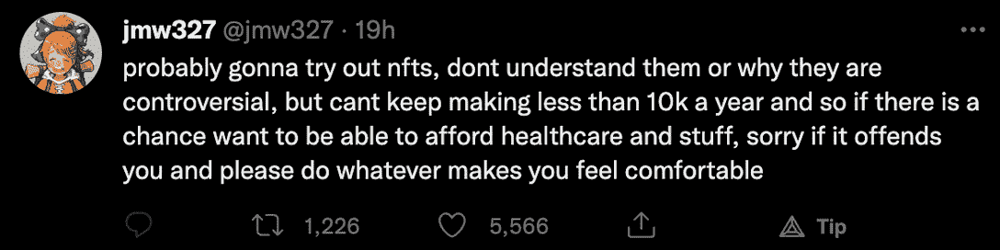
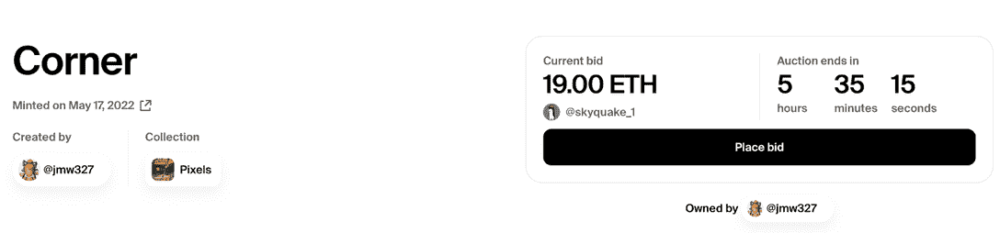
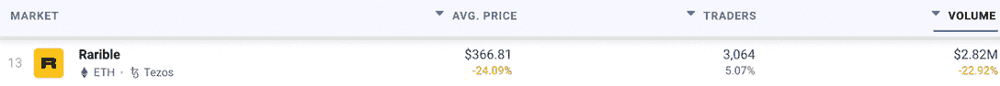
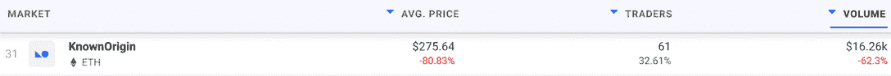
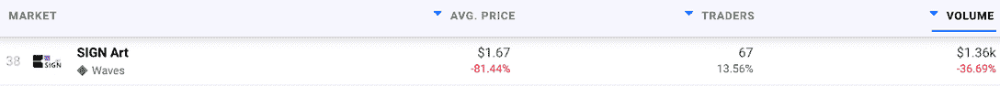

# 苦苦挣扎的数字艺术家求助于 NFTs，在 Twitter 上疯传

> 原文：<https://web.archive.org/web/https://dappradar.com/blog/struggling-digital-artist-turns-to-nfts-goes-viral-on-twitter>

## 艺术家 jmw327 在推特上表达了一年 10，000 美元的生活有多艰难，这促使他们转向 NFTs

一位名叫 jmw327 的陷入财务困境的数字艺术家一夜之间成为推特上的红人，因为他们在 NFT 的第一次发行将会比他们通常一年的收入还要多。当毕普从 Instagram 红人变成 NFT 百万富翁时，我们以前见过这样的举动。

#### 总结:

*   数字艺术家 [jmw327 在 Twitter](https://web.archive.org/web/20220704234909/https://dappradar.com/blog/struggling-digital-artist-turns-to-nfts-goes-viral-on-twitter/#financial) 上表达了他们的挣扎，这个帖子现在有超过 5000 个赞和超过 1000 次转发
*   他们为他们的一件名为“角落”的作品发起了一场拍卖，目前最高出价为 19 ETH，拍卖还有几个小时
*   尽管人们越来越担心熊市，NFT 艺术品市场还是吸引了更多的人

数码艺术家 jmw327 在发布了一条关于他们在这一职业道路上的奋斗的真诚而诚实的推特后，一夜之间成为推特上的轰动。根据他们的帖子，jmw327 一直在努力支付医疗保健等基本必需品，因为他们每年只赚 10，000 美元。这促使艺术家转向 NFT，尽管不知道它们是如何工作的，也不知道为什么它们在传统艺术空间如此有争议。现在，他们的一件艺术品正在基金会拍卖，目前的最高出价是 19 ETH，约合 3.86 万美元。

## 从财务困境到高价拍卖

数字艺术家 jmw327 接管了 Twitter NFT 空间，用一种简单但真诚和诚实的方式审视他们的财务状况。这条[推文](https://web.archive.org/web/20220704234909/https://twitter.com/jmw327/status/1526611810262163457)概述了 jmw327 如何通过他们的数字艺术作品努力养活他们自己，他们每年只赚大约 10，000 美元。为了改善他们的经济状况，艺术家求助于 NFTs。这带来了立竿见影的效果。

就在发布这条推文的几个小时后，jmw327 发布了一个链接，链接到他在基金会创作的第一件 NFT 艺术品。该作品已经成为热门，吸引了众多的出价，在撰写本文时最高出价为 19 ETH。你可以在这里查看 jmw327 的作品。

## NFT 能改变生活吗？事实证明他们可以

重要的是，jmw327 的故事指出了区块链技术和 NFTs 带来的一个重要成功。这位数字艺术家正努力出售他的作品，但每年只能赚几千美元。但一场 NFT 拍卖会已经在不到 24 小时内为他们带来了接近四倍的金额。

在他们新发现的 NFT 事业之前，jmw327 曾经以每件 200 美元的价格出售类似的数字艺术品和佣金。价值的差异是惊人的，而艺术品本身的质量是完全一样的。

然而，一旦被铸造成 NFT，这件艺术品就变得真实而稀有，由一个人拥有并存放在他们的钱包里。就价值而言，这是不可替代的代币能给艺术家和收藏家带来什么的最纯粹的案例研究之一。

我们以前见过这种类型的成功。Beeple 过去和现在都在 Instagram 上制作日常图片，但当他通过 NFTs 将自己的工作货币化后，他成了百万富翁。以类似的方式，音乐艺术家 3LAU 使用 Web3 和 NFT 技术来赚钱，这比 Spotify 上的流媒体音乐赚得多得多。

## NFT 艺术市场吸引更多用户

许多主流媒体和传统的艺术交易商已经将 NFTs 视为一种艺术媒介。这在某种程度上是可以理解的，考虑到 NFT 的繁荣主要是由更简单的亲民党艺术项目引起的。然而，数字艺术家开始越来越多地转向这种媒介，作为鉴定他们作品的一种方式。寻找 NFT 艺术品的收藏家也越来越多。

快速查看一下 dappar Dar NFT 顶级市场排名就会发现，以艺术为重点的市场一直在抵制熊市趋势，并吸引着更多的用户。最受欢迎的 NFT 市场之一 Rarible 在过去的 30 天里，交易者人数增加了 5%，总数超过了 3000 人。

在过去的三十天里，更针对独特艺术的小型市场也出现了活跃。KnownOrigin 吸引了 32%的交易者，而基于 Waves 的[符号艺术](https://web.archive.org/web/20220704234909/https://dappradar.com/waves/marketplaces/sign-art)则出现了 13%的增长。

这是一个重要的趋势，尤其是在加密市场面临严峻熊市的情况下。NFT 艺术正在复苏，它有可能改变艺术家和收藏家的生活。

DappRadar 将继续关注 NFT 空间，因为更多像 jmw327 这样的艺术家通过这种创新的创作方法改变了他们的生活。为了跟上 NFT 的最新趋势和新闻，请在 Twitter 上关注 DappRadar。

 NewsletterUnsubscribe at any time. [T&Cs](https://web.archive.org/web/20220704234909/https://dappradar.com/terms) and [Privacy Policy](https://web.archive.org/web/20220704234909/https://dappradar.com/privacy-policy)